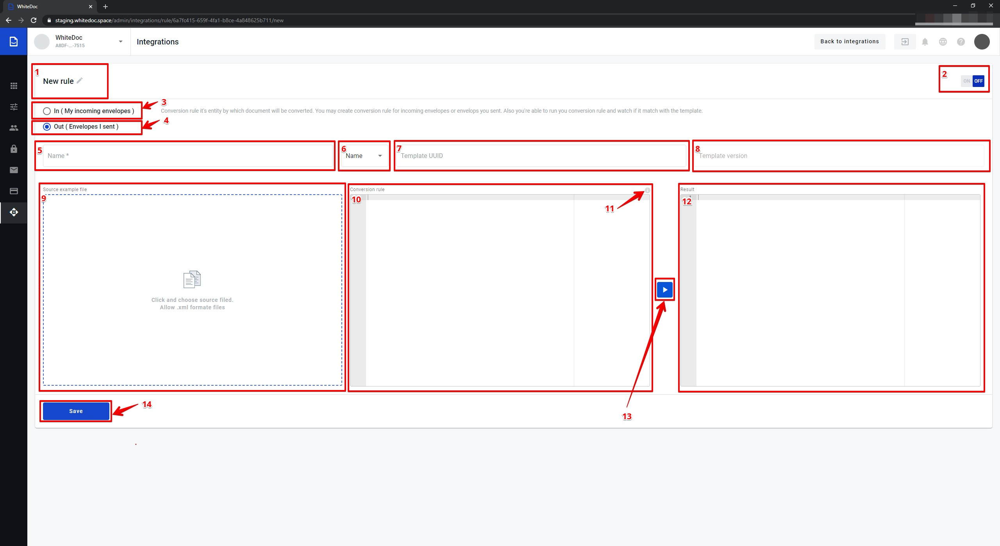

===============
Conversion rule
===============

Conversion rule enable convert document from customer format to whitedoc format and can make reverse conversion. For that customer should create conversion rule and depends on his selection on this page
he can create conversion rule for incoming and outgoing documents. Also, if customer open existed conversion rule he can update, delete or clone this rule.

Conversion rule creation process for outgoing document:
========================================================

#. For create conversion rule for outgoing document customer should select checkbox(3)
#. In field (1) customer can provide rule name or leave default name
#. In field (4) customer should provide matching rule. According this rule will be matching document and conversion rule
#. In field (5) customer should select according what content will be make matching

    - Name - matching rule will be match with file name
    - Content - matching rule will be match with file content
#. In field (6) customer should provide templateUUID which match to outgoing document
#. Field (7) will be auto filled with last template version. If needed customer can use not a last template version, for that need click on template version input(7), after that will be open list with all template version, customer can select necessary template version from this list. When fields (6) and (7) filled, fields (9) and (11) will be filled with autogenerated data
#. In field (9) shown conversion rule, if needed customer can update conversion rule inside this field(9). In field(11) shown autogenerated template
#. For fill in source example file field (8) customer should click on this field, after that will be open file explorer where customer can select source file in local machine. When file selected and opened, data from this file will be shown in this field(8). If customer want to update data in this field he should make changes in file and upload updated file to this field
#. When fields (8) and (9) filled with correct data, customer can check conversion result, for that need click on button execute (10) and after that in block Result(11) will be shown envelope
#. If execute finished with success customer can save new conversion rule, for that need click on button Save(10)
#. Customer can turn on conversion rule from this page, for that need move toggle(2) to the left side and click on button Save(12). After that to all outgoing documents which match to matching rule will be applied to this conversion rule

Conversion rule creation process for incoming document:
========================================================

.. image:: pic_ConversionRuleCard/conversionRulePage_2.jpg
   :width: 1000
   :align: center

#. For create conversion rule for incoming document customer should select checkbox(3)
#. In field (1) customer can provide rule name or leave default name
#. In field (4) customer should provide name, this name will be part of full name for all converted documents. Full name will be consist name from field(4)+time when this document was converted
#. In field (5) customer should provide templateUUID which match to incoming document
#. Field (6) will be auto filled with last template version. If needed customer can use not a last template version, for that need click on template version input(6), after that will be open list with all template version, customer can select necessary template version from this list. When fields (5) and (6) filled, field (7) will be filled with autogenerated data. If customer want to change data in field (7), he should update particular template and select necessary template version
#. In field (8) need input conversion rule which will be used for convert all incoming files, if needed customer can update conversion rule inside this field(8)
#. When fields (7) and (8) filled with correct data, customer can check conversion result, for that need click on button execute (9) and after that in block Result(10) will be shown document example after conversion
#. If execute finished with success customer can save new conversion rule, for that need click on button Save(11)
#. Customer can turn on conversion rule from this page, for that need move toggle(2) to the left side and click on button Save(11). After that to all incoming documents will be able this conversion rule

Working with existed conversion rules
=====================================

#. Update
#. Clone
#. Delete

**Update**

**Clone**

**Delete**

.. important:: **Please note!** `Conversion rule info <conversionRuleInfo.html>`_

