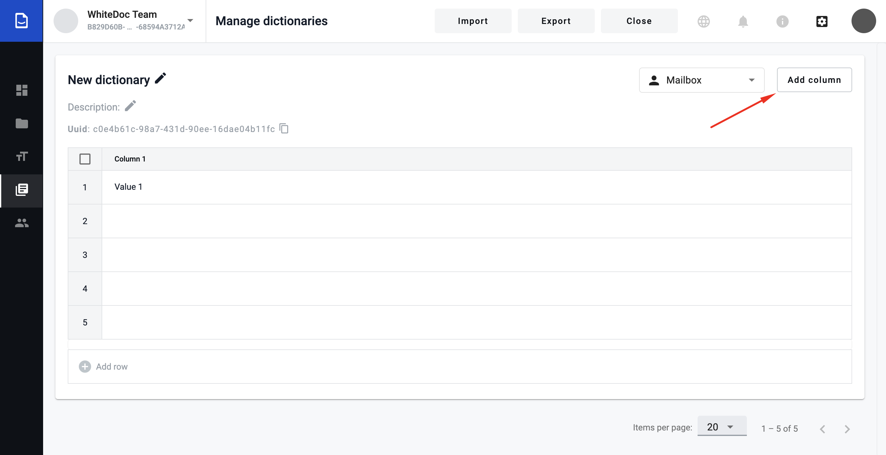
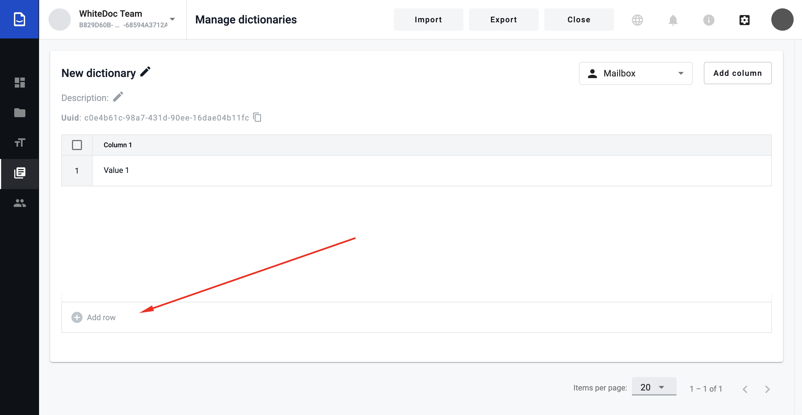
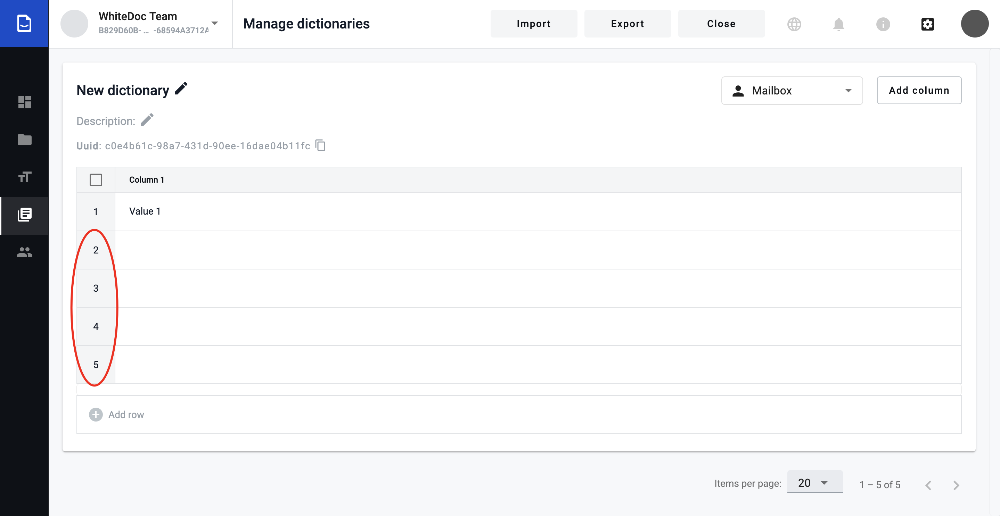

    ==========
Dictionary
==========

.. contents:: Сontent:
   :depth: 6

---------

Dictionary - is a list of records in a systematic form, e.g. list of employee(Name, Surname, Age, Address).

Create Dictionary
=================

1. Navigate to https://staging.whitedoc.space/dictionary

2. Click to create dictionary button.

.. image:: pic_dictionary/create_dictionary.png
   :width: 600
   :align: center

Editing dictionary
==================
Dictionary editing is available only to mailbox that are owner of this dictionary. When user doesn't have permissions to do some operation - functionality is blocked.

**Permissions**:

**Dictionary manage** - allow to create new dictionary, add column, change column order, edit columns, change name, description, access level of dictionary;

**Dictionary delete** - allow to delete dictionary;

**Dictionary row manage** - allow to create records and change value in records;

**Dictionary row delete** - allow to delete records.

Add column
==========
1. Add column to dictionary.

2. Enter a column name. Columns can have the same names. Maximum length of the column name is 64 characters.

.. image:: pic_dictionary/fill_dictionary_4.png
   :width: 600
   :align: center

.. image:: pic_dictionary/fill_dictionary_5.png
   :width: 600
   :align: center

Edit column
===========
1. Click to edit icon on column name. Icon appear when user point to column name.

.. image:: pic_dictionary/fill_dictionary_6.png
   :width: 600
   :align: center

2. Enter new column name.

.. image:: pic_dictionary/fill_dictionary_7.png
   :width: 600
   :align: center

.. image:: pic_dictionary/fill_dictionary_8.png
   :width: 600
   :align: center

Change column order
===================
1. Drag drag'n'drop icon and insert column to new position. Icon appear when user point to column name.
2. Drag column to new position.
3. Columns will be displayed in the same order on template on dictionary field.

Delete column
=============
1. Click to delete icon. Icon appear when user point to column name.
2. Confirm that you wanted to delete column.

.. warning:: **Please note!** `Behaviour of dictionary field after deleting a dictionary column <delete_behaviour.html>`_

Create empty record
===================

1. Create empty record in dictionary. User can create multiple empty records by clicking to the 'Add row' button. Each click - new record.

Edit record
===========
1. Click to table cell and start entering value to cell. Maximum length of the value is 256 characters.
2. Click checked and value will be applied, also you can click outside and value will be applied too.
3. Click cancel to reject changes and value will not change.

Delete record
=============
Supports multiple deletion.
1. Set active checkbox or checkboxes in first table column.
2. Click to delete row button.
3. Confirm operation.

Filtering records
==================
Multiple filters connected by 'OR'. Filter types: Contains, Does not contain, Is equal, Is not equal, Is empty, Is not empty.
1. Click to filter icon. Icon appear when user point to column name.
2. Set filter and enter value.
3. Column name with active filter will have the same color as filter.
4. Filters sort by column order.
5. To cancel filter - click to cancel icon on this filter.

Access level
============
Access levels are mailbox, account, public.

**Mailbox** - dictionary is visible only in this mailbox scope. Envelope with dictionary field - records from this dictionary will be available only to this mailbox. Recipient from other mailbox can't select data from this dictionary.

**Account** - dictionary is visible to all mailboxes in this account. Envelope with dictionary field - records from this dictionary will be available to all mailboxes in this account. Recipient from other account can't select data from this dictionary.

**Public** - dictionary is visible to all mailboxes. Envelope with dictionary field - all mailboxes can use records from this dictionary.

1. Click to select with access levels.
2. Chose new access level.

Edit dictionary name/description
================================
Dictionary name - maximum length is 128 characters.

Dictionary description - maximum length is 256 characters

1. Click to edit icon.
2. Enter value and click check to apply changes or cancel to reject changes.

Delete dictionary
=================
1. Click to delete icon.
2. Confirm operation.

.. warning:: **Please note!** `Behaviour of dictionary field after deleting a dictionary <delete_behaviour.html>`_

.. include:: delete_behaviour.rst
