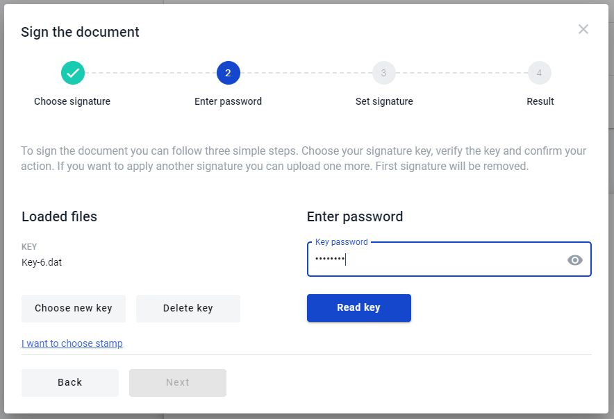
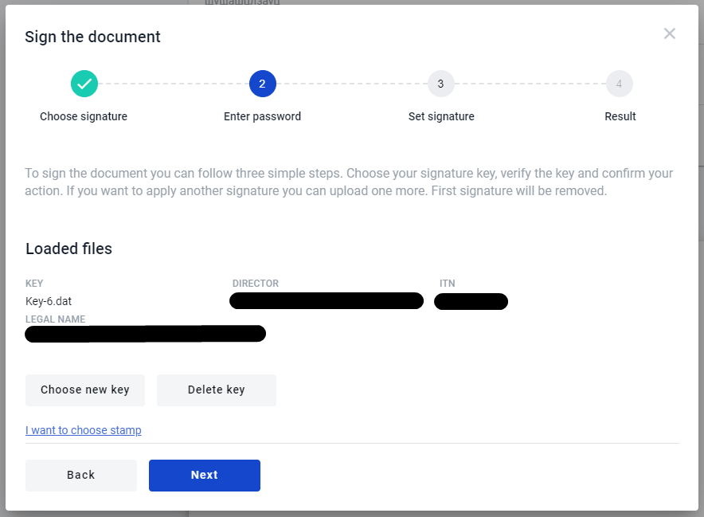
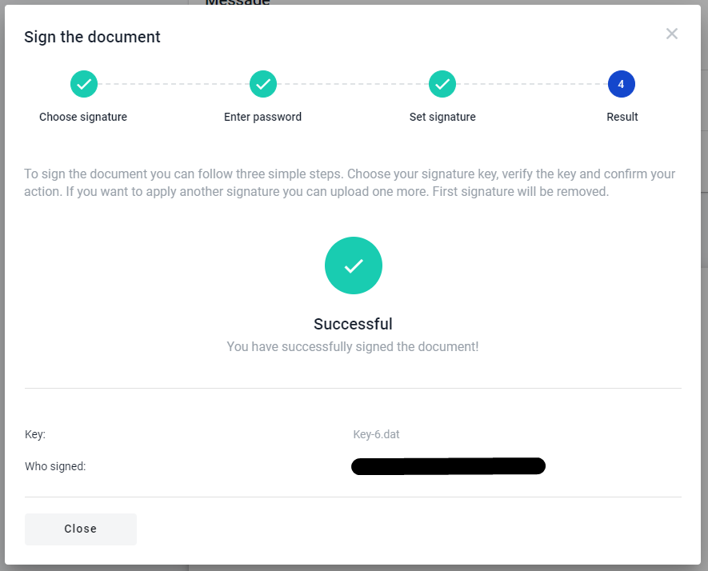
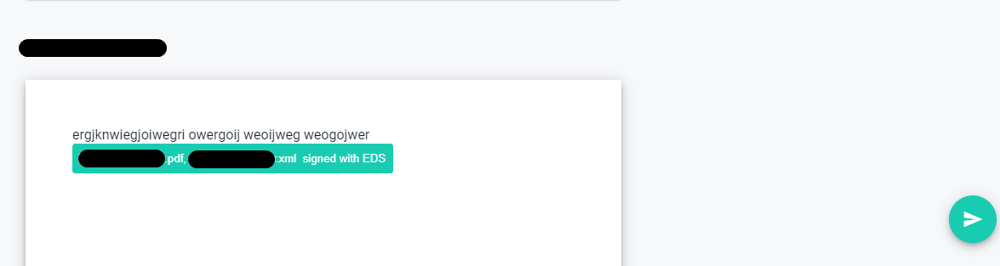

=============================
Digital signature on envelope
=============================

.. contents:: Сontent:
   :depth: 6

---------

On the envelope you can set digital signature and stamp if needed to the document. You can add digital signature using key with your digital signature.
You sign the two documnets type: pdf (human readable format) and xml (structured data of the document). You can download the signature and signed documents.

How to sign the document
========================

If you want to sign document you have to have at least one signature field in the document. How to add digital signature to the document you can read
in the topic "Digital signature on template". To sign the the document you have to do the following:

1. Click on the button of the digital signature (or click on the "pencil" button to follow to the field and click on it);

As soon as you click on, the modal window opens. In this modal window you will see the instruction related to sign process.

.. image:: pic_digitalSignature/chooseKeyWindow.png
   :width: 400
   :align: center

2. Click on the button "Choose key" to open folder manager;
3. Select the key on you computer or flash card;
4. As soon as file selected you will see the new modal window with password input which relates to choosen key and functionalit ot manage keys or add stamp;

.. image:: pic_digitalSignature/afterKeySelected.png
   :width: 400
   :align: center

5. Enter the password of the key and click "Read key" button (if you enter the valid password and key is valid you will see sign details and the next form of 
the modal window, if not you will see the error message);

6. As soon as you enter valid data you will see the information related to key with which you want to sign the document;

7. Press on the button "Next" to watch the information related to documents which you're going to sign (pdf (human readable format) and xml (structured data of the document));

.. image:: pic_digitalSignature/theListOfTheDocuments.png
   :width: 400
   :align: center

8. Click on "Next" button you will see the results of the signing the documents (if documents sing successfully you will see success message if not error message)

9. After the step above modal window closes and on the envelope you will see that button changes and in the button shows informtion related to which documents
has been signed;

10. To finish the signing documents you have to sign all documents related to your role and press on the button "Send"

As soon as you send the document with set signature, the signature will transform to detailed information about who and when signed the document. The note will 
appear in the place where button "Digital signature" has been located.

Also, you can set a stamp to the document if needed. You may do this just press on the link "I want to choose stamp" on the second step of the document signing.

How to donwload the signed data
===============================

You can donwload the signature(s) of the document(s) when all participant with role "Signer". You're able to download particular document with signatures or 
whole envelope with all the documents inside and all signatures inside.

To do this, just :

1. Check that envelope completed;
2. Open envelope;
3. Click on respective "download" button in the header, to download the full envelope with all signed documents;
4. Or click on respective "download" button ahead document name and you will download particular document with all signatures;

As soon as you click on the document download button archive with the documents will be uploaded.

How to check validity of the signatures
=======================================

To check the validity of the signatures that roles did you have to do the following:

1. Download the archive with signatures and document(s);
2. Follow the link https://czo.gov.ua/verify;
3. Select files .p7s and document you have signed;
4. Click on "Check" button;

After validation completed you will see results.
