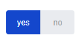

=============
Yes/No field
=============

"Yes/No" field it's a field which can be used for selection of the one option from the two. You can customize options value in the way you need.
It looks like button with two options of "Yes" and "No" values. After selection the value from the button will be changed to regular text with particular value.

.. contents:: Сontent:
   :depth: 6

Yes, No field addition to the document
======================================

You can add "Yes/No" field to document. To do it just drag and drop "Yes/No" field from the fields bar. Fill required fields and select required data (name, role, yes option and no option).

.. image:: pic_yes_no/defaultAdditionView.png
   :width: 200
   :align: center

By default value "Yes" and "No" prefilled, but you can customize it and enter value you need. Restrictions of the value: minimum 1 symbol, maximum 50  symbols.

.. image:: pic_yes_no/customAdditionView.png
   :width: 200
   :align: center

Yes, No field at the envelope
=============================
At the envelope "Yes/No" field looks like two buttons. Properties of the Yes, No field: maximum size of the "Yes/No" field is 200 px, and 100 px for one option.

.. image:: pic_yes_no/yesNoNotSelected.png
   :width: 100
   :align: center

Only one option can be selected.

If value selected and document sent, particular value converts to text and looks at the document as a text with background of the paerticular role.