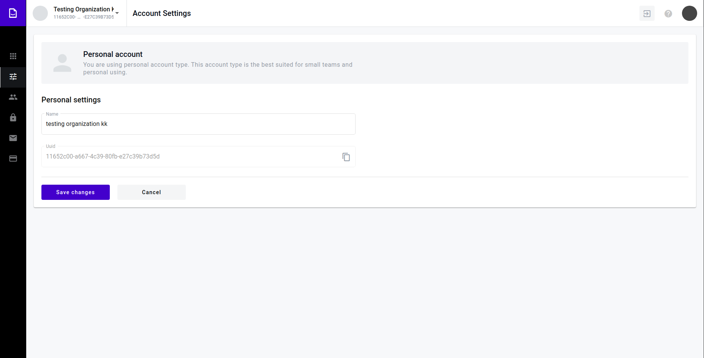
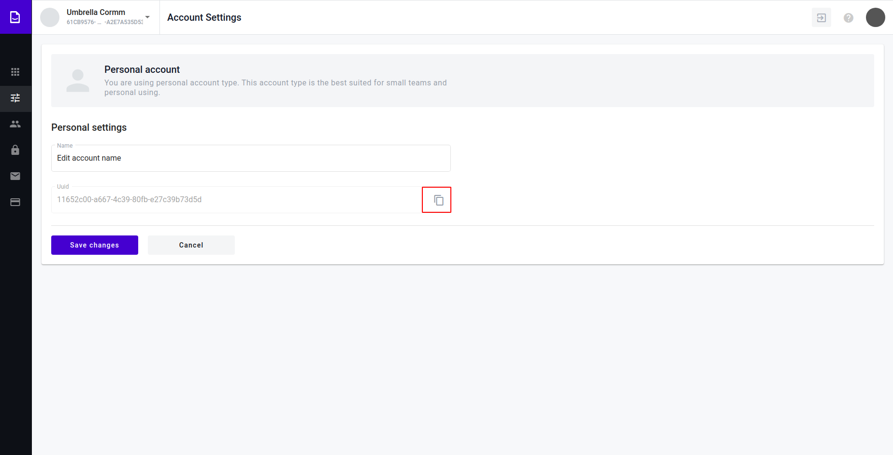
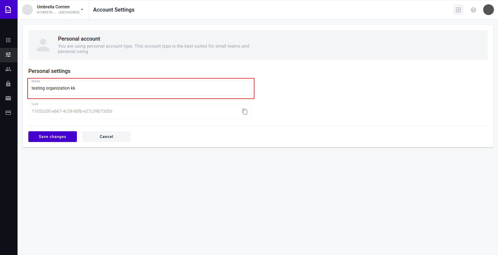
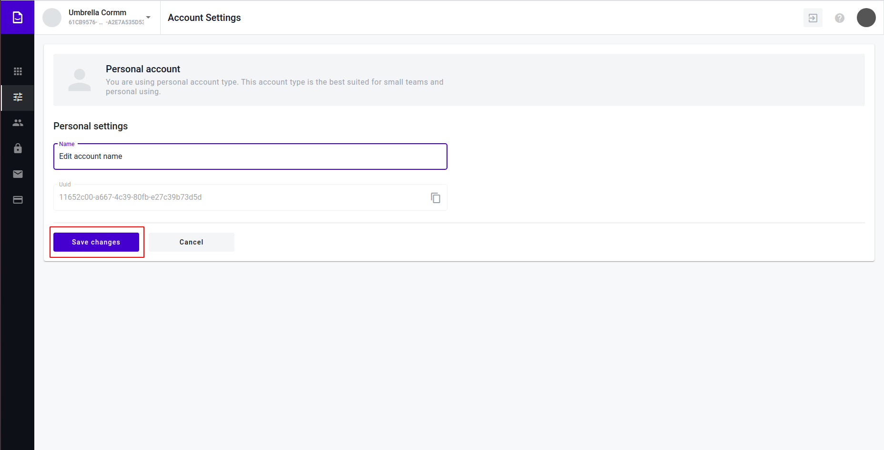
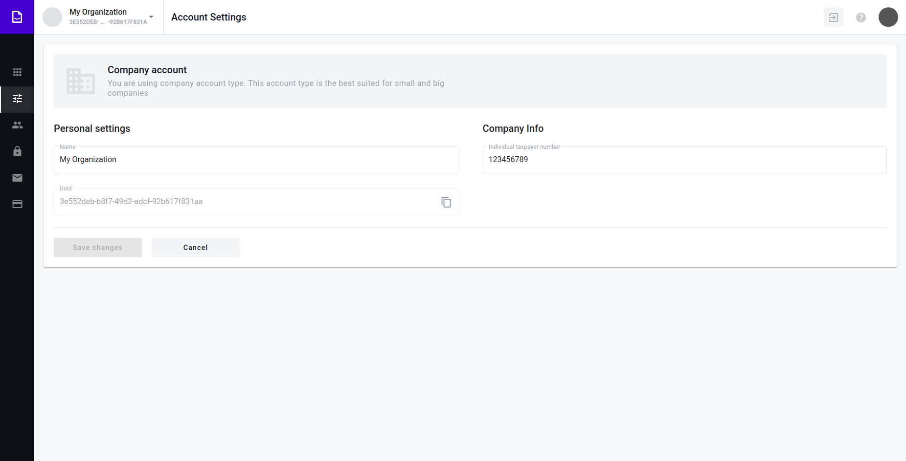
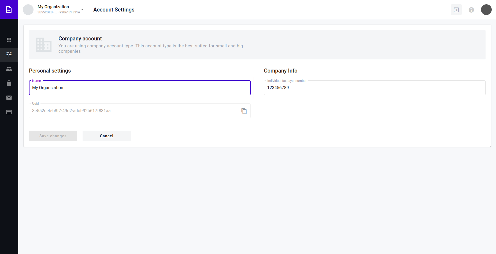
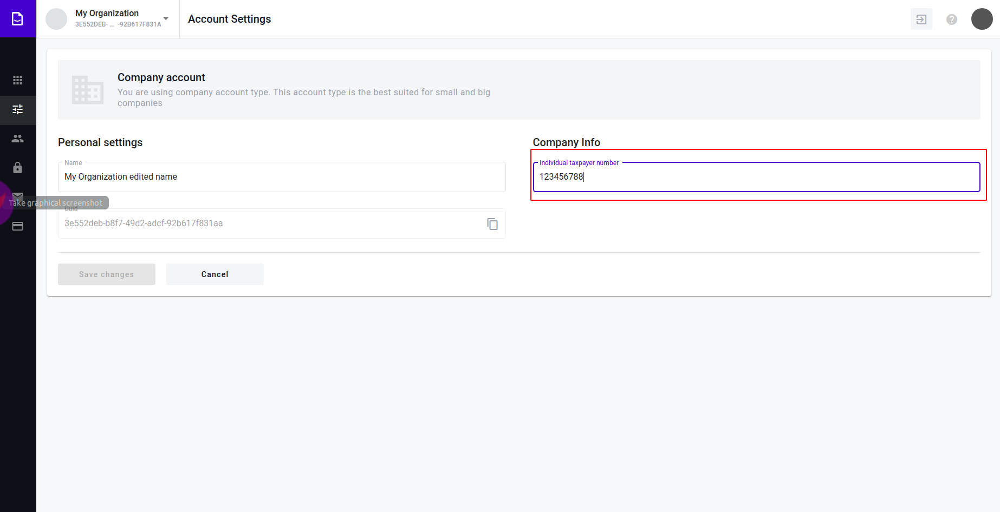
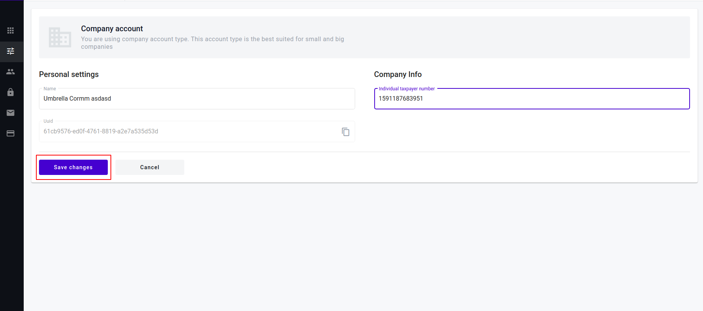
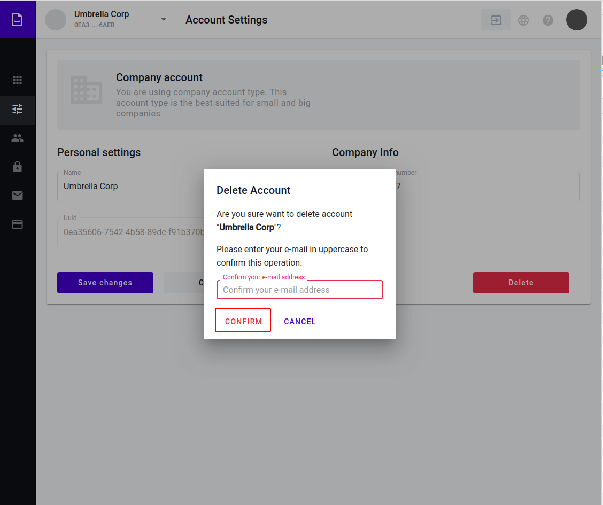

==============
Admin Settings
==============

.. toctree::
   
   domains/domains.rst
   external-links/external-links.rst

Account Settings - is a list of account properties that helps to identify and manage acсount. Data from account used for creating mailboxes and billing.

Copy Account uuid
=================
1. Navigate to https://staging.whitedoc.space/admin/account-settings

2. Click "copy" icon"

3. Message about successful copy should appear

.. image:: assets/account-uuid-copy-success.png
   :width: 600
   :align: center

Edit personal account
=====================

1. Navigate to https://staging.whitedoc.space/admin/account-settings

2. Click on the "Name" input. Validation (minimum 3 symbols, maximum 256 symbols)

3. Edit account name.

.. image:: assets/personal-account-name-edit.png
   :width: 600
   :align: center

4. Press save changes

4. Message about successful update should appear

.. image:: assets/personal-account-success.png
   :width: 600
   :align: center

Edit company account
====================

1. Navigate to https://staging.whitedoc.space/admin/account-settings

2. Click on the "Name" input. Validation (minimum 3 symbols, maximum 255 symbols)

3. Edit account name.

.. image:: assets/personal-account-name-edit.png
   :width: 600
   :align: center

4. Click on the "ITN" input. Validation (minimum 8 symbols, maximum 128 symbols)

.. image:: assets/company-account-itn.png
   :width: 600
   :align: center

5. Edit account itn.

6. Press save changes

7. Message about successful update should appear

.. image:: assets/company-account-success.png
   :width: 600
   :align: center

Going back
==========

1. Navigate to https://staging.whitedoc.space/admin/account-settings

2. Click "Cancel" button. This action will take you to previous page.

.. image:: assets/account-cancel.png
   :width: 600
   :align: center

Delete account
==============

1. Navigate to https://staging.whitedoc.space/admin/account-settings

.. image:: assets/account-delete-form.png
   :width: 600
   :align: center

2. Click "Delete" button.

.. image:: assets/account-delete-form-button.png
   :width: 600
   :align: center

3. Popup should open.

.. image:: assets/account-delete-form-popup.png
   :width: 600
   :align: center

4. Popup should open.

.. image:: assets/account-delete-form-popup.png
   :width: 600
   :align: center

5. If you want to cancel the operation click 'Cancel'

.. image:: assets/account-delete-form-popup.png
   :width: 600
   :align: center

6. Type your user e-mail in uppercase to email input

.. image:: assets/account-delete-form-popup-input.png
   :width: 600
   :align: center

7. Click "Confirm"

