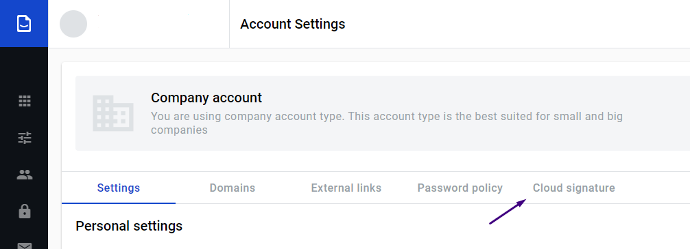
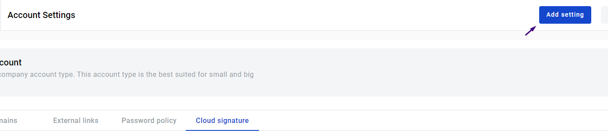
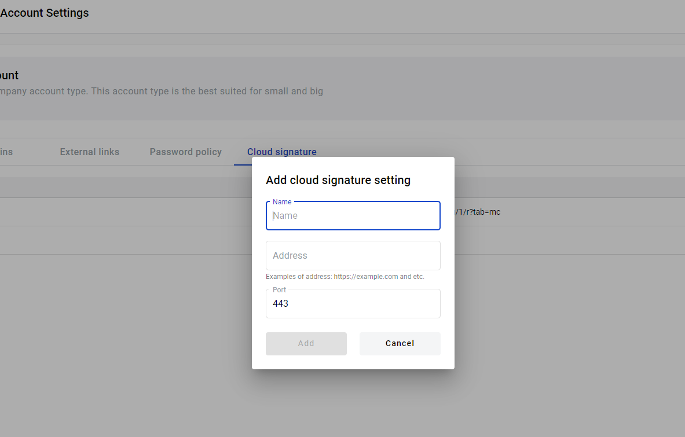
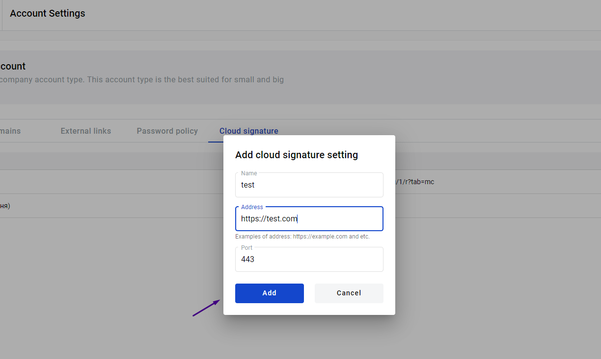

===============
Cloud Signature
===============

.. toctree::

Cloud signature is one of the many ways to sign document with Qualified Electronic Signature. And on this page will be described how to configure
cloud signature for your corporate account.

How to create configuration
===========================

Owner or user who has respective permissions to corporate account can configure Cloud signature for all corporate users and
users with verified corporate domains can use Cloud signature.

The short instruction here: Go to Admin panel, select Account Settings. On Account Settings page, select Cloud Signature tab.

1.  To create configuration, click [add setting] button

2.  Fill configuration form. Name of the signature can be any you want, url contain address to the signature server and port should respect to available port to connect

3. After filling, click  [Save] button

4. User can edit and delete the configuration, to do this, you need  click on the [edit] or [delete] icon

.. image:: pic/Screenshot_4.png
   :width: 600
   :align: center

5. As soon as configuration added corporate users are able to use cloud signature to sign documents