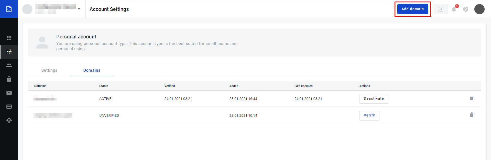
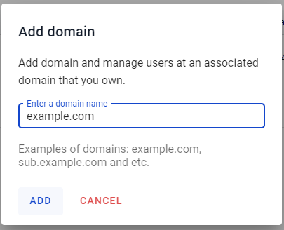
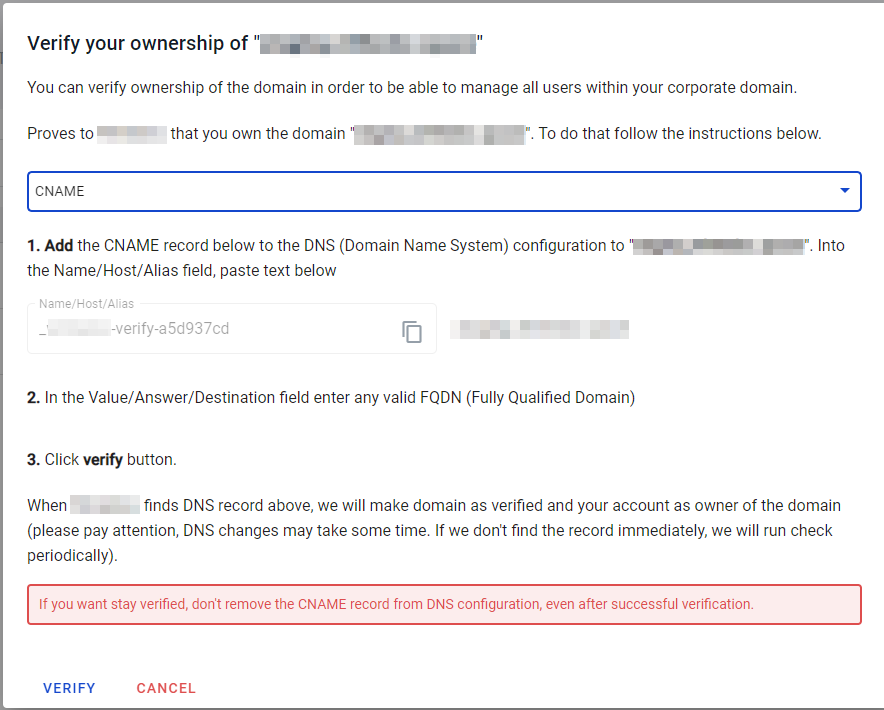
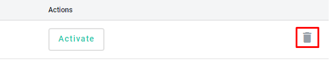
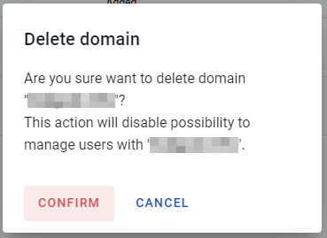

=====================
Domains configuration
=====================

.. toctree::

Domains configuration allows manage owned to you domanins, activate and deactivate domains inside platform.
Domains neccessary to add and verify if you need to create users on platform with domain you owned.

How to add domain?
==================

1. To add domain follow to the respective tab on the Account settings menu called "Domains". 

.. image:: assets/goToDomains.png
   :width: 600
   :align: center

2. Click on the button "Add domain" in header.

3. Enter domain name you owned and confirm your action

4. If domain is existing, we can ping it and domain has not verified by anyone else it will be added to the domain list

How to verify domain?
=====================

To verify domain on platform you have to add TXT or CNAME record to the DNS configuration of domain. To do it foollow instructions below:

1. Add domain to platform

2. After addition you will see modal window with instructions

3. Copy data from the modal and enter to the respective field on the DNS configuration of your domain

4. Click on "Verify" button on modal window and system automatically tries to confirm you ownership

5. As soon as system get proofs of your ownership admin get email notification related to successful domain verification on platform

How to activate domain?
=======================

As soon as domain verified you can activate it to use domain-related functionality such as user creation with respective domain.

1. Click on the "Activate button", which appeares after successful domain verification

.. image:: assets/activateDomain.png
   :width: 600
   :align: center

2. Domain is active

Domain deletion
===============

If you need to delete domain you can do this in two steps. 

1. Click on "bin" icon ahead domain you want to delete

2. Confirm you action (Pay attention that if you delete verified domain you will lose possibilit to manage user with your's domain)

