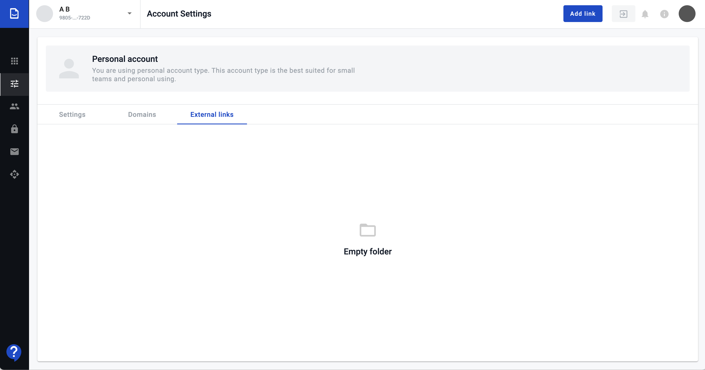
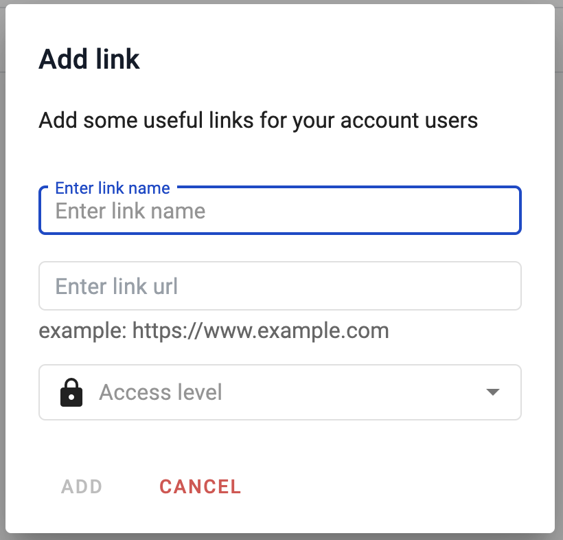
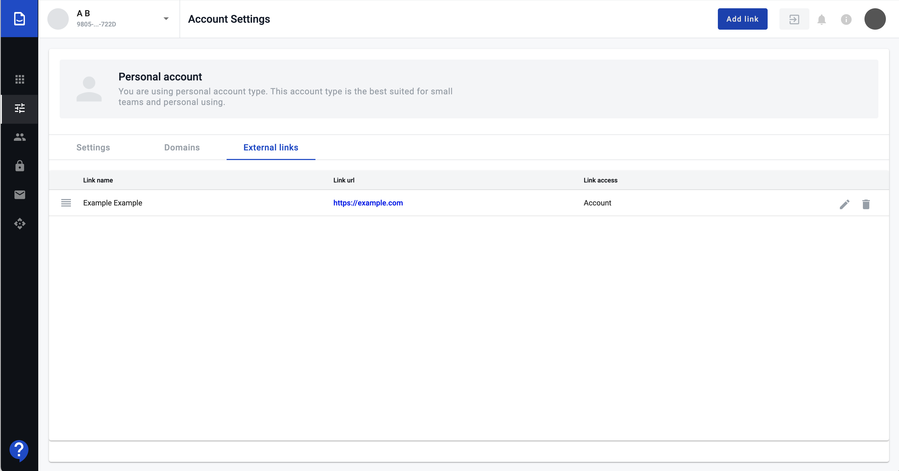
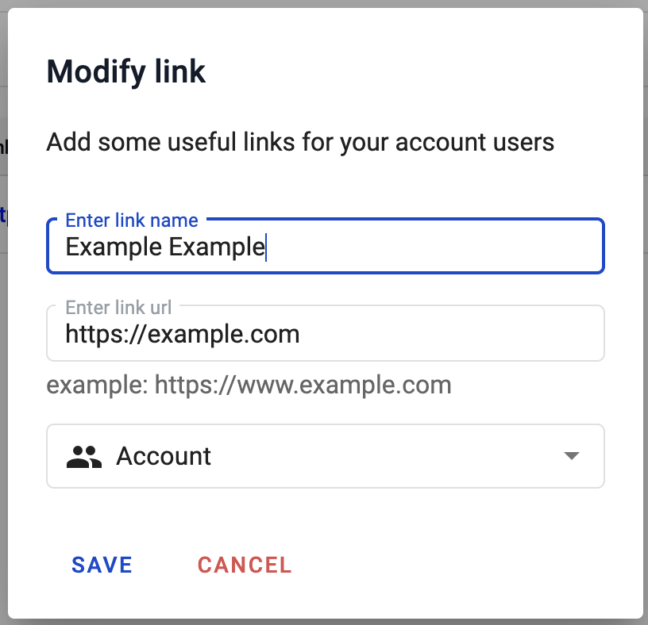
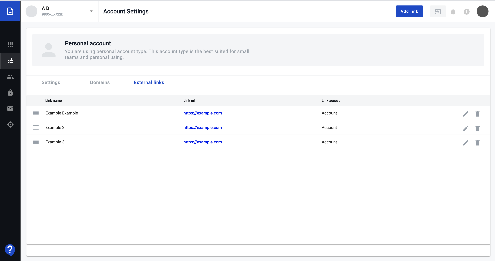
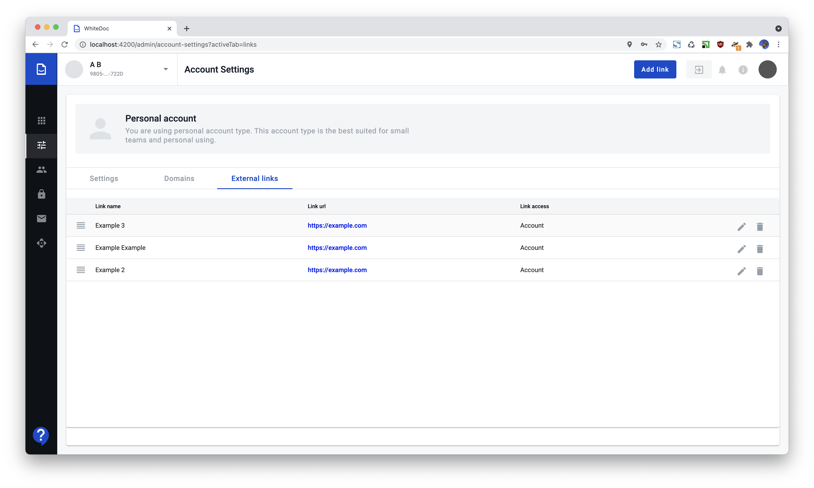
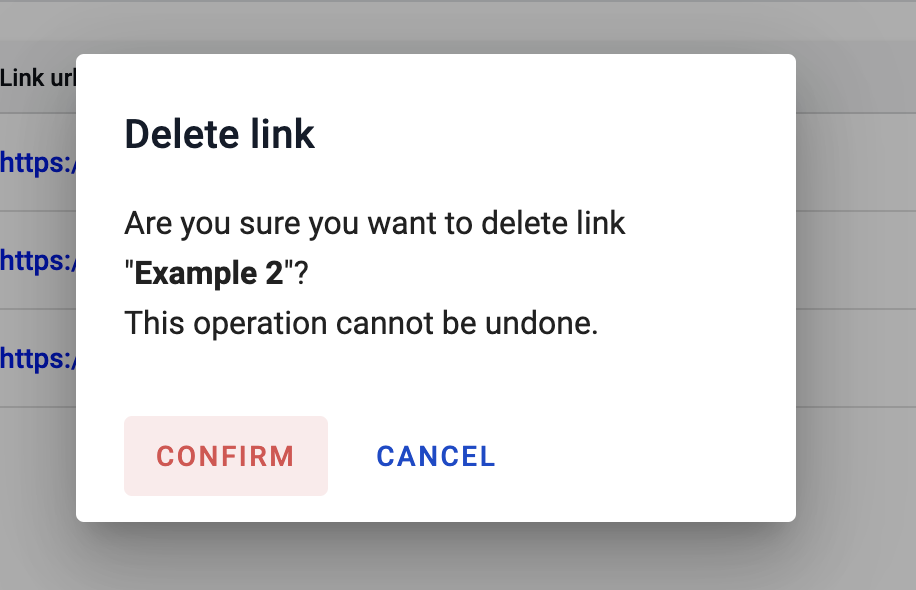

.. external-links-configuration:

=====================
External links configuration
=====================

.. toctree::

External links configuration allows manage list of links to external resources, which may be useful for account/mailbox users.

How to add external link?
==================

1. To add external link follow to the respective tab on the Account settings menu called "External links".

.. image:: assets/goToExternalLinks.png
   :width: 600
   :align: center

2. Click on the button "Add link" in header.

3. Enter link name, url and access level: account-wide or mailbox-specific

4. Popup wil be closed and new link will be added to the end of the existing links list

How to modify link?
=====================

1. To modify link press modify icon in the links list:

.. image:: assets/editLink.png
   :width: 600
   :align: center

2. Do changes and press save button

How to change links order?
=======================

1. Click on the "order" icon on the left in links list

2. Drag link to new position, and drop there

Link deletion
===============

If you need to delete link you can do this in two steps.

1. Click on "bin" icon ahead link you want to delete

.. image:: assets/deleteIcon.png
   :width: 600
   :align: center

2. Confirm you action

