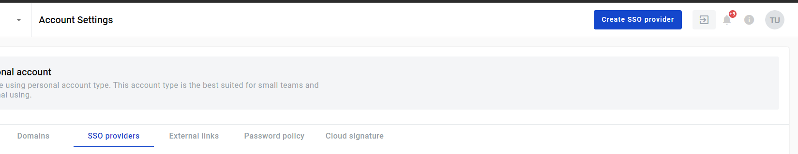
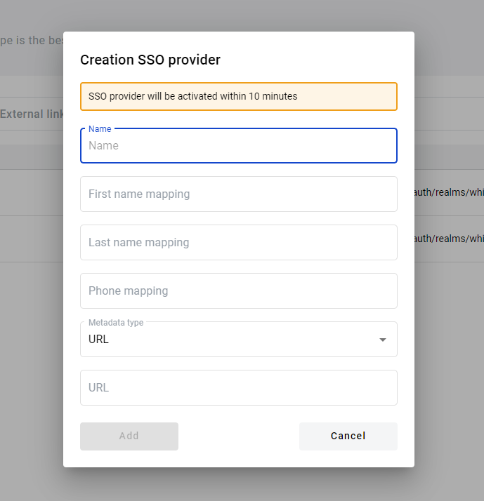
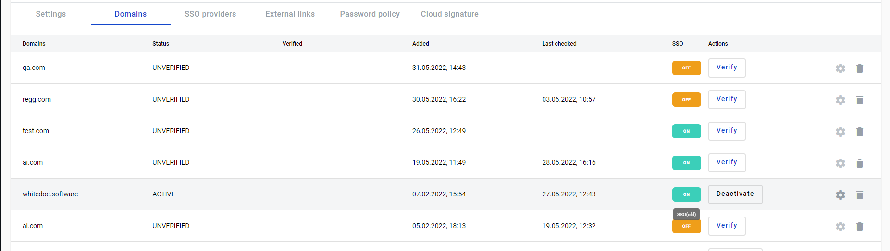
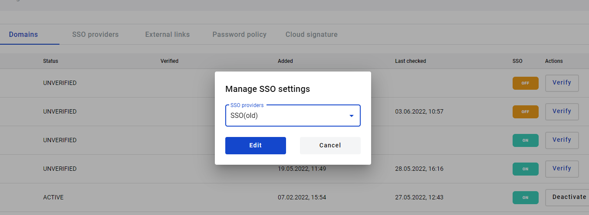
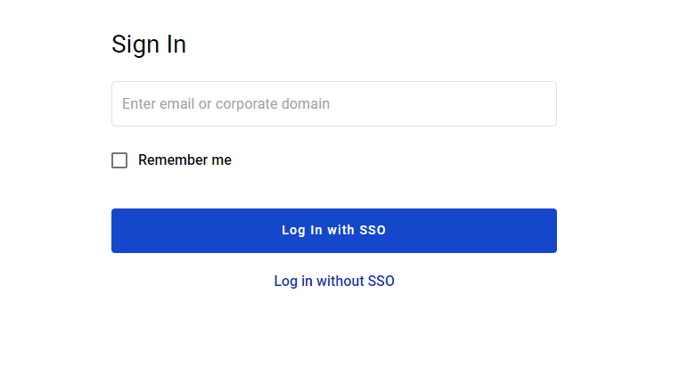

=================
SSO configuration
=================

.. toctree::

You can set authorization via SSO for your corporate users. To do this, you need to create a domain and verify it on the platform.
Next, you need to create an ISP SSO and connect it to the domain.

How to add SSO?
===============

1.Go to Admin panel. Chose Account Settings. Go to SSO providers page

2. On the SSO providers page click Create SSO provider button.After you click on the button you will open a modal window. Fill in the main fields.You can choose the Metadata type. Provide URL or XML. Once you have filled in all the data click add

3. Go to the domains page.Chose active domain, click on the icon Manage SSO setting.

4. You will see a modal window in which you can select the available SSO

5. After SSO connected to domain, your corporate users will be able to log in via sso.

6.Corporate user enters your corporate domain and fills out an authorization page, as a result of which he will be successfully authorized or receive a message that he needs to register via SSO.