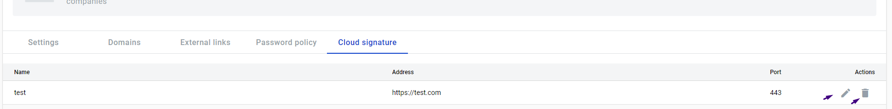

===============
Cloud Signature
===============

.. toctree::

How to create configuration
===========================

Corporate user can enable and configure Ridge in their corporate account, after which users of verified corporate domains can subscribe using Ridge.
Go to Admin panel, select Account Settings. On Account Settings page, select Cloud Signature tab.

.. image:: pic/Screenshot_5.png
   :width: 600
   :align: center

1.  You can create configuration, click [add setting] button

.. image:: pic/Screenshot_1.png
   :width: 600
   :align: center

2.  Fill configuration form

.. image:: pic/Screenshot_2.png
   :width: 600
   :align: center

3. After filling, click  [Save] button

.. image:: pic/Screenshot_3.png
   :width: 600
   :align: center

4. User can edit and delete the configuration, to do this, you need  click on the [edit] or [delete] icon

5. After adding a configuration, domain users can use it