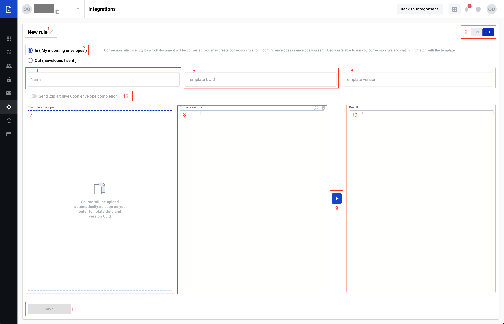
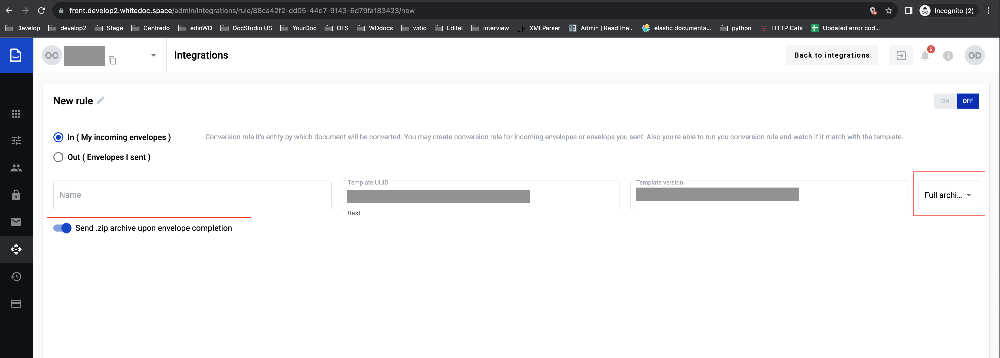

===============
Conversion rule
===============

Conversion rule enable convert document from customer format to whitedoc format and can make reverse conversion. For that customer should create conversion rule and depends on his selection on this page he can create conversion rule for incoming and outgoing documents. Also, if customer open existed conversion rule he can update, delete or clone this rule.

Conversion rule creation process for outgoing document
======================================================

.. image:: pic_ConversionRuleCard/conversionRulePage_1.jpg
   :width: 1000
   :align: center

1. For create conversion rule for outgoing document customer should select checkbox (3)
2. In field (1) customer can provide rule name or leave default name
3. In field (4) customer should provide matching rule. According this rule will be matching document and conversion rule (matching rule can be created using RegExp)

.. important:: F.e.: you have a couple of files with different names and similar part of name: example111.txt, example222.txt and example333.txt. To write a matching rule which will be appropriate for all of the files you can write next expression: example.*.txt and all files will be correspond to your matching pattern. `How to use regular expression you can find here <https://en.wikipedia.org/wiki/Regular_expression>`_

4. In field (5) customer should select according what content will be make matching
    - Name - matching rule will be match with file name
    - Content - matching rule will be match with file content

5. In field (6) customer should provide templateUUID which match to outgoing document
6. Field (7) will be auto filled with last template version. If needed customer can use not a last template version, for that need click on template version input(7), after that will be open list with all template version, customer can select necessary template version from this list. When fields (6) and (7) filled, fields (9) and (11) will be filled with autogenerated data
7. In field (9) shown conversion rule (customer can observe conversion rule example by click on info icon inside field (9)), if needed customer can update conversion rule inside this field(9). In field(11) shown autogenerated template
8. For fill in source example file field (8) customer should click on this field, after that will be open file explorer where customer can select source file in local machine. When file selected and opened, data from this file will be shown in this field(8). If customer want to update data in this field he should make changes in file and upload updated file to this field
9. When fields (8) and (9) filled with correct data, customer can check conversion result, for that need click on button execute (10) and after that in block Result(11) will be shown envelope
10. If execute finished with success customer can save new conversion rule, for that need click on button Save(10)
11. Customer can turn on conversion rule from this page, for that need move toggle(2) to the left side and click on button Save(12). After that to all outgoing documents which match to matching rule will be applied to this conversion rule

Conversion rule creation process for incoming document
======================================================

1. To create conversion rule for incoming document customer should select checkbox (3)
2. In field (1) customer can provide rule name or leave default name
3. In field (4) customer should provide name, this name will be part of full name for all converted documents. Full name will be consist name from field (4) + time when this document was converted if document with similar name has been already created. You can customize name using special variables for naming pattern:

- {mailboxUuid} - mailbox UUID which is using integration functionality
- {envelopeUuid} - envelope UUID of the envelope which has been created on platform
- {randomNumber} - random number
- {templateUuid} - template UUID on platform using which envelope has been created
- {date dateFormat} - date of the envelope receiving in format you need (dateFormat can be DDMMYYYY or any of available date formats)

4. In field (5) customer should provide templateUUID which match to incoming document
5. Field (6) will be auto filled with last template version. If needed customer can use not a last template version, for that need click on template version input(6), after that will be open list with all template version, customer can select necessary template version from this list. When fields (5) and (6) filled, field (7) will be filled with autogenerated data. If customer want to change data in field (7), he should update particular template and select necessary template version
6. In field (8) need input conversion rule which will be used for convert all incoming files, if needed customer can update conversion rule inside this field(8)
7. When fields (7) and (8) filled with correct data, customer can check conversion result, for that need click on button execute (9) and after that in block Result(10) will be shown document example after conversion
8. If execute finished with success customer can save new conversion rule, for that need click on button Save(11)
9. Customer can turn on conversion rule from this page, for that need move toggle(2) to the left side and click on button Save(11). After that to all incoming documents will be able this conversion rule

.. important:: **Please note!** `Conversion rule info <conversionRuleInfo.html>`_

**You might want to receive envelope archive to your server according to protocol you've chosen.**

1. Enter template UUID you want to make integration with
2. Set toggle (12) in active state to activate ZIP archive functionality
3. Chose archive type you want to send as soon as envelope will be COMPLETED

Working with existed conversion rules
=====================================

#. Update
#. Clone
#. Delete

**Update**
For update conversion rule for outgoing document, customer should upload source file and successfully finish execute. Button Save will be unavailable until execute not successfully finished. For update conversion rule for incoming document also need successfully finish conversion rule execute.

**Clone**
Customer can create new conversion rule using clone function. For use this function want to clone conversion rule he should open this rule from conversion rule list. Where conversion rule is open customer should click on clone button, after that customer can update cloned rule. For save new conversion rule need successfully finish execute and click on save button.

**Delete**
Customer can delete any conversion rules, for that need open conversion rule, click on delete button and in opened modal window confirm deletion.