=========
Mailboxes
=========

.. toctree::

   delete_mailbox_behaviour.rst

---------

Mailboxes page is a part of admin panel interface. This page allows:

1. Manage existing mailboxes
2. Create new mailboxes
3. Remove users from mailboxes
4. Delete mailboxes

.. image:: pic_mailboxes/mailboxesMainView.png
   :width: 600
   :align: center

Add new mailbox
===============

1. Click on the button "Add new mailbox"

.. image:: pic_mailboxes/mailboxesAddNewMailbox.png
   :width: 600
   :align: center

2. Modal window of the mailbox creation opens. Enter a name of the mailbox

.. image:: pic_mailboxes/mailboxesEnterMailboxName.png
   :width: 600
   :align: center

3. Click on the button "Create" (it will become enablled after name is entered)

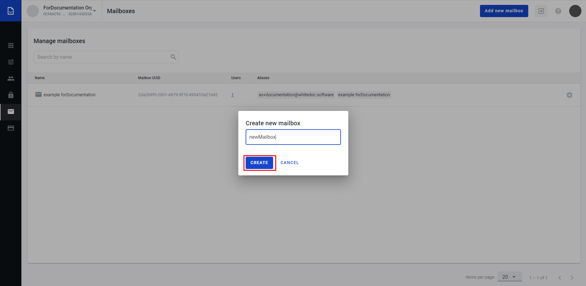

4. After successful mailbox creation you will see message in the right corner of the page and mailbox will show in the list of mailboxes

.. image:: pic_mailboxes/mailboxesSuccessfulCreation.png
   :width: 600
   :align: center

Generate a report by mailbox
============================

If you want to get xlsx file with report by mailboxes you have to do the following:

1. Open platform
2. Got to Admin Panel
3. Open tab 'Mailboxes' and select all necessary records
4. Click on button with document icon (button called "Generate report")
5. After click you will see the message that report will be send to you email after generation
6. Follow to email address
7. Open email you got
8. Click on button "Download"

Now you can open the file on your computer

Check users assigned to mailbox
===============================

To see the list of users which have access to the mailbox click on the link with number in the column "Users". After this action you will be redirected to the page page with perdefined filter by Mailbox.

Mailbox edit
============

Edition interface allows update name of the mailbox, add and remove aliases to the mailbox, copy the mailboxs UUID, unassign all users with access to the mailbox and delete mailbox. To open mailbox edit form click on the settings icon.

.. image:: pic_mailboxes/mailboxesOpenEditionForm.png
   :width: 600
   :align: center

============
Settings tab
============

Edit mailbox name
=================

Name field has length validation:

1. Min value - 1 symbol
2. Max value - 255 symbols

To edit name just focus the name change it and click on "Save changes" button.

.. image:: pic_mailboxes/mailboxesNameUpdate.png
   :width: 600
   :align: center

After successful edition of the mailbox the notification message will show at the right corner of the page.

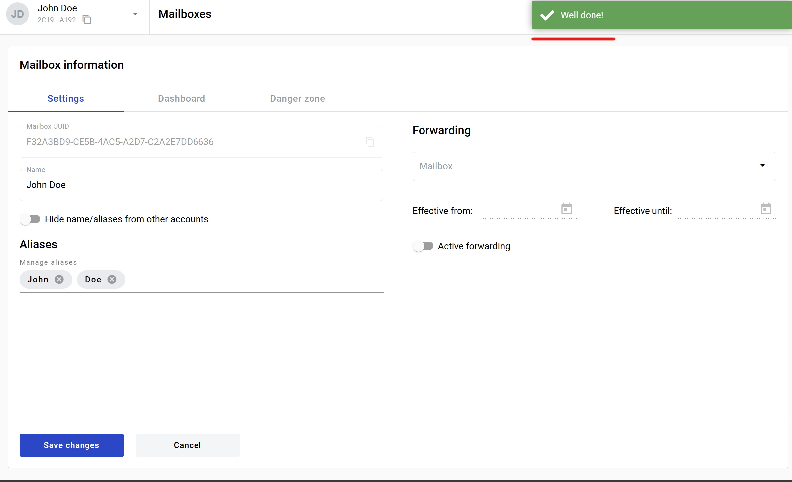

You can hide visibility of your mailbox for system members.To do this, activate the toggle: "Hide name/aliases from other accounts". When the toggle is active mailbox name or alias can be found only by users who have access to this account.

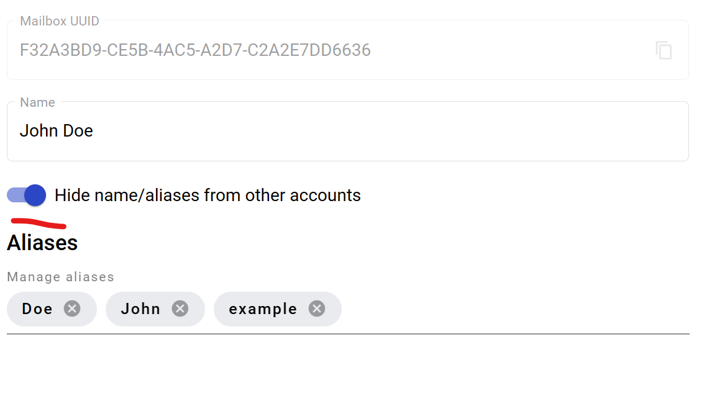

Copy mailbox UUID
=================

To copy the mailbox UUID click on the copying icon. After successful copying the notification message will be shown at the right corener of the page.

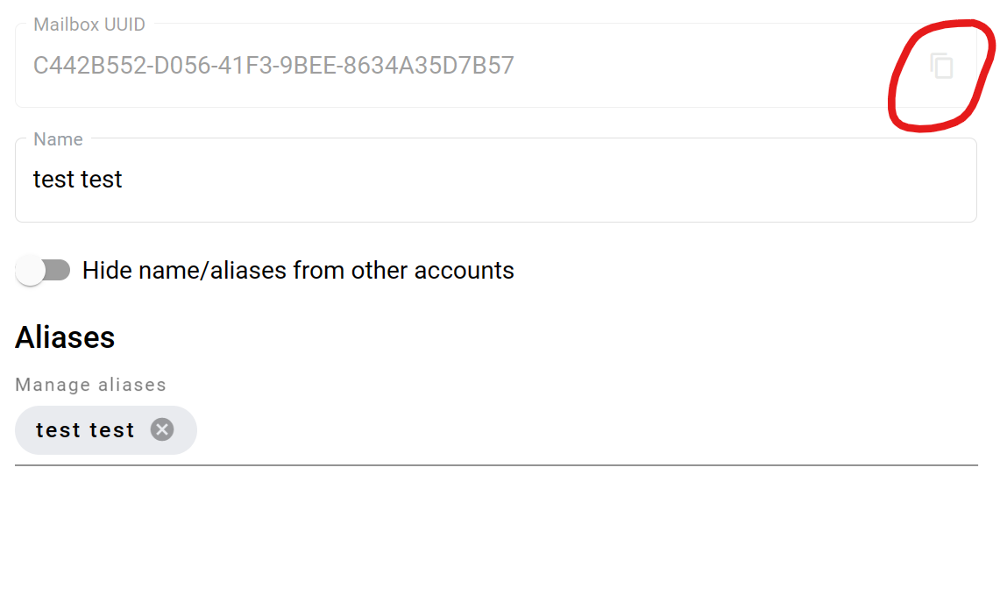

Alias management
================

Two identical aliases can not be added to one mailbox.

.. note:: Two different mailboxes in the system can have same alias. If you need to ensure that you're alias is unique systewide, you can use qualified alias. Qualified aliases use a prefix with semicolon in the end e.g. TIN:youralias. If such prefix is used, same alias with same prefix can not be created in the system after initial one is created. For such aliases only letters, numbers and dash are allowed. Please note that not any prefix can be used - please contact your administrator for information on what unique prefix groups are used on your instance of application.

To add alias(es) to the mailbox:

1. Click on the aliases area of the page 

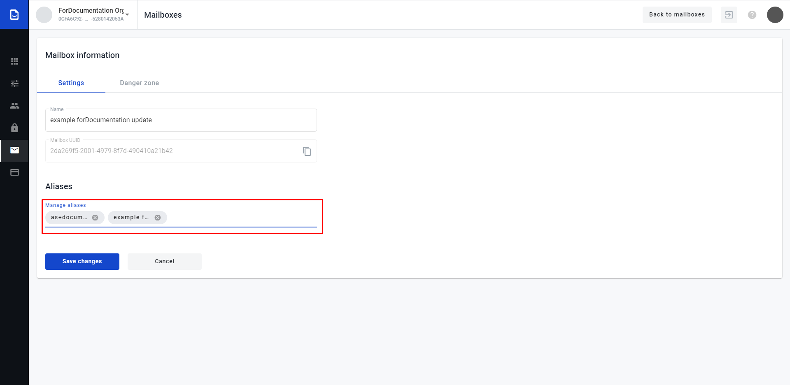

2. Enter the alias and press "Enter", "." or "," button on keyboard to add alias to the list, after that click on "Save changes" button

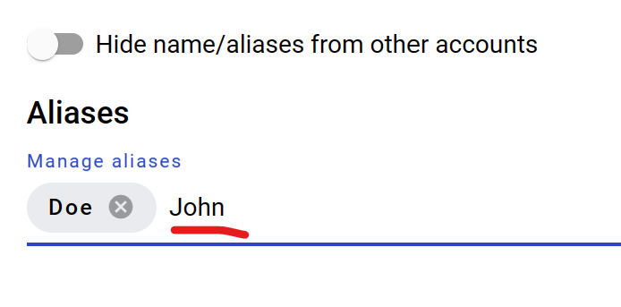

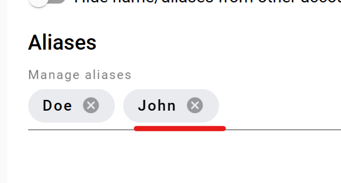

3. To remove alias from the mailbox, click on remove icon of the alias and click on "Save changes" button

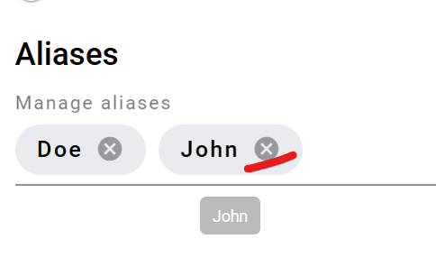

4. After successful edition of the mailbox the notification message will show at the right corner of the page

Envelope forwarding configuration
=================================

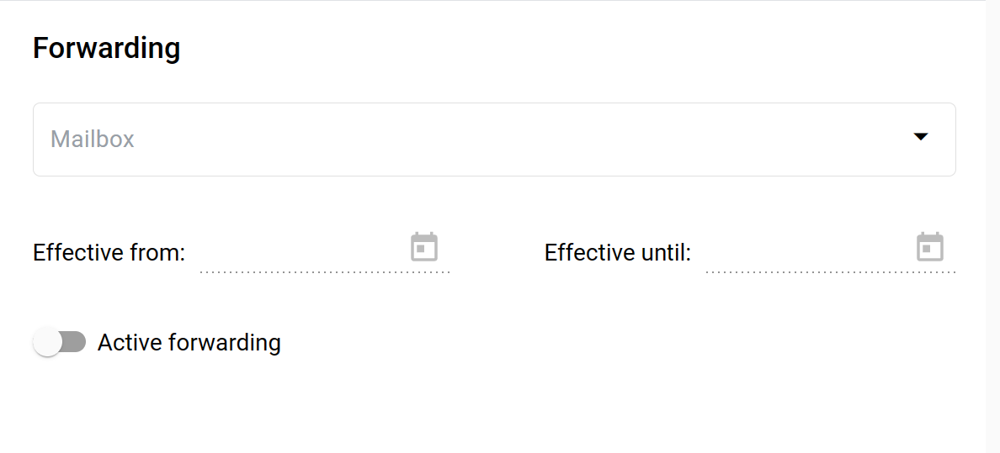

In this section you can configure automatic forwarding of all incoming envelopes. To do so:

1. Select a target mailbox which will be a delegate of yours
2. Select effective from date - it will specify a start date of the forwarding period (can be left empty to start period immediately)
3. Select effective until date - it will specify an end date of the forwarding period (can be left empty to make period indefinite)
4. Enable "Active forwarding" toggle
5. Click on "Save changes" button

Forwarding is configured now. If you wish to disable it at some point later, you can disable "Active forwarding" toggle and click on "Save changes" button.

=============
Dashboard tab
=============

To create custom dashboard instead of default one switch to tab "Dashboard" which contains:

1. Editor area where you able to enter your HTML code which will replace default dashboard
2. Checkbox to activate custom dashboard
3. Button "Save" changes

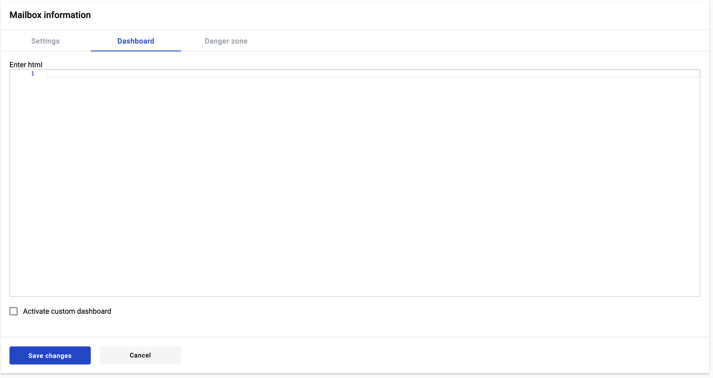

If you want to customize dashboard it's necessary to put content to html area, set checkbox in active state and save changes. Than dashboard will be changed to custom HTML for this specific mailbox and all users who has access to mailbox will see custom dashboard.

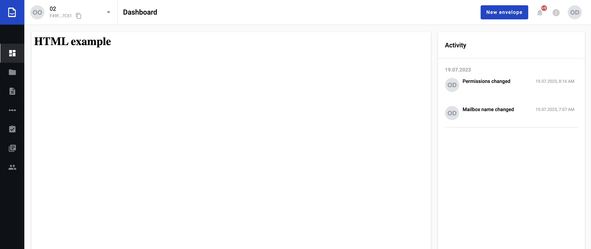

.. note:: `Custom HTML can not be more than 16 mb size`_

===============
Danger zone tab
===============

To remove all users from mailbox or delete mailbox switch to "Danger Zone" tab by click on "Danger Zone" heading

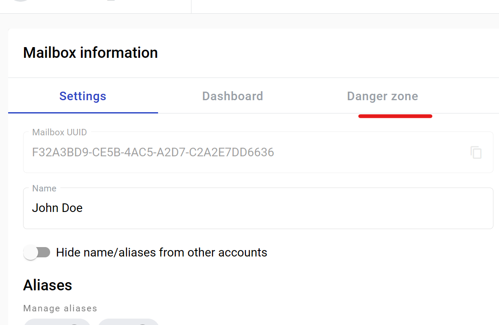

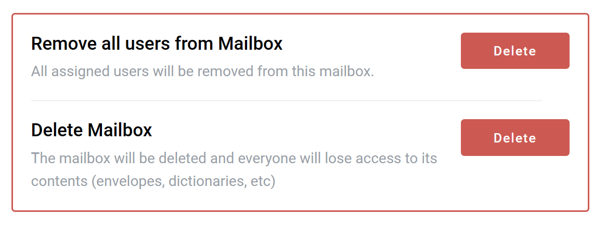

Remove users from mailbox
=========================

1. To remove all users from mailbox (remove all permissions to the particular mailbox from the all users who has it except the user who do the action) click on the button "Deactivate"
2. Confirm the decision and users will be unassigned

Delete mailbox
==============

1. To delete mailbox click on "Delete" button
2. Enter the mailbox in upper case to the field in the modal window which opens after click on "Delete" button
3. Confirm the decision and mailbox will be deleted

.. note:: `Behaviour of mailbox after deletion <delete_mailbox_behaviour.html>`_

.. include:: delete_mailbox_behaviour.rst