=====
Users
=====

.. toctree::

   usersInviteExternal.rst
   usersInviteInternal.rst
   usersDomainUsers.rst
   manageUsers/manageUsers.rst
   filterSearchUsers/filterSearchUsers.rst

Invite users to Account/Mailbox by email
========================================

Registered user can invite in Account/Mailbox any users if he has necessary permissions . If user accept your invite he will get special permissions which you provide him when send invite.
By email you're able to invite registered users and users who has not already registered at the platform.

To invite new users in your Account/Mailboxes follow by next steps:

1. Navigate to https://staging.whitedoc.space/admin/users.

.. image:: pic_users/users_1.png
   :width: 600
   :align: center

2. Click on (1)Invite user button.

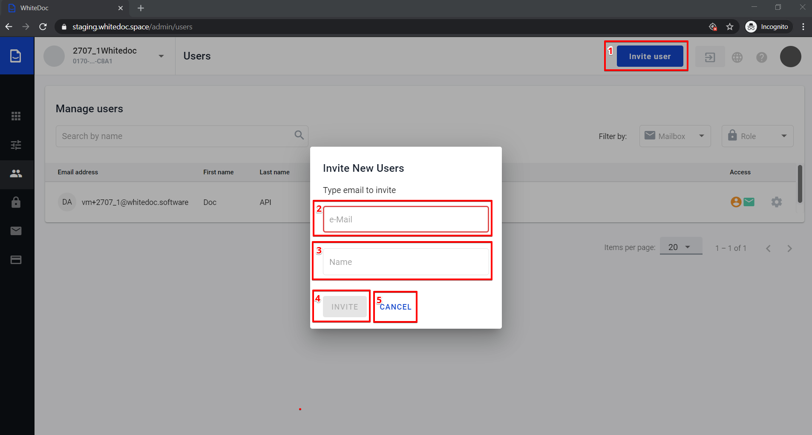

3. After that will shown modal window with two fields for fill. (2)Email field and (3)Name field.
(2)Email field is required and on email which you input on this field will be send invitation letter. (3)Name field is optional.

4. If you filled necessary field (2)email and optional filled field (3)name, click on (4)Invite button(Button (4)Invite
will be unavailable before you fill in field (2)), after that you will be redirected to user edition page at the account tab where you can select permissions which you want to provide for this user.
On this page you can select permissions for user to account and user to mailboxes.

Add permissions to account
==========================

Select role with permissions from (2)roles list. To add role click on (1)+Add role button. You're able to choose a couple of roles to one user. For you will be available system roles by default. If you want you can create custom roles and these roles will be available here.

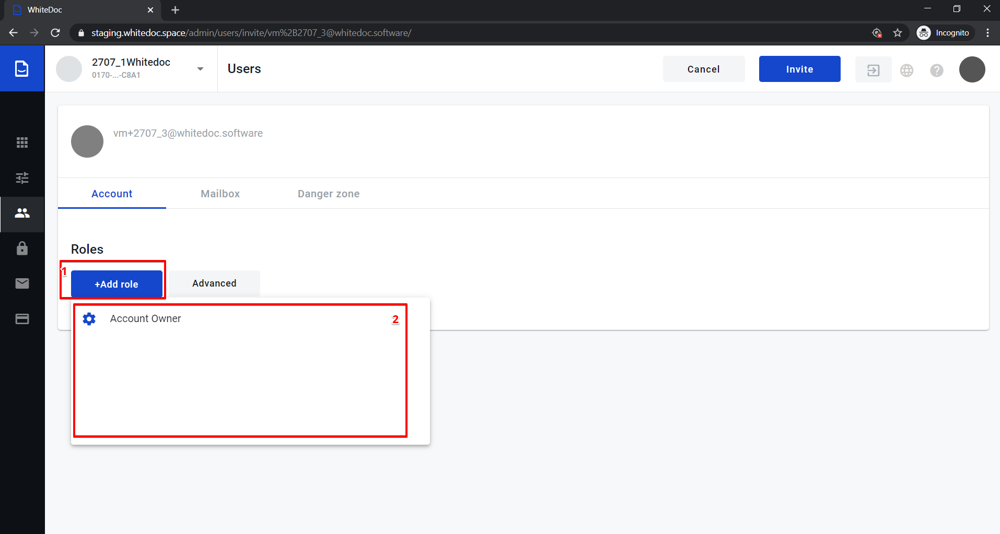

Select specific permissions from (4)permissions list. To select specific permissions click on (1)Advanced button. After that modal window will be opened, there are (2)search field, (3)filters, (4)permissions list and control button (5)Apply, (6)Cancel.
For select necessary permission you should select checkbox near permissions. When you select all account permission which
you want provide for invited user click on (5)Apply button or if you change your mind click on  (6)Cancel button.

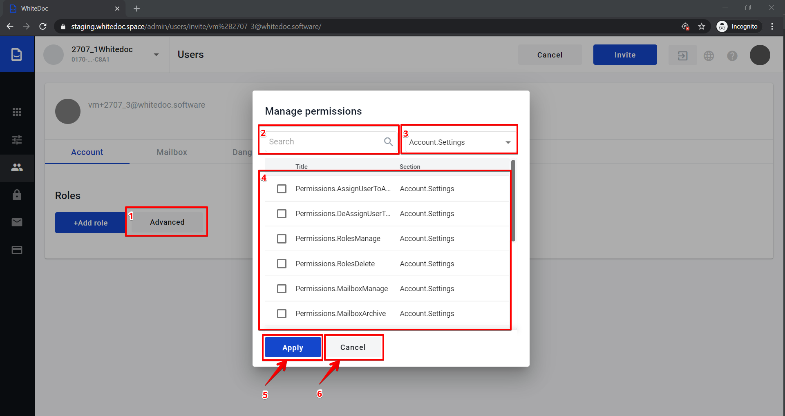

Add permissions to mailbox
==========================

For select permission to mailbox need go to (1)mailbox tab. On this tab presented mailboxes which related to this account.

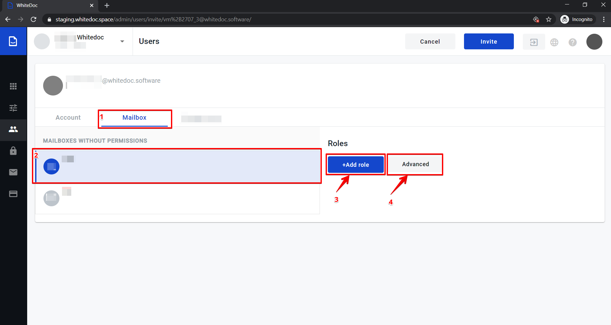

To add permissions to mailbox you can in the same way as to account. The main difference is we have to choose a mailbox to which permissions will be added.

5. If you have defined all permission which you want to provide to user click on Invite button in the header. If invite has created successfully at the top right corner of the page notification message will be shown,
and invitation letter will be sent to the email which has been provided. The process of the invitation will be evolved in two directions, depending on whether we are inviting new or existing user.

.. warning:: `Behaviour of invite internal user <usersInviteInternal.html>`_

.. warning:: `Behaviour of invite external user <usersInviteExternal.html>`_

.. _create-users:

Create one user
===============

As administrator of account you can create users with verified and activated domain. It can be used if you working in company and you have to create corporate users.
How to add, verify and activate domain you can find by link :ref:`domains configuration <domains-configuration>`.

To create corporate user you have to do the following:

1. Navigate to https://staging.whitedoc.space/admin/users with administratore access

2. Click on "Create user" button

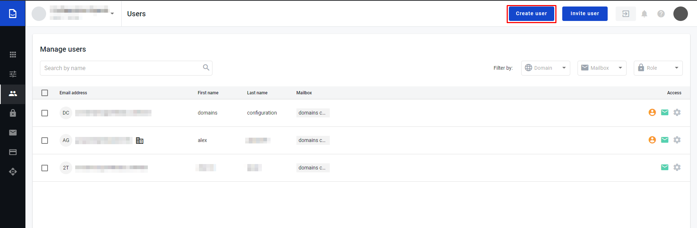

3. Fill required fields on the user creation form, such as: first, last names, first part of email and select domain part

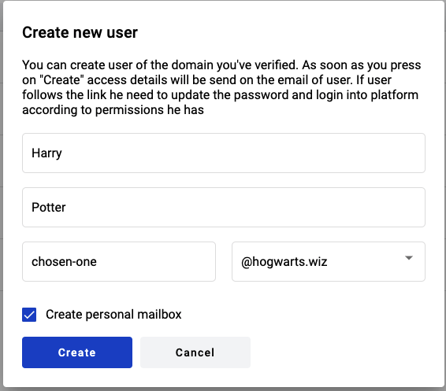

4. Click on "Create" button

5. After this steps user will be created and for admin opens user permissions configuration page. How to add specific permissions to the mailbox and/or account you can find :ref:`Add permissions to account` and :ref:`Add permissions to mailbox`.

6. As soon as permissions defined, click on "Save button" in the header of the page and user permissions will be applied

.. _howToAuth:

How to authorized as corporate user?
====================================

As soon as administrator of the account created users they get email with instructions.

1. Open email "You are registered on the electronic document management platform"

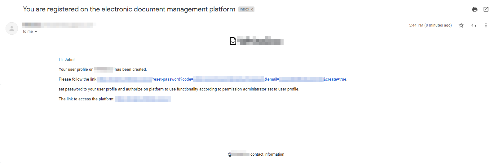

2. Follow the link to create password to user profile

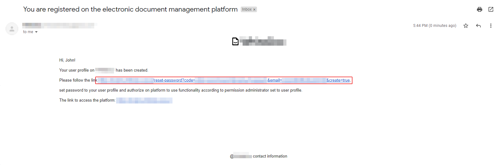

3. Set password and confirm it

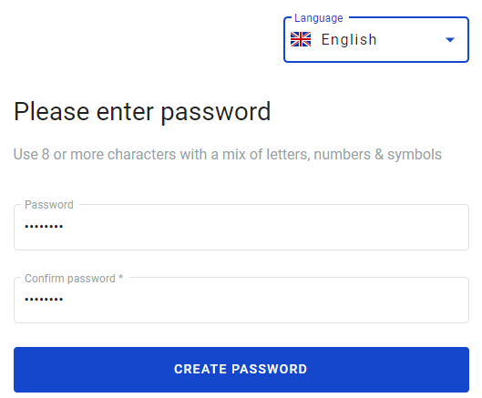

4. Authorize on platform using credentials above

5. Now user can use platform according to the permissions were set

Create any quantity of users
============================

As administrator of account you can create users with verified and activated domain. It can be used if you working in company and you have to create corporate users.
How to add, verify and activate domain you can find by link :ref:`domains configuration <domains-configuration>`.

To create more than one user you can click on "Create" button in header and select recpective option "Create users". Modal window appeares and you will be able 
to download the example of the file for massive user creation.

You can open the file using any tool which support .xlsx format. Also, you have to save the file in this particular format, so don't change extention.

What is the content of the file?
================================

File contains defferent qunatity of sheets and it depends on qunatity of Mailboxes in the particular account.

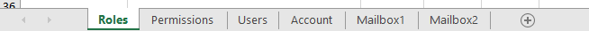

1. First sheet is "Roles". On this sheet are showing all roles which avaliable for particular account. If you want to clarify what exact role does, you can get this
information using UI or API. Also, roles information optionaly can be used on the Account and Mailbox sheets (we will observe it below).

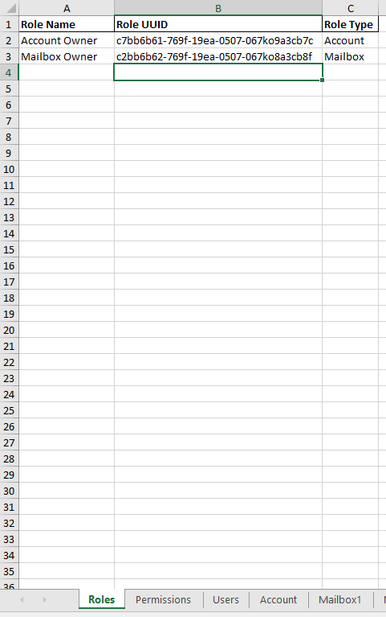

2. Second sheet is "Permissions". On this sheet are showing permissions which can be used on the Account and Mailbox list.

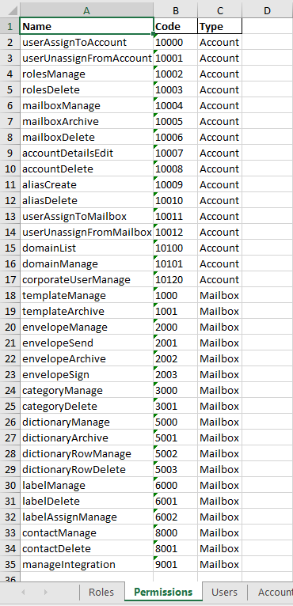

3. Third sheet is "Users". There are we have to fill users data (first name, last name and email). According to theese data users would be created.

.. warning:: **Please note!** All users in the list have to have relation to verified domain(s). So if you decided to add user to the list from unverified or inactive domains, all process of users creation will be stoped.

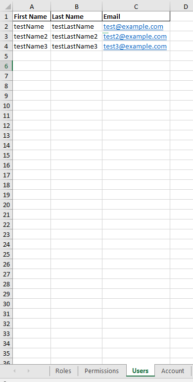

4. Fourth sheet is "Account". This sheet is serves to set access levels to account for particular users from the list users. You can set access to account using roles or permissions.

.. warning:: **Please note!** If you add incorrect email to the sheet it will not be added to the platform.

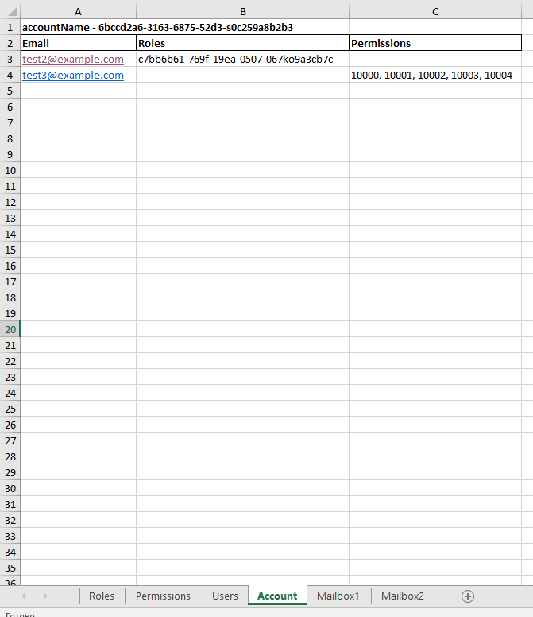

5. Fifth and the next sheets are "Mailboxes". Each sheet has identification of the mailbox in the top of the sheet. You can set access to mailbox using roles or permissions.

.. warning:: **Please note!** If you add incorrect email to the sheet it will not be added to the platform.

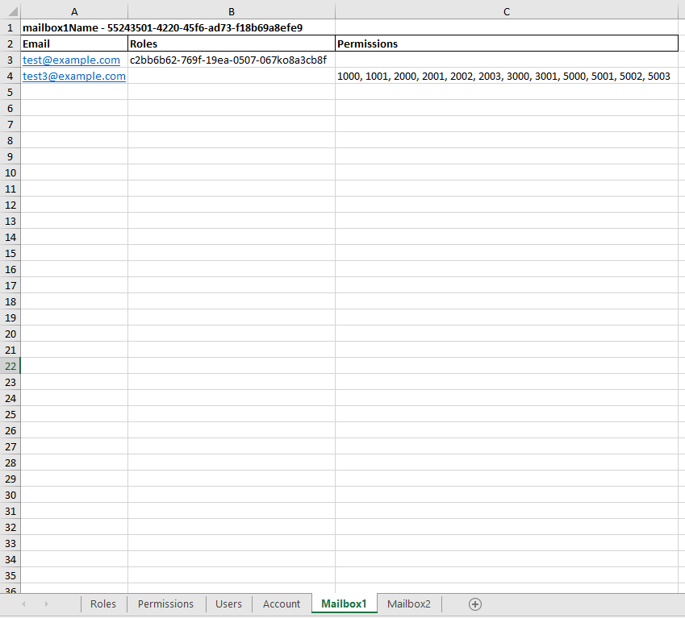

As soon as you fill the file with data you need you can upload the file and create users. All users get emails 
and have to follow the instructions as described in the :ref:`How to authorized as corporate user? <howToAuth>`