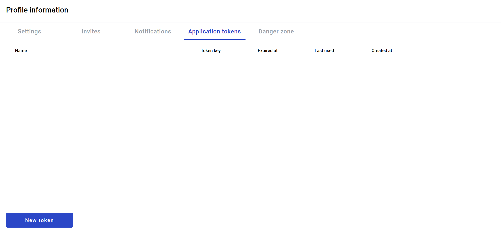
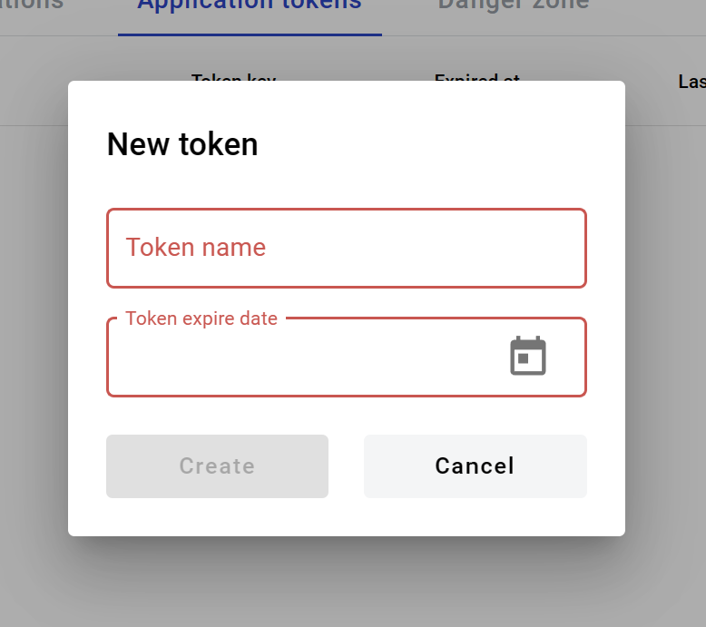
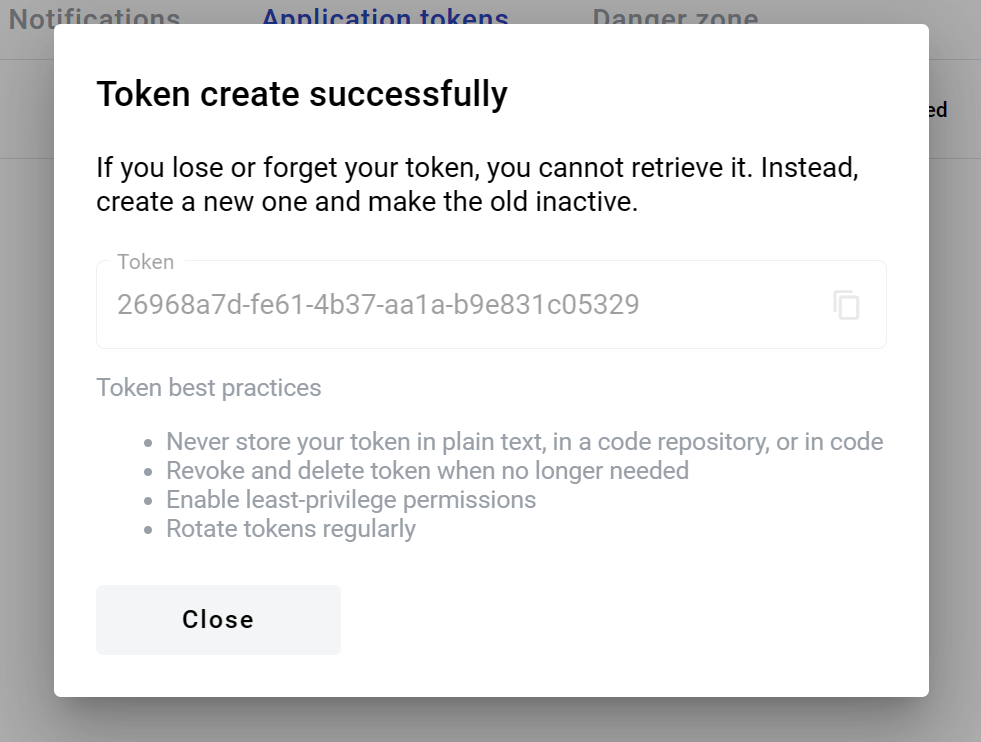
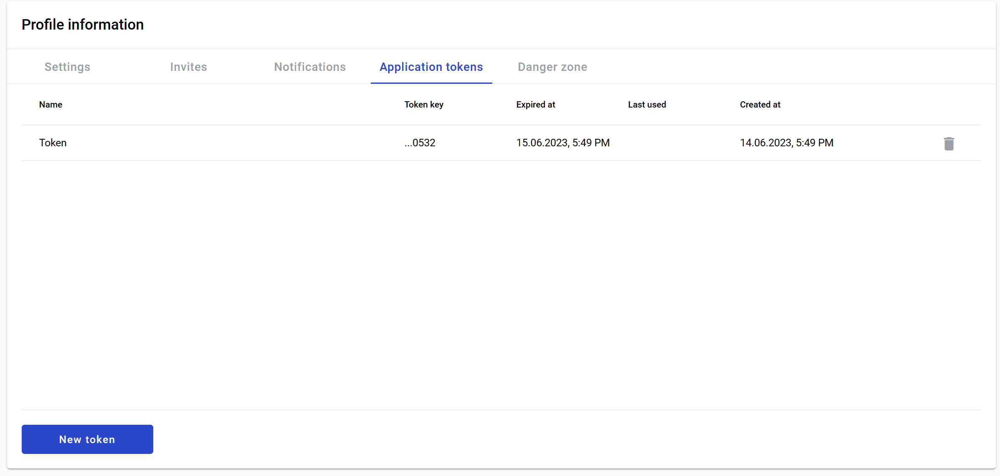

.. _appToken:

==================
Application tokens
==================

.. note:: This feature can be disabled by instance administrator. In such case possibility to create new tokens will be disabled. All previously existing tokens will continue beeing valid (up to expiration date).

You can create authorization tokens for use with API and 3rd party integrations. To do so:

1. Go to /profile?activeTab=application-tokens page

2. Click on New token button
3. Fill in Token name and Token expire date

4. Confirmation window will open. Make sure to copy your token because this will be only time you see it. Also make sure to read token best practices

.. warning:: It will be impossible to see your token after this window is closed.

5. All done. Now you can see list of your tokens on this page and revoke them if needed.

.. note:: You will receive email notification before token expiration in 30 and 1 days before it expires.