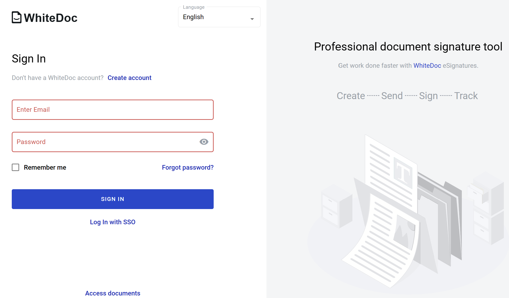

.. _login:

=======
Sign in
=======

To authorize on the platfor platform:

1. Open /auth/login page

2. Enter you email and password and click on "Sign in" button

Additionally you can "Remember" the email you've entered for next signs in on platform, to do this set checkbox on "Remember me" text. If you forgot password and want to reset it, click on "Forgot password?" link and follow the instructions. If your password has been expired according to the :ref:`password policy <passwordPolicy>` and you are trying to sign in to platform, instead of successful authorization you will be redirected to special page for password renewal.