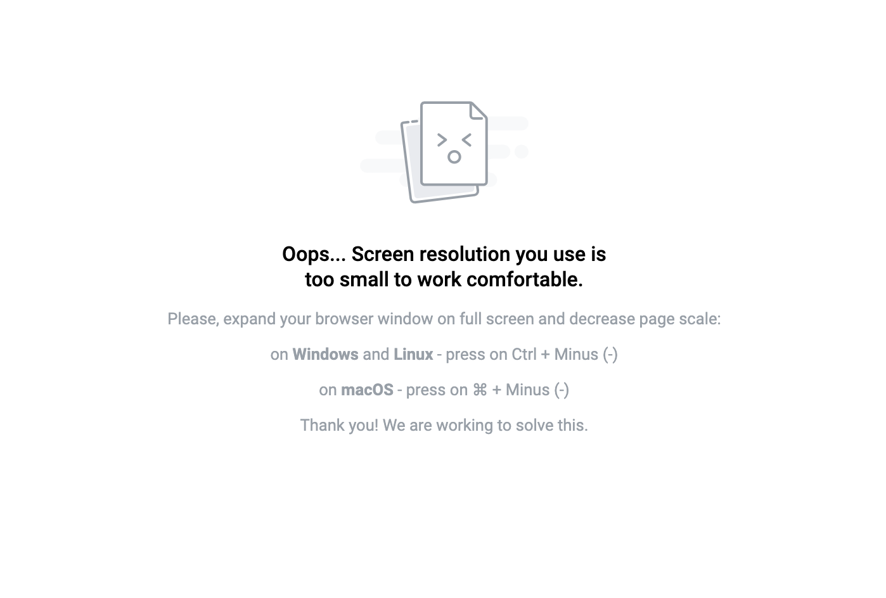
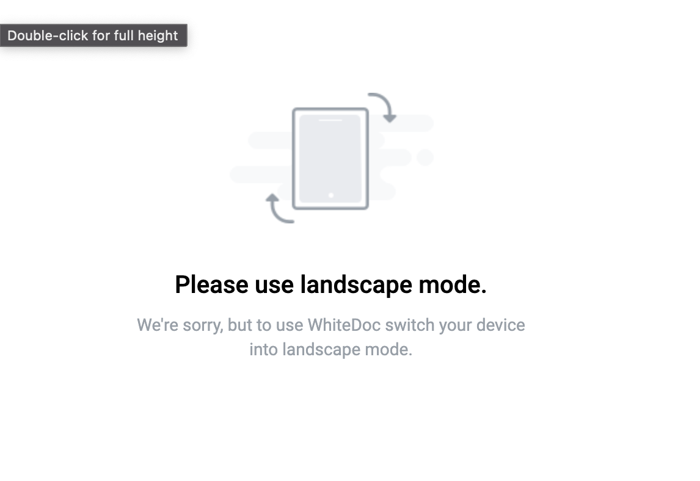

===============================================
Devices and screen sizes for work with platform
===============================================

**For convenient work with the service, the user must have one of 3 types of supporting devices:**

1. Desktop computer.
2. Tablet.
3. Mobile phone.

At the stage of initialization or / changing the screen resolution, the system checks whether the current screen resolution
of the user is acceptable for further convenient work.

==================
Screen size limits
==================

**1. Desktop**

   minWidth = 1440,

**2. Tablet**

    minWidth = 756,
    maxWidth = 1439

**3. Mobile**

    minWidth = 320,
    maxWidth = 755,

If the user uses a screen resolution that is not suitable for working with the service, he will see a dummy notification
with instructions on what to do next.

=============
User messages
=============

**1. If the user is using a desktop computer, they will be prompted to:**

 "Oops... Screen resolution you use is too small to work comfortable.
 Please, expand your browser window on full screen and decrease page scale:
 on Windows and Linux - press on Ctrl + Minus (-)
 on macOS - press on command button on keyboard + Minus (-)
 Thank you! We are working to solve this."

**2. If the user is using a mobile or tablet device, they will be prompted to change it orientation to album or portrait:**

.. image:: ./pic_deviceAndScreensForWork/mobilePortraitMsg.png
   :width: 600
   :align: center
