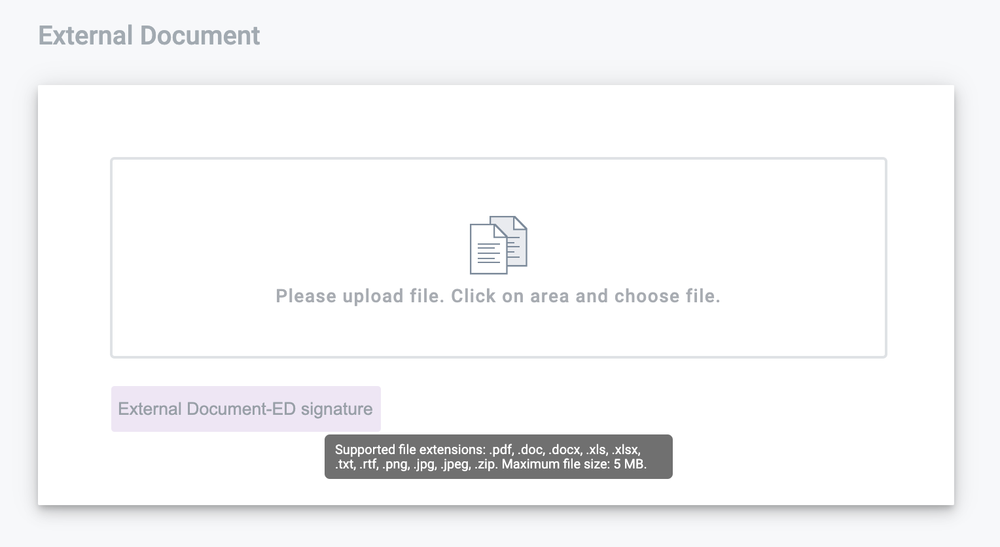
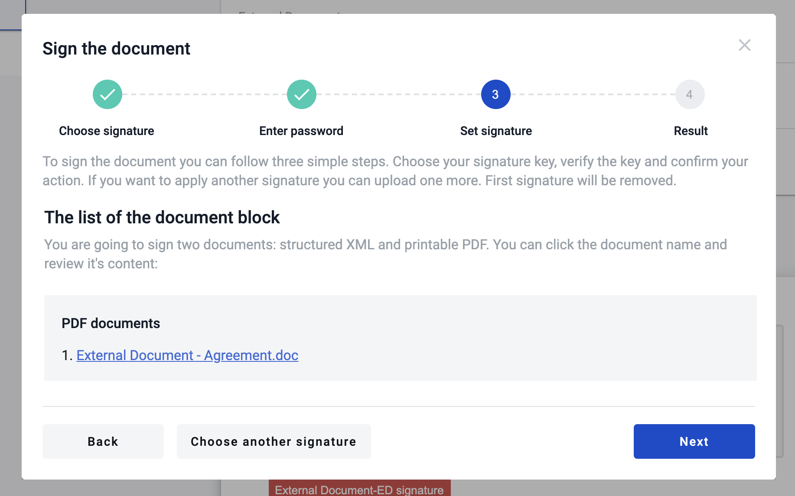

=================
External Document
=================

.. toctree::

---------

How to upload the external document?
====================================

1. Click to upload zone.

2. Choose file.
3. When the upload is finished - you will see name of file inside uploading section. Also you could choose another file before you send envelope.

.. image:: pic_externalDocument/UploadedAgreement.png
   :width: 600
   :align: center

4. To send envelope - you should fill other field('s) and upload another external document('s) assigned to your role.

External document signing process
=================================

For signing external document used only electronic digital signature. And signature should be set at template page.

Process of signing external document has only one difference from signing internal document.
In case of signing external document electronic digital signature applied only to .pdf file version(no .xml).

