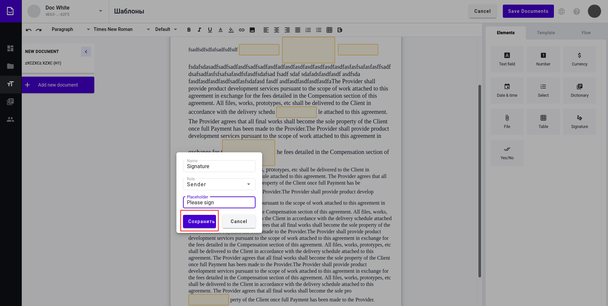

===========
Sign Field
===========

.. toctree::

Sign field is a field that allows user to sign our documents online.

Create Sign Field
=================

1. Navigate to https://staging.whitedoc.space/template/form/editor

2. Drag and drop sign-field to the document

.. image:: assets/sign-field-icon.png
   :width: 600
   :align: center

3. Form should appear

.. image:: assets/sign-field-form.png
   :width: 600
   :align: center

4. Fill the name of the field (Should be unique per document)

.. image:: assets/sign-field-form-name.png
   :width: 600
   :align: center

5. Choose Role to fill this field by clicking on "Role" input (default role is Sender)

.. image:: assets/sign-field-form-role.png
   :width: 600
   :align: center

5. Choose Role to from the list by clickin on role name

.. image:: assets/sign-field-form-role-select.png
   :width: 600
   :align: center

6. Fill the placeholder for this field (Not mandatory, if you won't fill this field, name will be used as placeholder)

.. image:: assets/sign-field-form-placeholder.png
   :width: 600
   :align: center

7. Click save

8. Field added

.. image:: assets/sign-field-added.png
   :width: 600
   :align: center

Cancel Sign Field
=================

1. Navigate to https://staging.whitedoc.space/template/form/editor

2. Drag and drop sign-field to the document

.. image:: assets/sign-field-icon.png
   :width: 600
   :align: center

3. Form should appear

.. image:: assets/sign-field-form.png
   :width: 600
   :align: center

4. Click "Cancel" button. Field won't be added

.. image:: assets/sign-field-form-cancel.png
   :width: 600
   :align: center

Edit Sign Field
=================

1. Navigate to https://staging.whitedoc.space/template/form/editor

2. Click on the sign field in the document

.. image:: assets/sign-field-added.png
   :width: 600
   :align: center

3. Edit field form should appear on the right side

.. image:: assets/sign-field-edit-form.png
   :width: 600
   :align: center

4. Click on "Delete" button will delete field and close edit form

.. image:: assets/sign-field-edit-form-delete.png
   :width: 600
   :align: center

5. Click on Cancel will close edit form

.. image:: assets/sign-field-edit-form-cancel.png
   :width: 600
   :align: center

6. You can change parameters the same way as described in "Create Sign Field"

.. image:: assets/sign-field-edit-form-fields.png
   :width: 600
   :align: center

7. Click on "Save" will Save all the changes you mad and close edit form

.. image:: assets/sign-field-edit-form-save.png
   :width: 600
   :align: center

Fill Sign Field
=================

1. Navigate to https://staging.whitedoc.space/envelope/create/:uuid (where uuid is uuid of your template with signature field)

.. image:: assets/envelope-editor.png
   :width: 600
   :align: center

2. Click on signature field

.. image:: assets/envelope-signature.png
   :width: 600
   :align: center

2. Popup must open

.. image:: assets/envelope-signature-popup.png
   :width: 600
   :align: center

3. Draw your signature on the empty area by pressing left side on the mouse and dragging it around. You have to draw at least 0.5 sec to complete validation of the field

.. image:: assets/envelope-signature-popup-signing.png
   :width: 600
   :align: center

4. Click on "Clear" button to reset draw area

.. image:: assets/envelope-signature-popup-clear.png
   :width: 600
   :align: center

5. Click "Sign" to insert your signature to the field (can't be empty)

.. image:: assets/envelope-signature-popup-save.png
   :width: 600
   :align: center

6. Click "Cancel" to close popup without changes

.. image:: assets/envelope-signature-popup-cancel.png
   :width: 600
   :align: center

7. After clicking "Save" you will see your signature in the document

.. image:: assets/envelope-signature-ready.png
   :width: 600
   :align: center

8. You can't edit signature you can only replace it by clicking on the picture of your signature and repeating steps 2, 3 and 5
