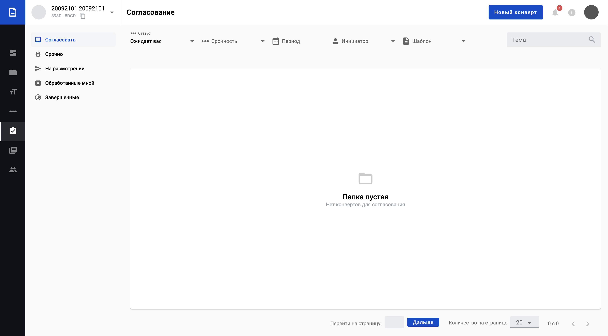
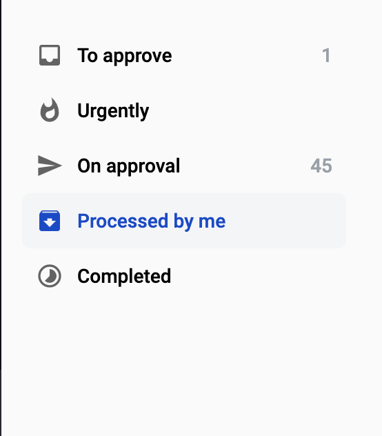
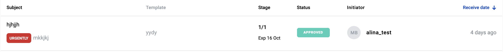
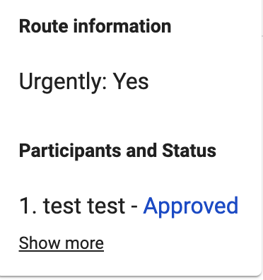

===================
Approve management
===================

.. toctree::

In this section we will discuss the following topics:

1. How to Manage Approvals.

2. How to filtering Approvals.

3. How to use Approvals folders.

4. How to check Approvals Flow.

5. How to complete or reject envelopes

Approval is a module with the functionality of viewing the list of envelopes for reconciliation, paginator, filters, search for envelopes.

* Access to this menu is possible only in the presence of appropriate permissions.

* In this page user can see folders (in left side).

* Filters and search witch user can change (in top side).

* In the main screen user can see table with envelopes list what matches the set filters or search query.

* Page url is automatically set filters, so user can copy/send url of page to other user, and user can see filtering content from url.
* In the bottom of page user can see paginator for change listing page.

* When you click on the status in the tooltip displays the entire history of the approval flow of the envelopes.

* When user click show more button in tooltip, for user opening approver comments.
