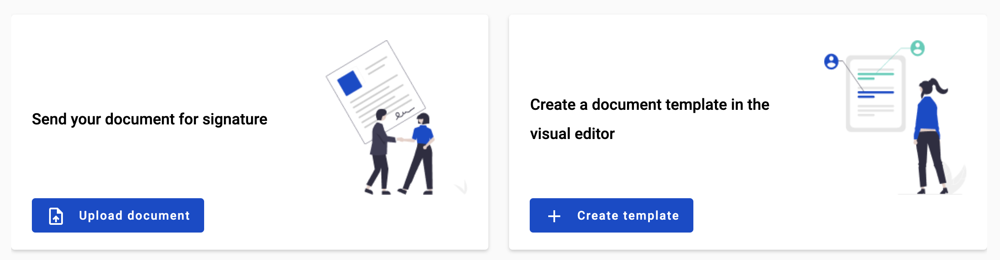
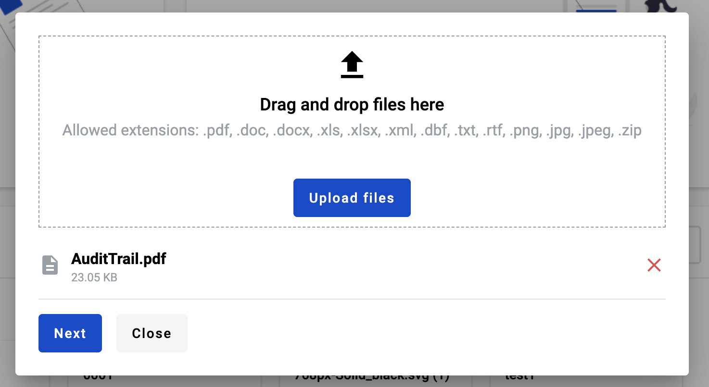
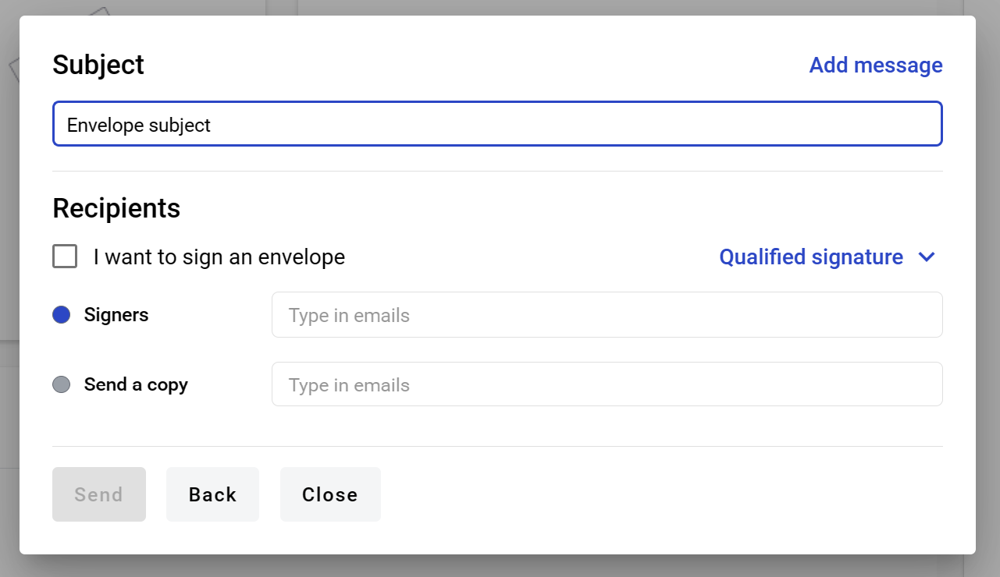
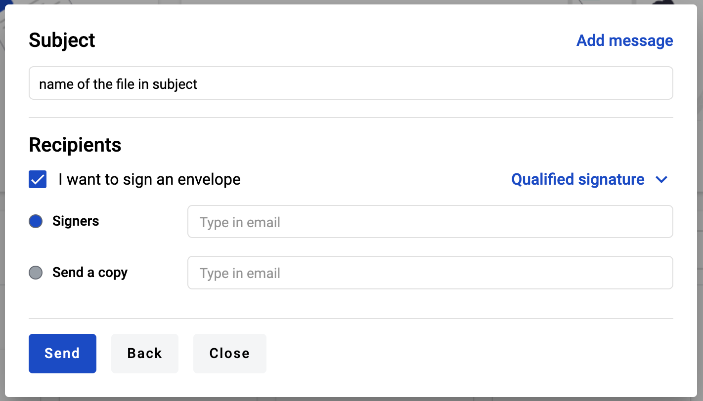
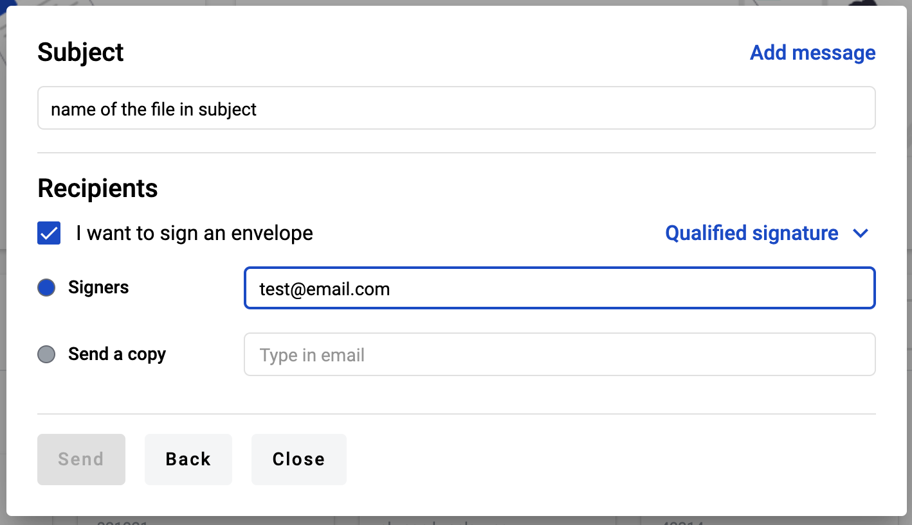
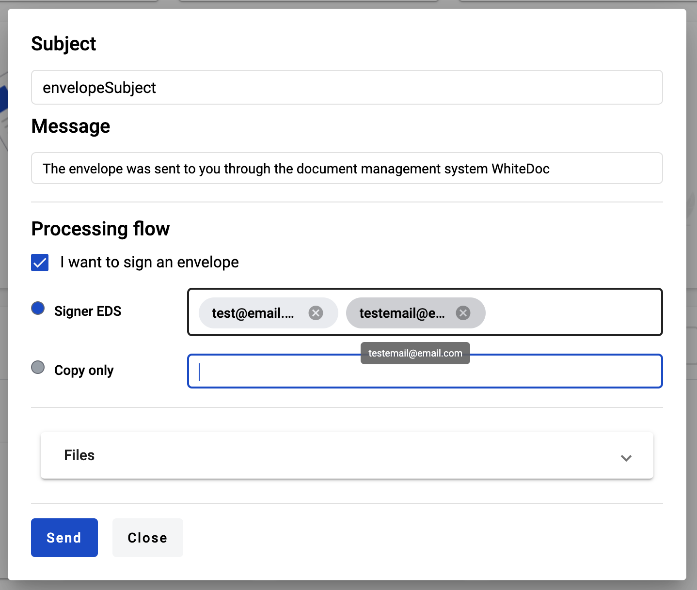

.. _dashboard:

==================
Dashboard overview
==================

Dashboard has two blocks for quick actions - quick send of file as copy or for sign and template creation.

How to send external document using quick send functionality?
=============================================================

If you want to send external document (such as image, document, archive) to anyone in a quick way you can use quick send functionality. To do so:

1. Open dashboard and click on button "Upload document" in quick send block

2. After click on "Upload document" button modal window will open. Here you can upload file for quick send (5MB per file max and 25MB total max)

3. After file upload you can see all files in the list on screenshot above
4. To continue quick send click "Next" button. You will be redirected to the envelope properties page, where you need to fill envelope details

5. You can select EDS or E-ink signature type (some can be disabled depending on instance settings). If you also want to sing document(s) you can click on checkbox "I want to sign an envelope" to be added as one of signers

6. To specify recipients you have to click on the input against to respective role type (Signers or Send a copy) and type recipients emails (they can be divided by enter or space buttons on keyboard)

7. After entering emails you will be see all contents of the email on mouse hover

8. When you will finish all required actions with envelope properties you can click "Send" button and envelope will be sent. If "I want to sign an envelope" checkbox was selected you will be automatically redirected to envelope signing modal window