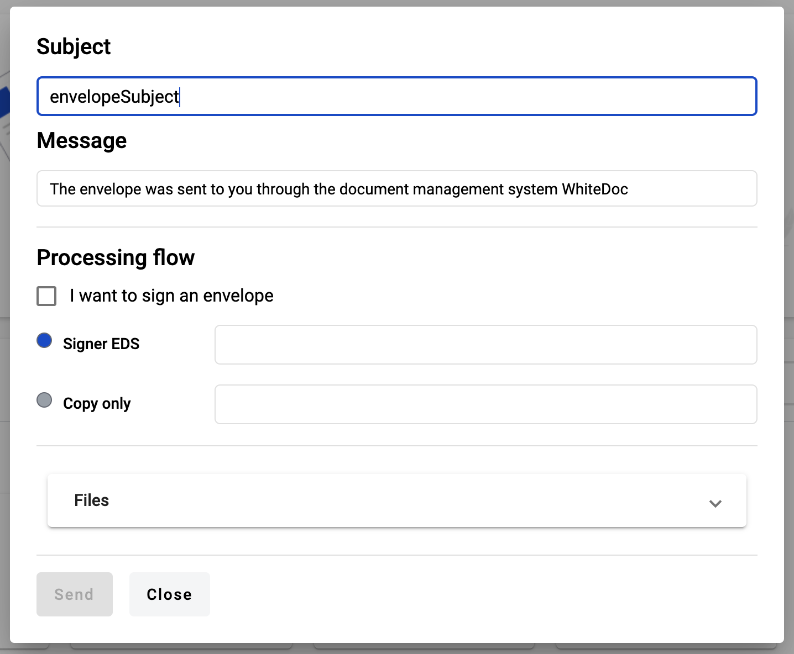

.. _dashboard:

==================
Dashboard overview
==================

.. toctree::

On dashboard user has two blocks for quick actions, first one is quick send of file as copy or for sign and second one
is template creation

How to send external document using quick send functionality?
=============================================================

If you want to send external document (such as image, document, archive) to somebody in quick way you may use quick send functionality.

To do this follow instructions:

1. Open dashboard and click on button "Upload document" in quick send block

.. image:: pic_dashboardOverview/dashboardOverview.png
   :width: 400
   :align: center

2. As soon as you click on "Upload document" modal window for drag and drop files opens and over it opens file manager of you computer. Where you can select files to upload (you're able to upload any quantity of files, but limit of the all of them shouldn't be more than 25MB and each file shouldn't be more than 5MB or another limits if instance you're using has one)

.. image:: pic_dashboardOverview/dragAndDropModal.png
   :width: 400
   :align: center

3. When you select files and confirm selection on your file manages you can observe all files in the list on screenshot above

4. To continue quick send click "Next" button. You will be redirected to the envelope properties page, where you have to clarify
envelope details such as: subject, message (optional), recipients (it could be e-ink, EDS (if instance you're working on supports this type of signature) signers or copy roles)

5. You can specify signature type Qualified or e-ink signature. If instance you're working on doesn't support Qualified signature you will not be able to signature type selector. If you also want to sing document(s) you can click on checkbox "I want to sign an envelope" and after envelope creation you will be able to sign envelope

.. image:: pic_dashboardOverview/envCreationModal2.png
   :width: 400
   :align: center

6. To clarify recipients you have to click on input against to respective role type (Signers or Send a copy) and write recipients emails divide them by enter or space button on keyboard

.. image:: pic_dashboardOverview/envCreationModal3.png
   :width: 400
   :align: center

7. After entering email you are able to observe full content of the email on mouse hover

.. image:: pic_dashboardOverview/envCreationModal4.png
   :width: 400
   :align: center

8. When you finish all required actions with envelope properties you may click on "Send" button and envelope will be created.
If you select checkbox "I want to sign an envelope" and Qualified signature type, EDS signature modal window opens automatically when envelope will be created and
you have to sign all documents. If you don't select checkbox you will be just redirected to envelope.
