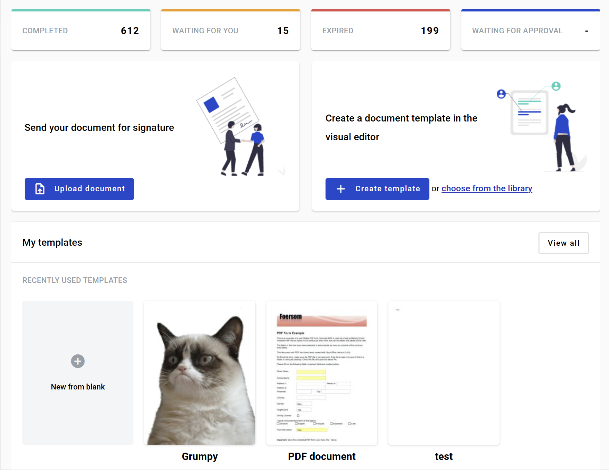
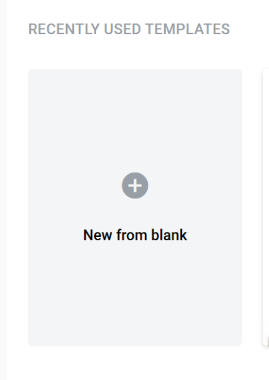
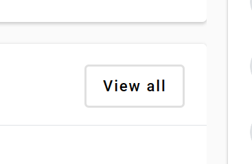
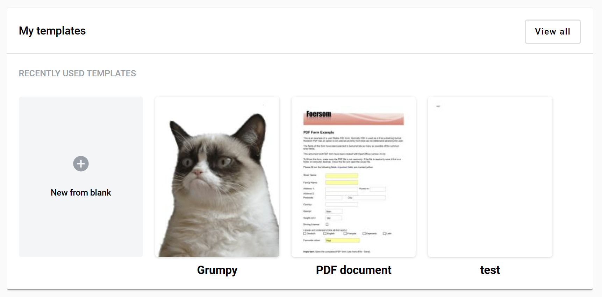

====================================
Recently used templates on dashboard
====================================

Recently used templates block allows you to create new template from dashboard, see the list of recently used templates and open templates list form from dashboard page:

1. To open template creation form from dashboard click on "New from blank" button

2. To open template list page from dashboard click on "View all" button

Recently used templates section
===============================

1. Templates which were used at least once will be displayed at the recently used templates section

2. You can click on recently used template to create an envelope from it
3. Maximum quantity of the templates at this particular form is 4 templates