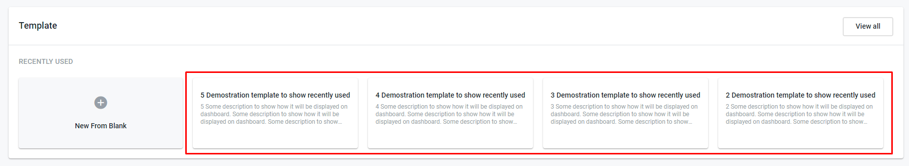

====================================
Recently used templates on dashboard
====================================

.. toctree::

Recently used templates block allows to user create new template from dashboard, see the list of the last fourth recently used templates, open edition form of the particular recently used template and open templates list form from dashboard page.

.. image:: pic_dashboard/recentlyUsedTemplatesMainView.png
   :width: 600
   :align: center

Open template creation form from dashboard
==========================================

Click on "New From Blank"

.. image:: pic_dashboard/recentlyUsedTemplatesNewFromBlank.png
   :width: 600
   :align: center

User will be redirected to template creation page https://staging.whitedoc.space/template/form/create 

Open template list page from dashboard
======================================

Click on "View all"

.. image:: pic_dashboard/recentlyUsedTemplatesViewAll.png
   :width: 600
   :align: center

User will be redirected to template creation page https://staging.whitedoc.space/template/list?s=mailbox

Recently used templates displaying on dashboard
===============================================

1. If user use template at least one time the template will be displayed at the recently used templates form on dashboard
2. If user click on recently used template it will open particular template for edition
3. Maximum quantity of the templates at this particular form is 4 templates

.. image:: pic_dashboard/recentlyUsedTemplates4Templates.png
   :width: 600
   :align: center

4. If user creates new envelope using new template and he has already had 4 templates at recently used the oldest one will disapear and new one will be shown to the user

