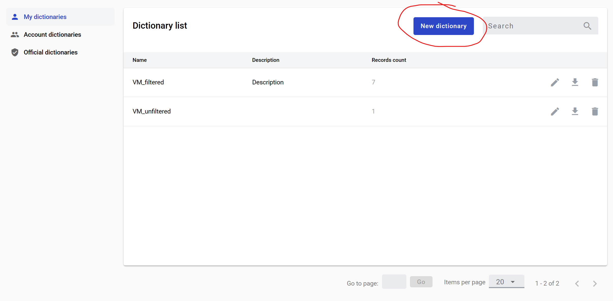
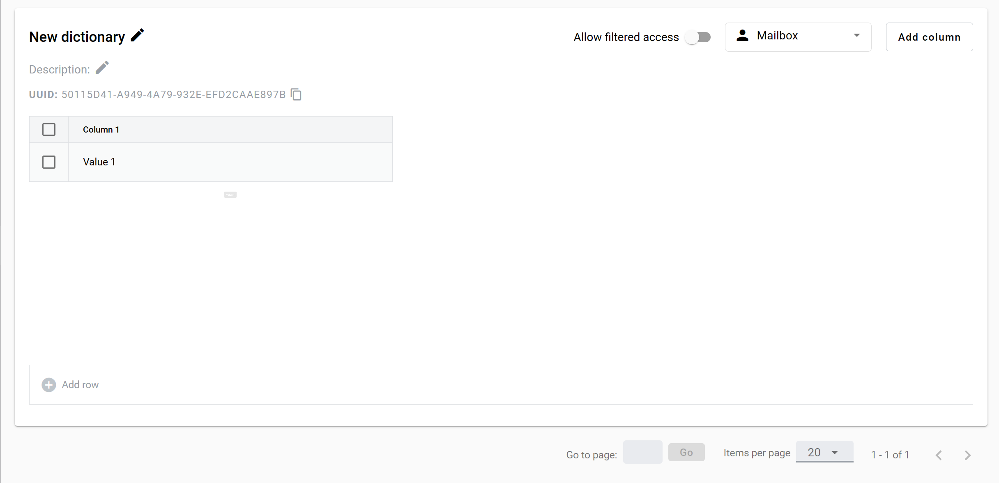
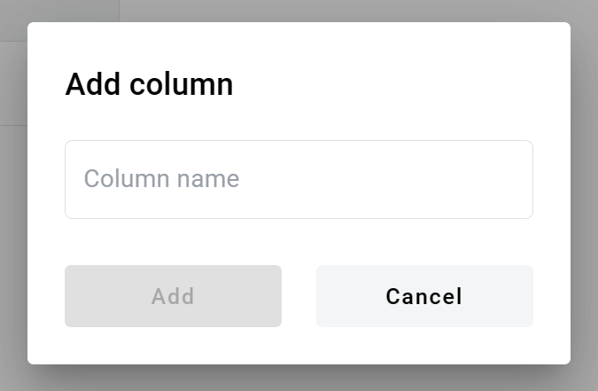
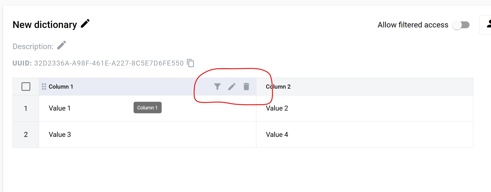
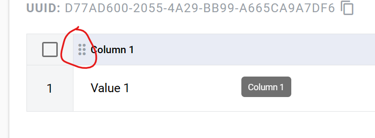

==========
Dictionary
==========

Dictionary is a table of records, e.g. list of employees (Name, Surname, Age, Address).

Creating a dictionary
=====================

.. note:: This functionality is blocked if mailbox has no permission. Dictionary editing is available only to mailbox which is an owner of this dictionary.

**Permissions:**

*Dictionary manage* - allows to create new dictionaries, add columns, change columns order, edit columns, change name, description and access level of dictionaries.

*Dictionary delete* - allow to delete dictionaries.

*Dictionary row manage* - allow to create records and change values in records.

*Dictionary row delete* - allow to delete records.

1. Navigate to https://platform_address_here/dictionary
2. Click on create dictionary button

3. New dictionary will be opened

4. New dictionary - default name of a dictionary. You can change it as needed (128 characters max)
5. Description - default description of a dictionary. You can change it as needed (256 characters max)
6. Allow filtered access - this attribute specifies if access to this dictionary will be filtered or full. If disabled - all records from a column will be available for choise in the envelope with dictionary field. If enabled - only values form matching rows will be returned. Values from other columns are used for row matching
7. Access level (mailbox by default) - specifies which mailboxes will have access to the dictionary

*Mailbox* - dictionary is visible to current mailbox only. In envelopes with this dictionary field records from this dictionary will be available to current mailbox only. Roles with other mailboxes will not be able to select data from this dictionary field.

*Account* - dictionary is visible to all mailboxes in this account. In envelopes with this dictionary field records from this dictionary will be available to mailboxes in current account. Roles with mailboxes from other accounts will not be able to select data from this dictionary field.

*Public* - dictionary is visible to all mailboxes. In envelopes with this dictionary field records from this dictionary will be available to any mailbox. Roles with any mailbox will be able to select data from this dictionary field.

8. Click on Add row button to add new row
9. You can select rows with a chechmark. If any rows are selected, Delete rows button will appear which allow you to remove rows
10. Click on Add column button to add new column
11. Enter a column name (64 characters max)

12. Hover over column header to see column edition options (filter, rename and delete)

.. warning:: `Behaviour of dictionary field after deleting a dictionary column <delete_behaviour.html>`_

13. Columns can be rearrenged via drag & drop by this icon (same order will be used in dictionary field creation menu)

Editing a record
================

1. Click on a table cell and enter a value (256 characters max)
2. Click checkmark to apply new value (also you can click outside of a cell)
3. Click cancel to revert changes

Filtering records
=================

Multiple filters connected by 'OR'. Filter types: Contains, Does not contain, Is equal, Is not equal, Is empty, Is not empty.

1. Click on a filter icon (appears on column header hover)
2. Select filter and enter value
3. Click on Add button
4. Column name with active filter will have the same color as filter
5. Filters are sorted by column order

Deleting a dictionary
=====================

1. Click on a delete icon on according dictionary on a dictionary list page
2. Confirm your action

.. warning:: `Behaviour of dictionary field after deletion a dictionary <delete_behaviour.html>`_

.. include:: delete_behaviour.rst