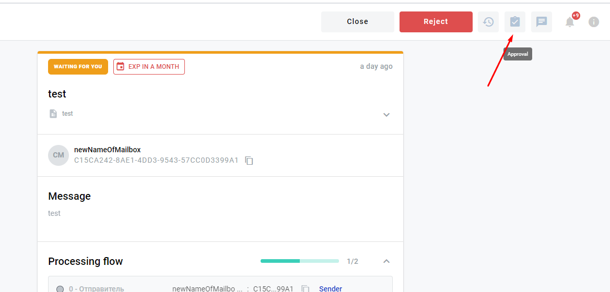
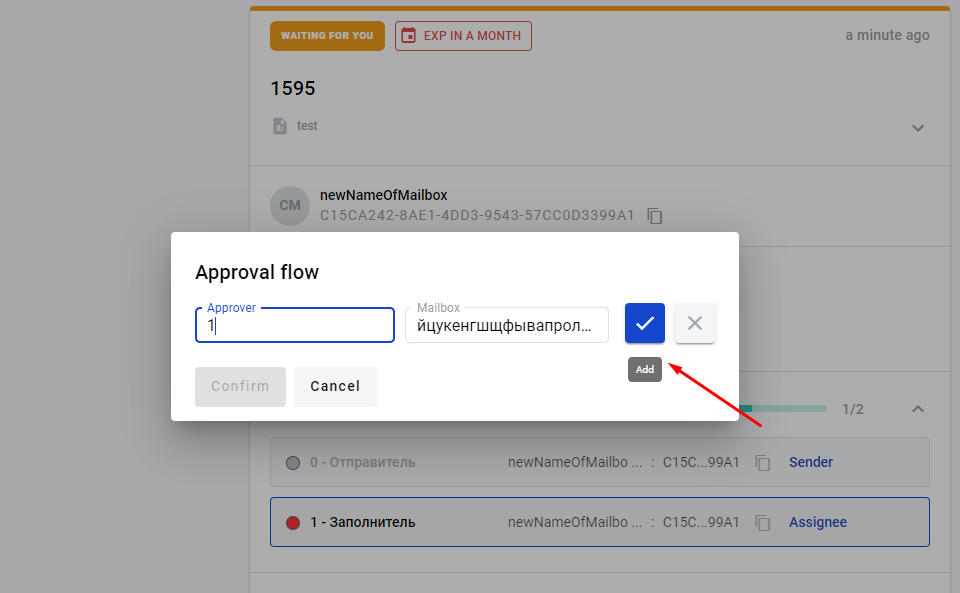
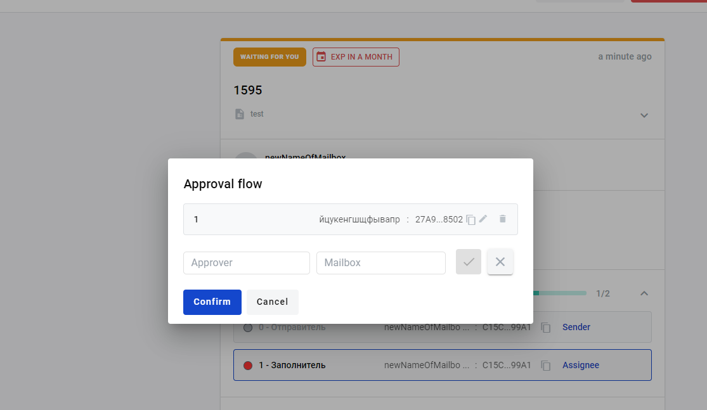
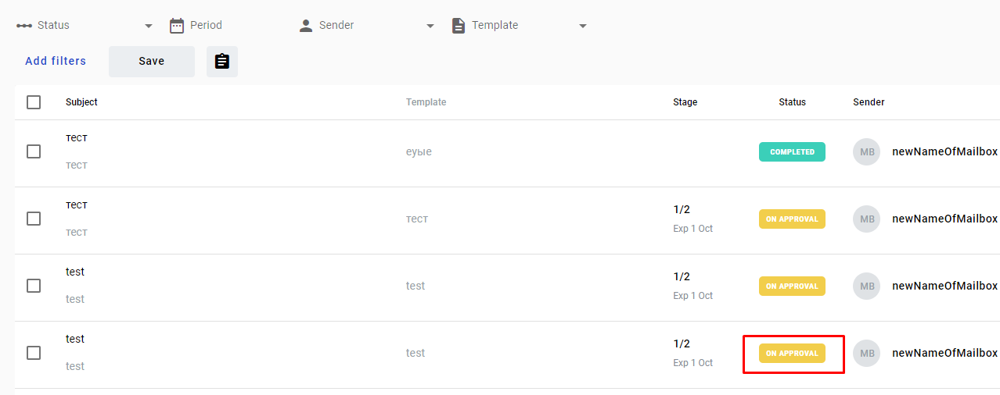
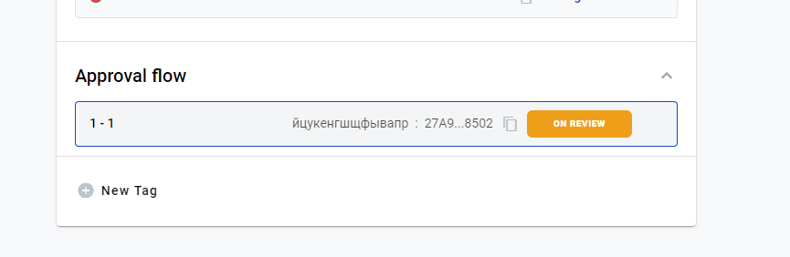
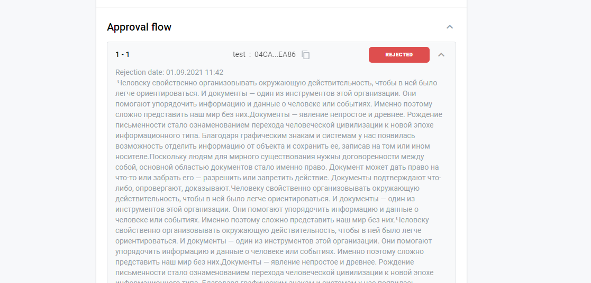
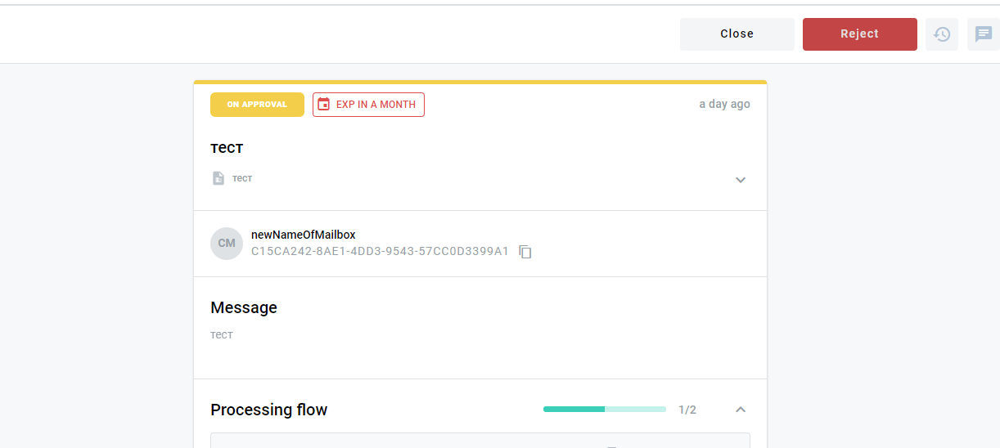

=========================
Envelope approval process
=========================

.. toctree::

---------

How to send envelope for approval
==========================================

1.User can send envelope in the "Waiting" status or a draft envelope for approval.Open envelope  in the "Waiting" status, in the upper right corner of the envelope,  click [Approval] button.

2.In the field "Аpprover" and "Mailbox" (you can search by the name of the mailbox or uuid code) input details of the approver.Click [Add] button. You can create  unlimited number of approvers.You can delete approver by clicking [Cancel]

3.After completing  approval form, click [Confirm] button.

4.When you sent the envelope for approval, its status is "On Approval".

5.You can view approval process, for this, you need go to envelope with the status "On Approval", select "Approval flow".

6.You can view comments and  envelope status.

7.When envelope  in the  "On Approval " status,user can reject the envelope.

8.After approval envelope returns to status "Waiting", and user can re-send the envelope for approval.

