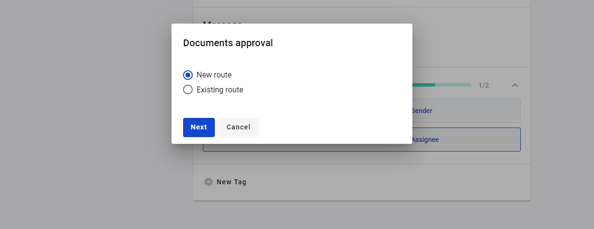
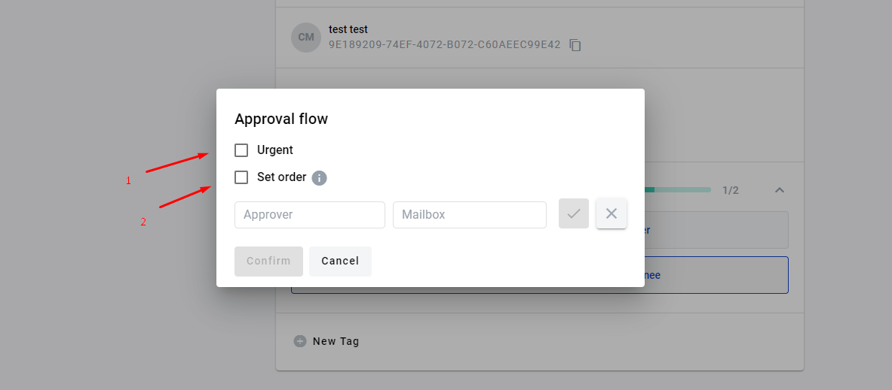
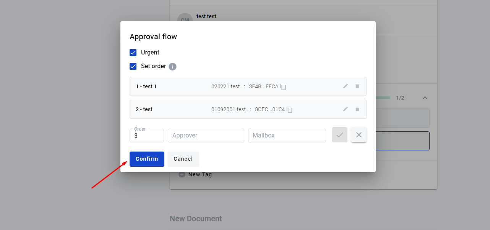
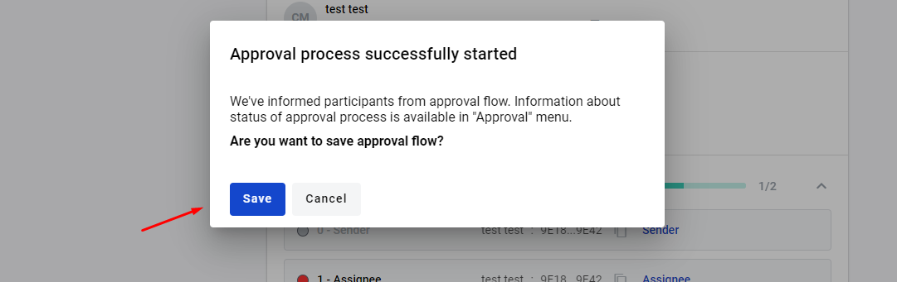
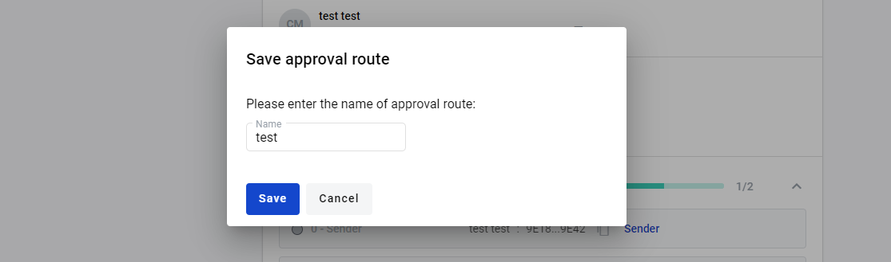
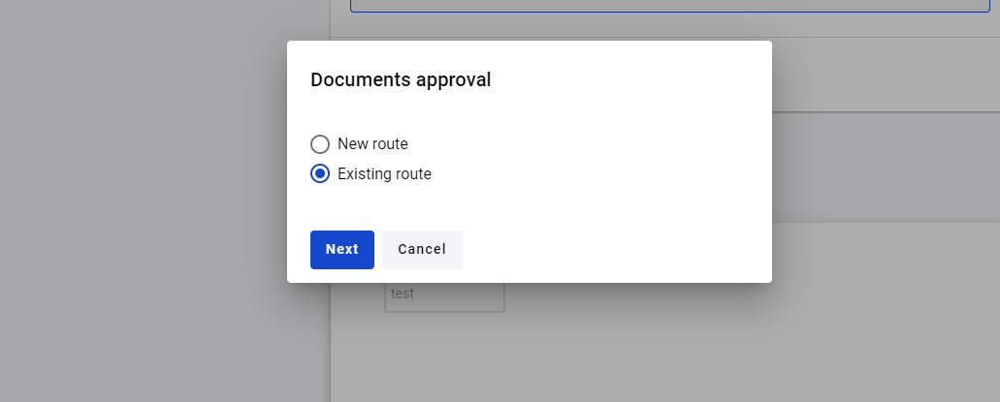
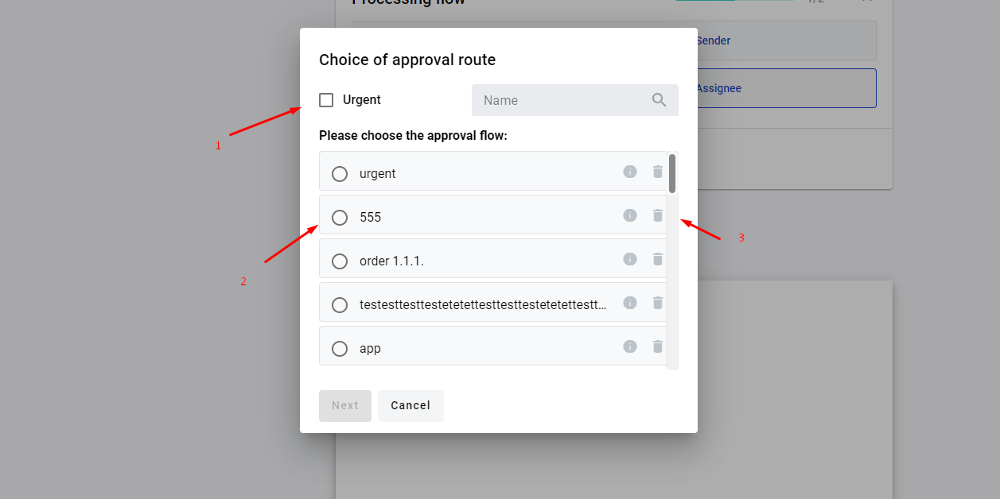

=========================
Envelope approval process
=========================

.. toctree::

How to send envelope for approval
=================================

1. User can send envelope for approval in the "Waiting" status or a draft envelope. To do this open envelope in "Waiting" status, in the upper right corner of the envelope header click on [Approval] button

.. image:: pic_approval/Screenshot_2.png
   :width: 600
   :align: center

2. In the input "Аpprover" and "Mailbox" (you can search mailbox by name or uuid) enter details of the approver and click on [Add] button. You can create unlimited quantity of approvers. You can delete approver by clicking on [Cancel] button

.. warning:: **Please note! You can't set approver mailbox to mailbox that's takes part in envelope processing or duplicate mailbox from approval flow.**

.. image:: pic_approval/Screenshot_4.png
   :width: 600
   :align: center

3. As soon as you finish approval flow creation you can click on [Confirm] button to start approval process

.. image:: pic_approval/Screenshot_5.png
   :width: 600
   :align: center

4. Envelopes which have been sent for approval have status "On approval"

.. image:: pic_approval/Screenshot_10.png
   :width: 600
   :align: center

5. You can view approval process, to do this you have to go to envelope with the status "On Approval" scroll down to "Approval flow" section and expand it

.. image:: pic_approval/Screenshot_6.png
   :width: 600
   :align: center

6. You're able to observe approval statuses and comments of approvers

.. image:: pic_approval/Screenshot_8.png
   :width: 600
   :align: center

7. While envelope has "On Approval " status, user that started approval process, can't process envelope further. In application is displayed only the last approval process. All data from previous approval process are available by API

.. image:: pic_approval/Screenshot_7.png
   :width: 600
   :align: center

8. Approver can reject or agreed approval and add comment for explaining his decision (optional)

9. When approver choose to reject approval - envelope approval process is ended here and approval process will be in the status rejected

10. When approver choose to agreed approval - envelope approval process is continue and next approver will receive this envelope for approval

11. When approval flow process is finished (all approvers agreed, someone from approvers reject), envelope returns to status "Waiting". User, that started approval can process envelope further or start new approval process

.. toctree::

How to use approval flow
========================

1. User can send envelope for approval in the “Waiting" or "Draft" status. To do this open envelope in respective status, at the upper right corner of the envelope header click on [Approval] button

2. Select New route

3. To add approver to the flow fill in “Approver” and “Mailbox” (you can search mailbox by name or uuid) inputs and click on [Add] button. You can create unlimited quantity of approvers. You can delete approver by clicking on [Cancel] button. You can mark envelope with "Urgent" status(1). When, you select "Urgent" status for envelope, user receives envelope marked "Urgent". User can change the order. To change the order user has to set checkbox “Set order”(2)

4. As soon as you finish approval flow creation you can click on [Confirm] button to start approval process

5. You can save the route

6. To save route, set name for route and click [Save] button

7. You can use saved routes. To do this on the first step of approval process select option "Use existing route"

8. Select saved route(2).You can delete route(3), and mark envelope with "Urgent" status(1)

9. After route selection, click [Next] button