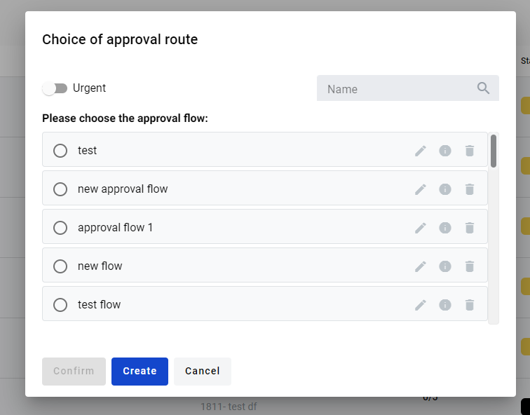
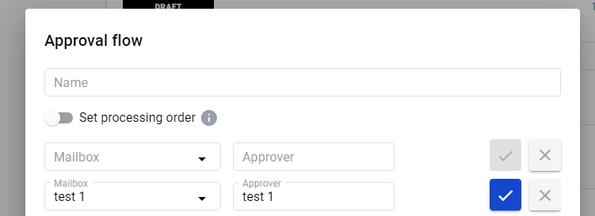
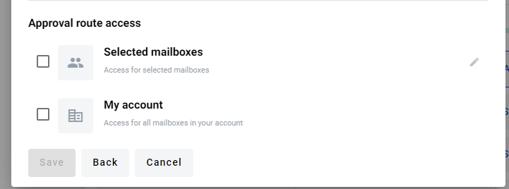
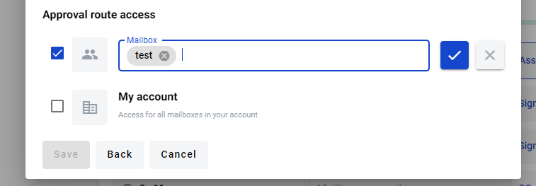

.. _send-for-approval:

=========================
Envelope approval process
=========================

.. toctree::

How to send envelope for approval
=================================

1. User can send envelope for approval in the "Waiting" status or a draft envelope. To do this open envelope in "Waiting" status, in the upper right corner of the envelope header click on [Approval] button

.. image:: pic_approval/Screenshot_2.png
   :width: 600
   :align: center

2. In the open modal window, user can select a saved route and send an envelope for approval.
   Also at this step, we can specify envelope as urgent. In the modal window, a search is available by name of route, and next to each route there is an info icon in which you can view all information about route.

3. In order to create a new route, click on the [Create] button
4. In the name field, write the name of the route. In the input "Аpprover" and "Mailbox" (you can search mailbox by name or uuid) enter details of the approver and click on [Add] button.
   You can create unlimited quantity of approvers. You can delete approver by clicking on [Cancel] button

.. warning:: **Please note! You can't set approver mailbox to mailbox that's takes part in envelope processing or duplicate mailbox from approval flow.**

5. User can specify access to route. Access can be granted to specific users from your account, or you can grant access to all account users.

6. Grant access to specific mailboxes click on edit access Selected mailboxes, and write name of mailbox

7. As soon as you finish approval flow creation you can click on [Save] button.
   After them, user has saved the route, he goes to the list of routes, selects desired route and click [Confirm] button.

8. Envelopes which have been sent for approval have status "On approval"

.. image:: pic_approval/Screenshot_10.png
   :width: 600
   :align: center

9. You can view approval process, to do this you have to go to envelope with the status "On Approval" scroll down to "Approval flow" section and expand it

.. image:: pic_approval/Screenshot_6.png
   :width: 600
   :align: center

10. You're able to observe approval statuses and comments of approvers

.. image:: pic_approval/Screenshot_8.png
   :width: 600
   :align: center

11. While envelope has "On Approval " status, user that started approval process, can't process envelope further. In application is displayed only the last approval process. All data from previous approval process are available by API

.. image:: pic_approval/Screenshot_7.png
   :width: 600
   :align: center

12. Approver can reject or agreed approval and add comment for explaining his decision (optional)

13. When approver choose to reject approval - envelope approval process is ended here and approval process will be in the status rejected

14. When approver choose to agreed approval - envelope approval process is continue and next approver will receive this envelope for approval

15. When approval flow process is finished (all approvers agreed, someone from approvers reject), envelope returns to status "Waiting". User, that started approval can process envelope further or start new approval process

