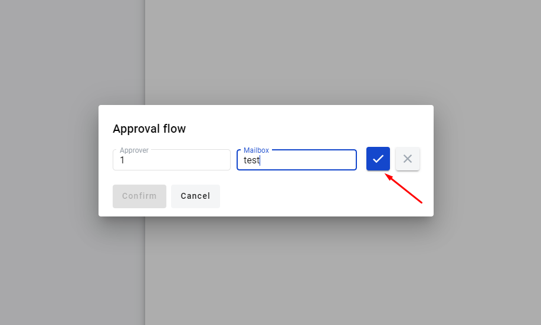
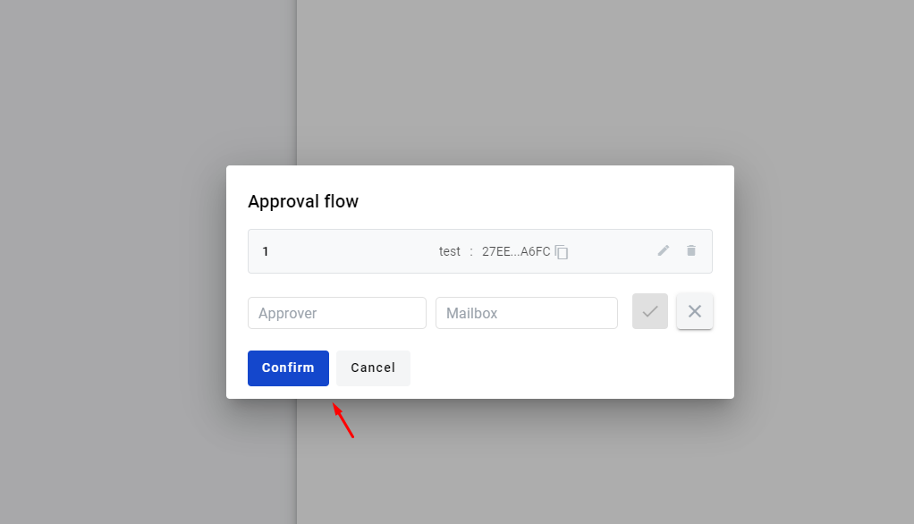
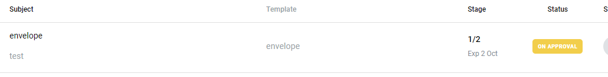
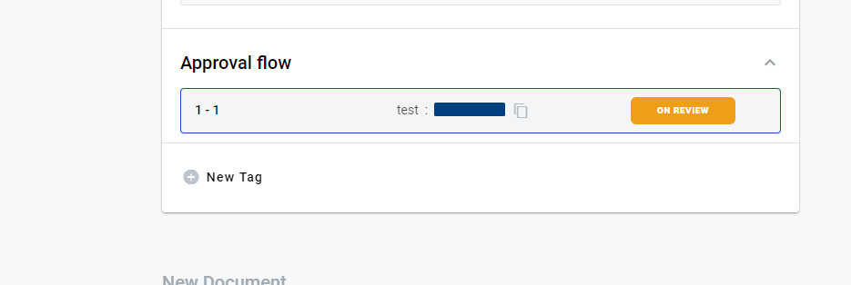
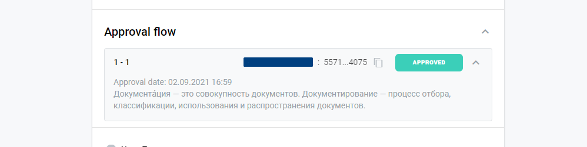
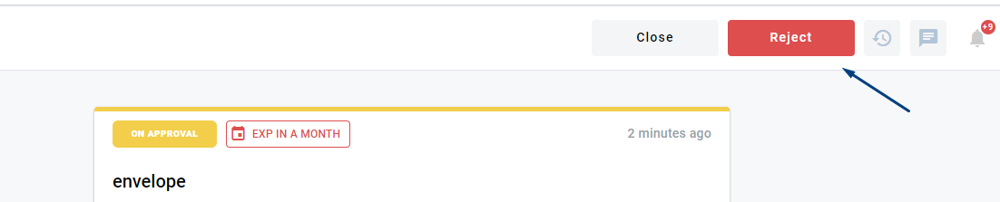

=========================
Envelope approval process
=========================

.. toctree::

How to send envelope for approval
=================================

1. User can send envelope for approval in the "Waiting" status or a draft envelope. To do this open envelope in "Waiting" status, in the upper right corner of the envelope header click on [Approval] button.

.. image:: pic_approval/Screenshot_2.png
   :width: 600
   :align: center

2. In the input "Аpprover" and "Mailbox" (you can search mailbox by name or uuid) enter details of the approver. and click on [Add] button. You can create unlimited quantity of approvers. You can delete approver by clicking on [Cancel] button.

3. As soon as you finish approval flow creation you can click on [Confirm] button to start approval process.

4. Envelopes which have been sent for approval have status "On approval".

5. You can view approval process, to do this you have to go to envelope with the status "On Approval" scroll down to "Approval flow" section and expand it.

6. You're able to observe approval statuses and comments of approvers.

7. While envelope has "On Approval " status user can only reject the envelope.

8. After approval envelope returns to status "Waiting", and user can re-send the envelope for approval or send it according to the general flow.