========
Comments
========

.. toctree::

---------

How to toggle comments section
==============================

1. Click on comments icon in header.

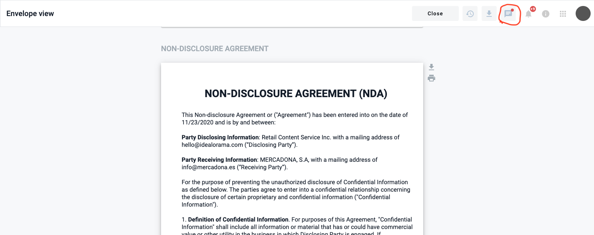

2. Comment section appears.

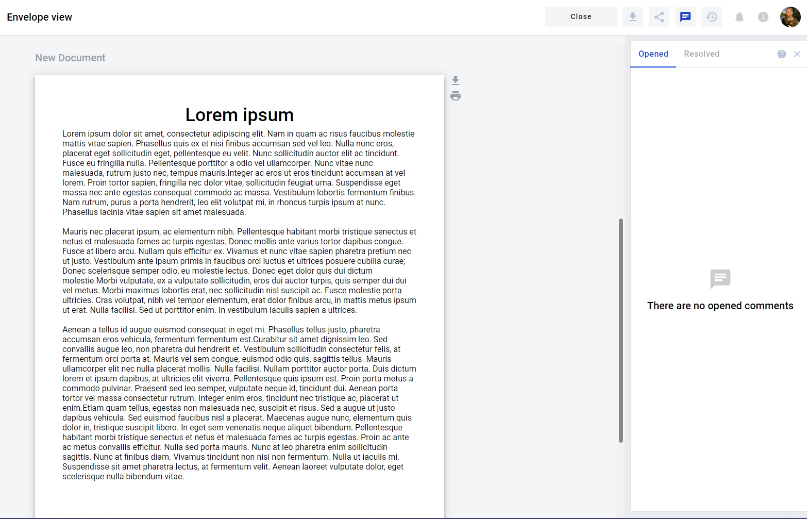

How to add comment
==================

.. note:: **Please note!** It's possible to add comments only to saved drafts or envelopes.

.. note:: **Please note!** Comments can be applied only to whole section, table or table-cell

1. Select place where you want to add comment.

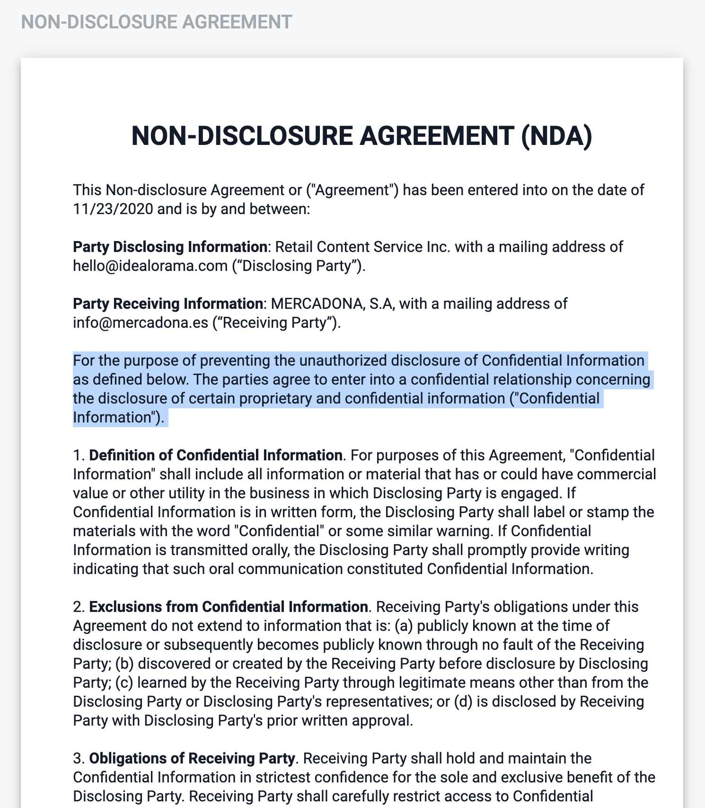

2. Right-click on the desired paragraph and select "Comment".

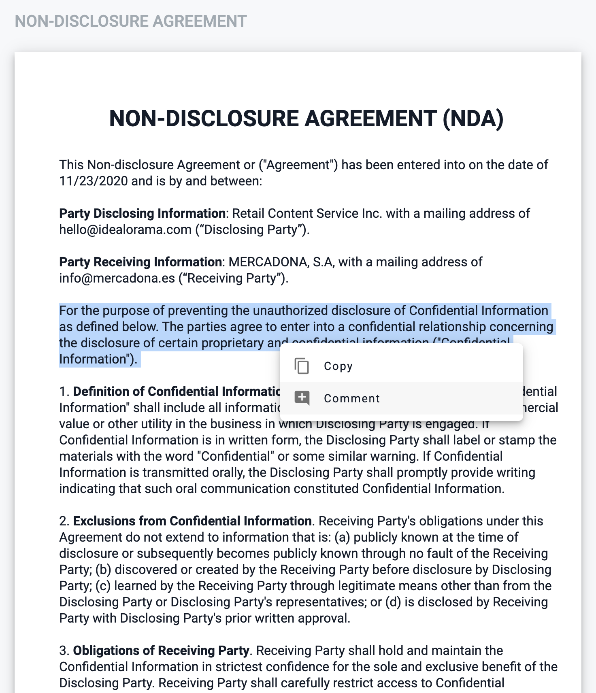

3. Write a comment in the window that appears and click on "Save" button.

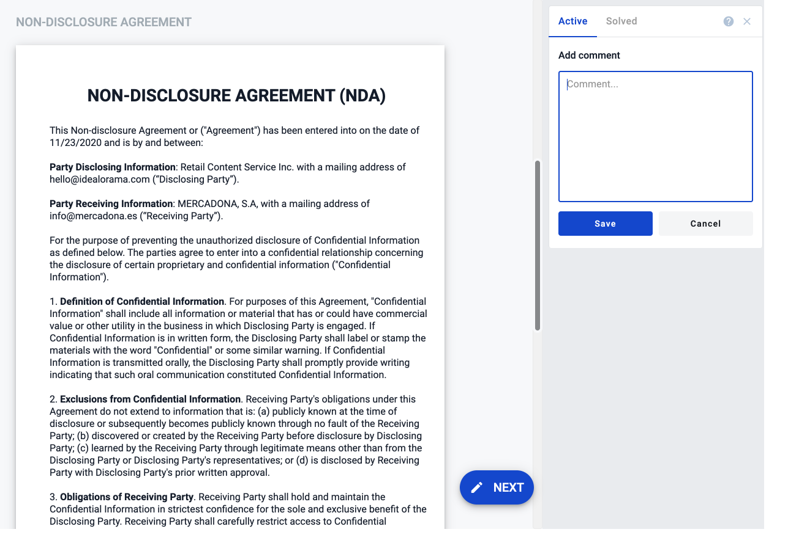

4. Comment appeared. Also you can see highlighted section on envelope to which this comment attached.

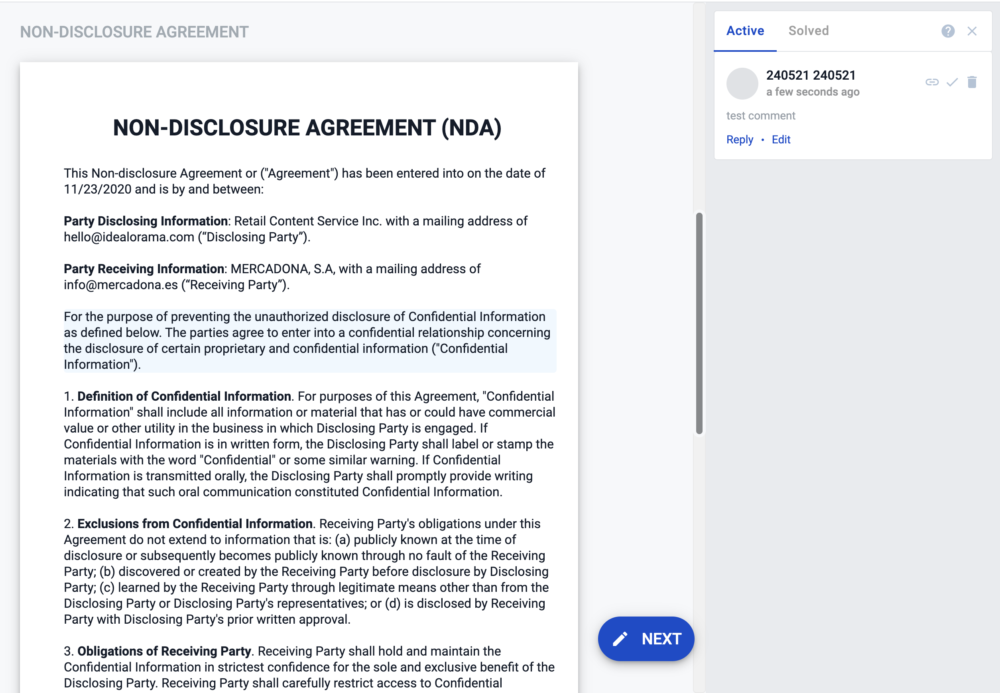

How to add a reply to a comment
=============================

1. Click to a "Reply" on initial comment.

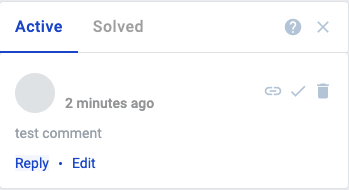

2. Enter your reply message and click "Save".

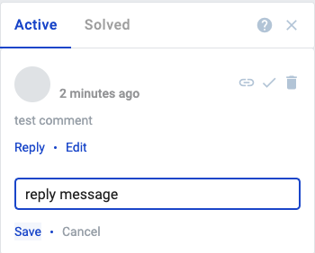

3. New message appeared in comment thread.

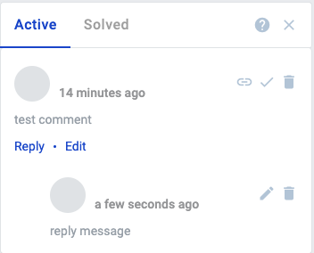

How to edit comment
===================

.. warning:: **Please note!** You can edit only your comments

1. Click on "Edit" (only for initial comment in thread) or edit icon (for comments inside thread).

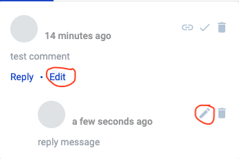

2. Edit your comment and click "Save".

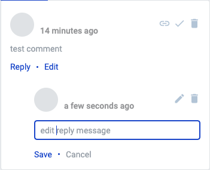

3. Comment was edited.

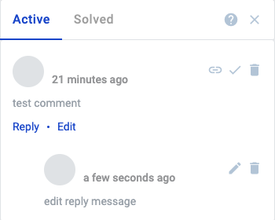

How to delete comment
=====================

.. warning:: **Please note!** You can delete only your comments

.. warning:: **Please note!** If you delete the initial comment all comment thread will be deleted.

1. Click on delete icon.

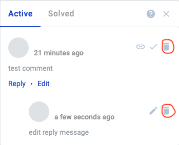

2. Confirm deletion of the comment.

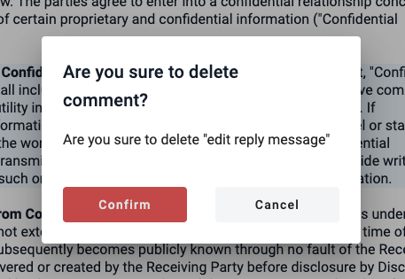

3. Comment deleted.

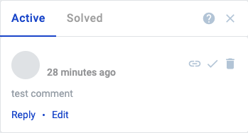

How to solve comment threads
============================

.. warning:: **Please note!** You can solve only your comment threads.

.. warning:: **Please note!** You can solve only active comment threads.

1. Click on solve icon.

.. image:: pic_comments/SolveComment/SolveComment1.png
   :width: 600
   :align: center

2. Comment solved. Now this comment thread is located in solved comment section. Also highlighted section on envelope to which this comment attached is removed in case when it's last comment attached to this section.

.. image:: pic_comments/SolveComment/SolveComment2.png
   :width: 600
   :align: center

How to reopen comment threads
=============================

.. warning:: **Please note!** You can reopen only your comment threads.

.. warning:: **Please note!** You can reopen only solved comment threads.

1. Click on reopen icon.

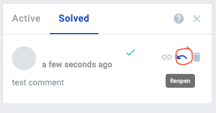

2. Comment reopened. Now this comment thread is located in active comment section. Also highlighted section on envelope to which this comment attached is added in case when it's the first comment attached to this section.

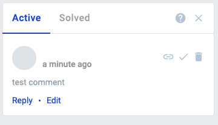
