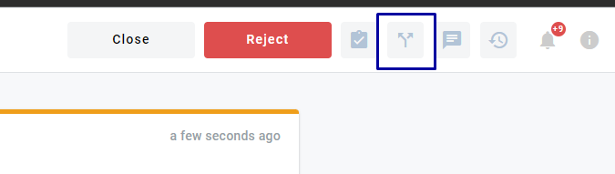
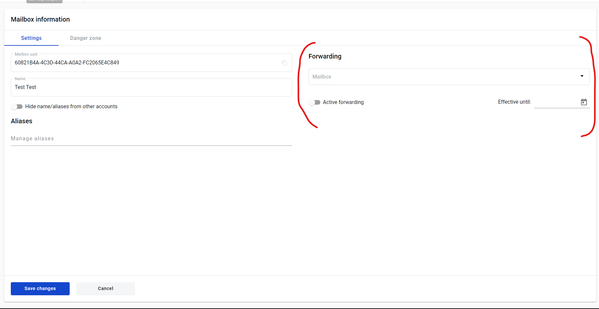
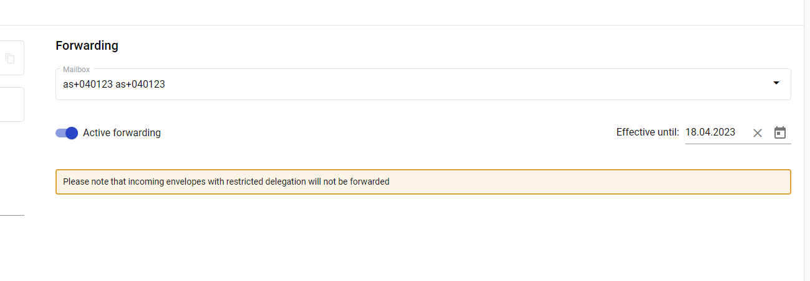
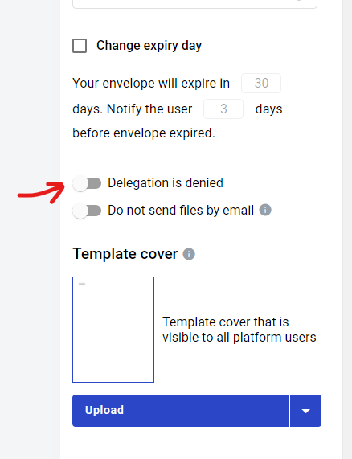

.. _send-for-delegation:

===========================
Envelope delegation process
===========================

Envelope delegation is a process which allows to delegate all actions assigned to recepient mailbox in the envelope processing flow to other mailbox. In other words it can be called envelope forwarding.

.. toctree::

How to send envelope for delegation
===================================

1. For delegation you need to open envelope in “Waiting” status and click Delegation button in the upper right corner of the envelope header

.. note::
   This button will only appear for mailboxes with delegation permission.

2. In the mailbox field of opened window find and select desired delegate mailbox by name, uuid or alias (or enter email address) and click Confirm

.. image:: delegation_pic/delegationModal.png
   :width: 600
   :align: center

3. When it is done envelope will be received by mailbox which was selected for delegation

4. Delegate will be able to perform all actions which were assigned to initiator role or cancel the delegation

.. image:: delegation_pic/delegationCancel.png
   :width: 600
   :align: center

5. Initiator can cancel delegation if delegate has not completed his step in envelope processing flow. In this case delegate will lose access to the envelope. To do this, initiator has to click the Cancel button on the processing flow window

How to configure automatic incoming envelopes delegation
========================================================

It is possible to enable automatic incoming envelopes delegation for selected mailbox (enable automatic envelopes forwarding).

1. Go to Admin panel -> Mailboxes -> Selected mailbox settings

.. note::
   This section will only appear for mailboxes with delegation permission.

2. In mailbox field find and select desired delegate mailbox by name, uuid or alias (or enter email address). It will become a delegate for all incoming envelopes of your mailbox

3. You can specify Effective until date. If selected, forwarding will be automatically disabled day after selected (e.g. if 18.04.23 is selected, automatic delegation will turn off 19.04.23 at 00:00)

4. Make sure to enable Active forwarding toggle if you want to enable delegation to selected mailbox

5. Click Save changes when all options are configured

.. warning::
   Envelopes with restricted delegation will not be automatically forwarded to selected mailbox and still be sent to your mailbox even when forwarding is enabled.

How to restrict envelope delegation
===================================

It is possible to restrict delegation of any outgoing envelope. Such envelopes can be processed only by recepients specified in envelope flow settings.

1. Envelope delegation can be restricted in template editor. It will affect all envelopes created from this template and can not be overridden on envelope level. This option is disabled by default

2. It is also possible to restrict delegation on draft page for each envelope individually if it was not done on template level

 .. image:: delegation_pic/denyDelegationEnvelope.png
   :width: 600
   :align: center