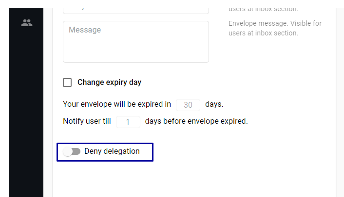
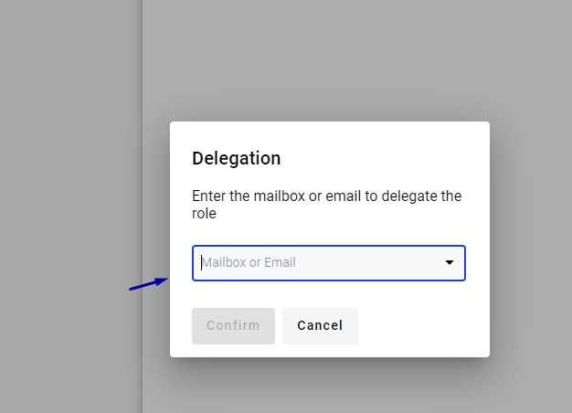
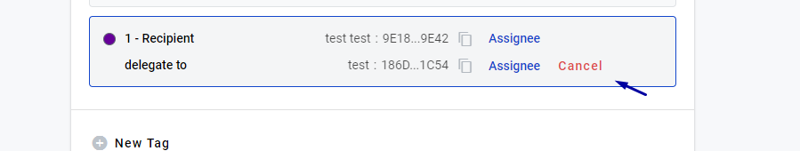

.. _send-for-delegation:

===========================
Envelope delegation process
===========================

.. toctree::

How to send envelope for delegation
===================================

1. User can set the ability to delegate envelope, when creating template. Delegation is available by default.

2. User can disabled delegation on draft page, if he not disabled delegation in  template.

 .. image:: delegation_pic/Screenshot_14.png
   :width: 600
   :align: center

3. For delegation you need open envelope in “Waiting” status, in the upper right corner of the envelope header click on [Delegation] button.

.. image:: delegation_pic/Screenshot_10.png
   :width: 600
   :align: center

4. For order to delegate, you need  click on the delegation icon. In the mailbox field, enter email  or mailbox uuid, click confirm button.

5. User can delegate  for user on the flow or user in the system, or for any user, who is not yet registered in the system.

6. After delegated envelope, the participant, to which envelope, has been delegated, receives notification in the system and a letter by mail.

7.  Delegate can fill in, reject and send the envelope.

8. Initiator can cancel delegation, if delegate has not completed envelope. In this case,delegate will lose access to viewing and filling out  envelope. To do this, initiator need to click the cancel button on the processing flow.