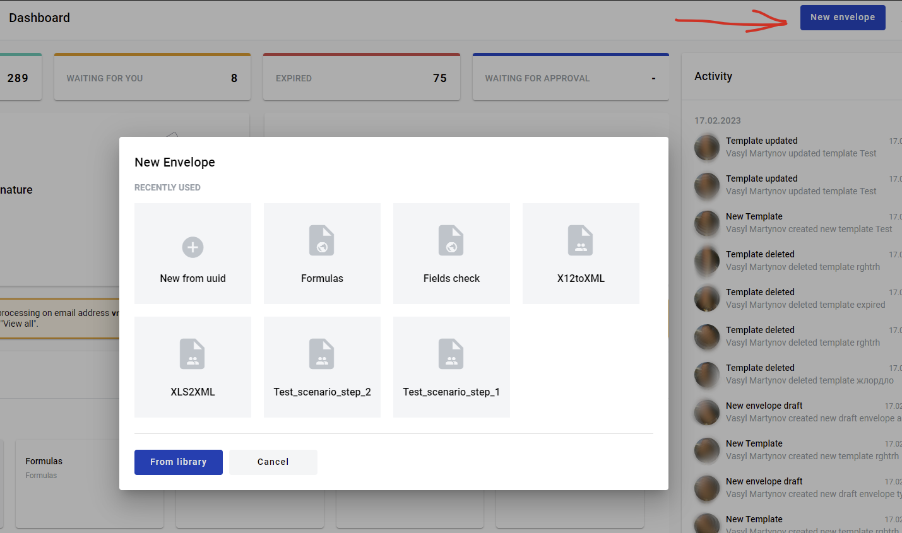
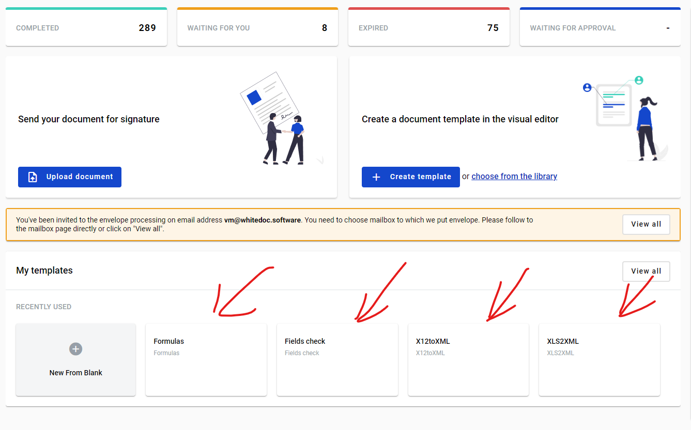
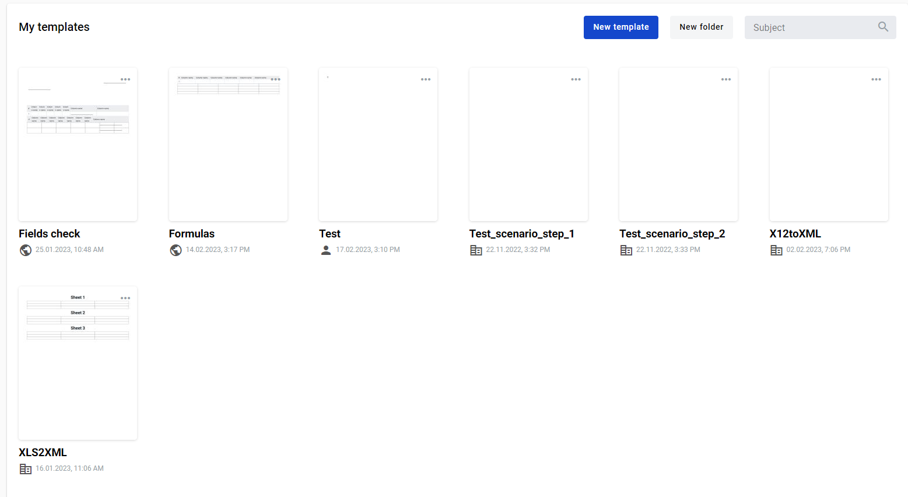
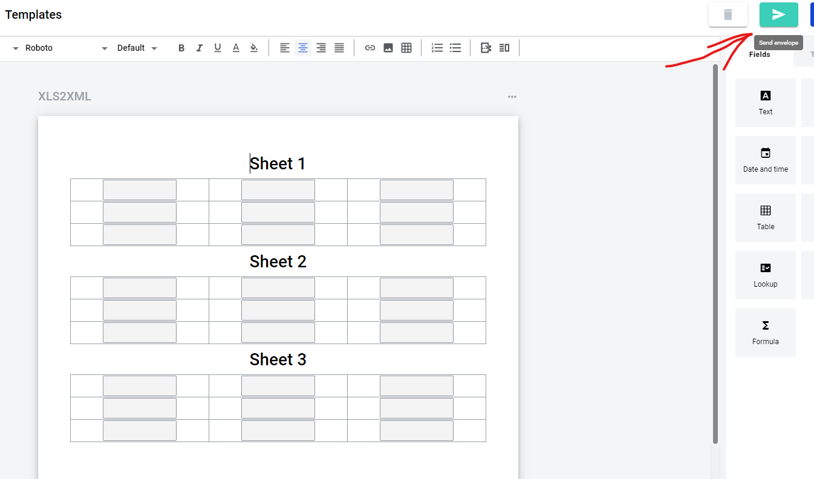

=================
Envelope creation
=================

.. toctree::
    
There are several ways to create an envelope:

1. Create an envelope via Quick send button on the dashboard. More details on this can be found :ref:`here <dashboard>`

2. By clicking "New envelope" button on the dashboard

3. By clicking any template panel on the dashboard

4. By clicking any template panel on the templates list page

5. By clicking "Send" button in the template editor

Envelope draft will be opened

.. image:: picEnvelopeCreation/envelopeFlow.png
   :width: 400
   :align: center

From this page you will have to fill all roles that take part in envelope processing flow (unless they are predifined on the template level). Note that you can enable "I am assignee/approver/signer" attribute to predefine your own mailbox for specified role. After all mandatory fields will be filled you can send envelope to the next participant of the flow.