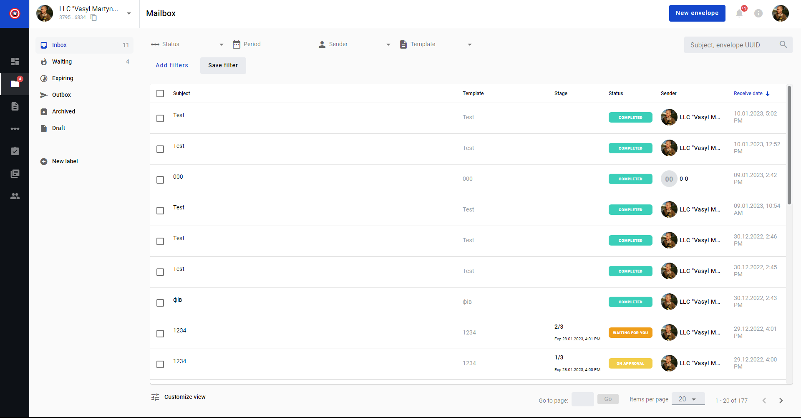
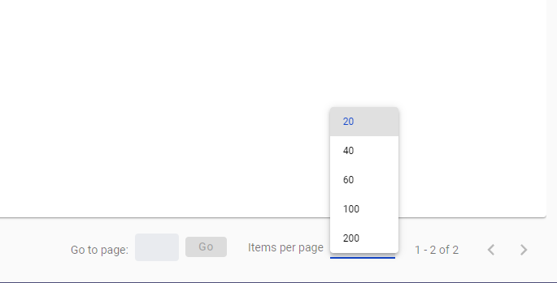
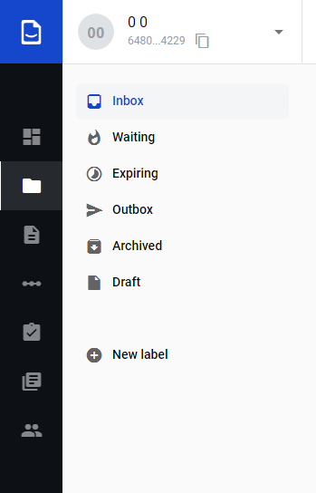

===================
Envelope management
===================

.. toctree::
    
You can view and manage your envelopes on Mailbox page:

You can select how many envelopes are shown on the page in Items per page menu

   
Custom columns can be added to the envelopes list from Customize view menu. Start typing field name in search to see available field:

.. image:: picEnvelopeManagement/3.png
   :width: 400
   :align: center
   
.. note::
   Any fields with enabled Search attribute will be available as customn columns.
   
Also you can filter shown envelopes by adding filters or envelope fields from according menu:

.. image:: picEnvelopeManagement/4.png
   :width: 400
   :align: center
   
.. note::
   Configured filters can be saved by clicking Save filter button.
   
On the left side of the page you can navigate through your mailbox folders:

Also you can create new envelope from this page by clicking New envelope button near your profile icon in the upper-right corner.