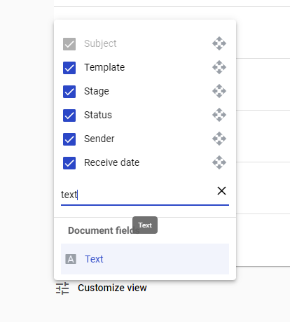
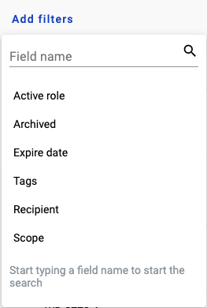
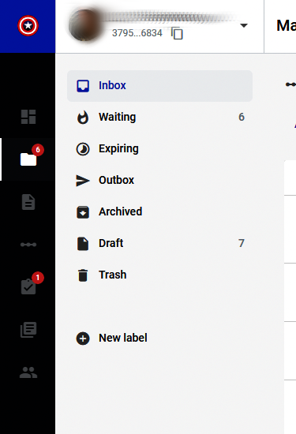

===================
Envelope management
===================

.. toctree::
    
You can view and manage your envelopes on Mailbox page. Also you can create new envelope from this page by clicking New envelope button near your profile icon in the upper-right corner

.. image:: picEnvelopeManagement/page.png
   :width: 400
   :align: center

You can select how many envelopes are shown on the page in Items per page menu

.. image:: picEnvelopeManagement/paginator.png
   :width: 400
   :align: center
   
Custom columns can be added to the envelope list from Customize view menu. Start typing field name in search box to list available fields

   
.. note::
   Any field with enabled Search attribute will be available as custom column.
   
Also you can filter shown envelopes by adding filters or envelope fields from this menu

   
.. note::
   Configured filters can be saved by clicking Save filter button.
   
On the left side of the page you can navigate through your mailbox folders

Envelopes can be moved to Archive folder by selecting them and clicking on Archive button

.. image:: picEnvelopeManagement/zip.png
   :width: 400
   :align: center

.. note::
   Only envelopes in Completed, Expired and Cancelled statuses or Drafts can be archived.

Later such envelopes can be unarchived from according folder by Unarchive button

.. image:: picEnvelopeManagement/unzip.png
   :width: 400
   :align: center

Envelopes can be moved to Trash folder by selecting them and clicking on Delete button

.. image:: picEnvelopeManagement/trash.png
   :width: 400
   :align: center

.. note::
   Only envelopes in Completed, Expired and Cancelled statuses or Drafts can be deleted.

Later such envelopes can be restored from according folder by Restore button

.. image:: picEnvelopeManagement/restore.png
   :width: 400
   :align: center