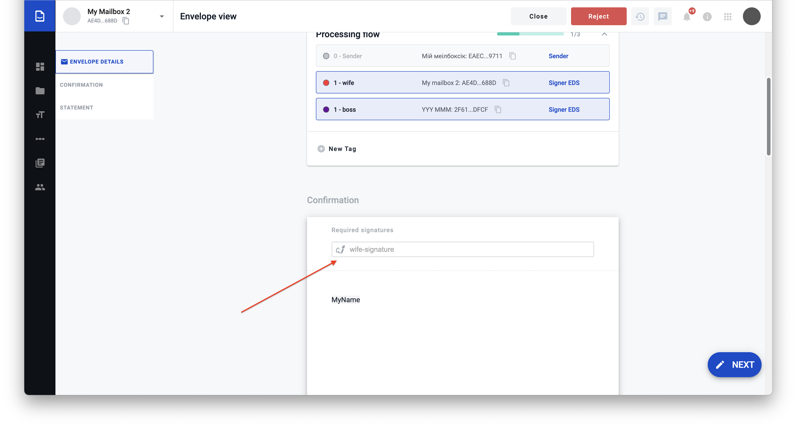
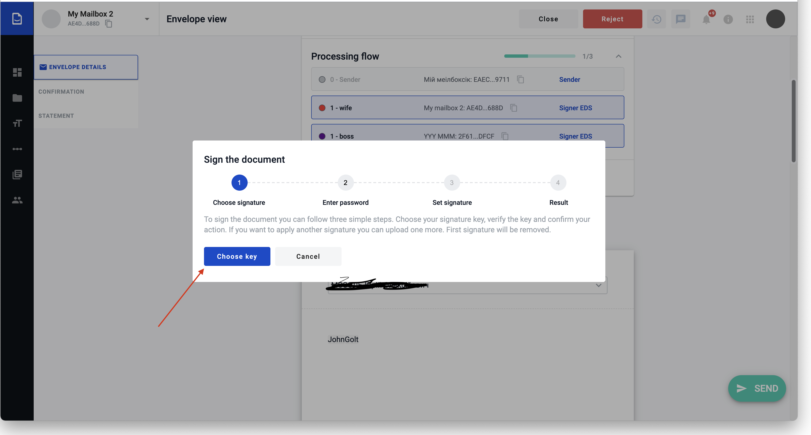
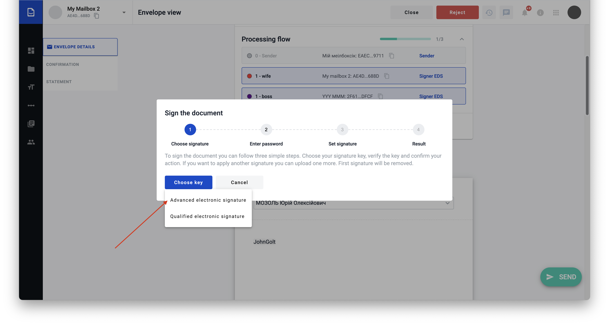
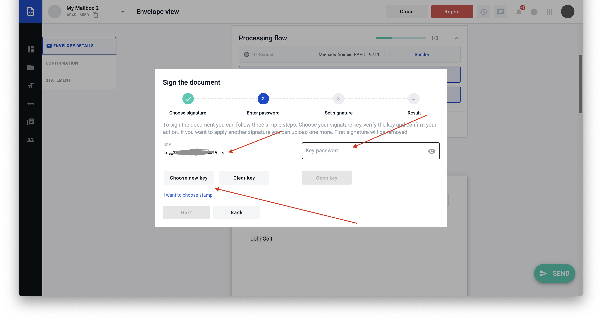
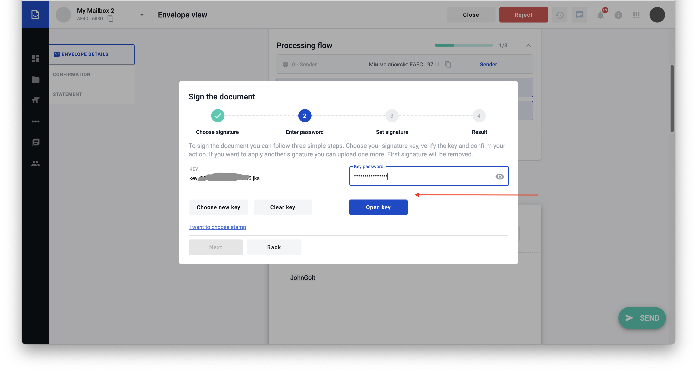
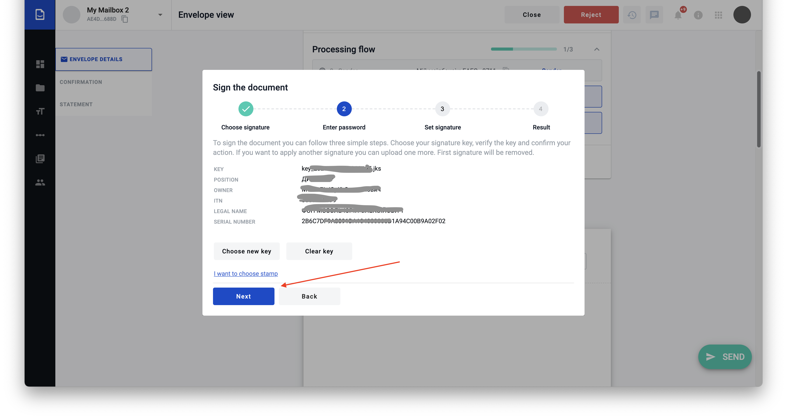
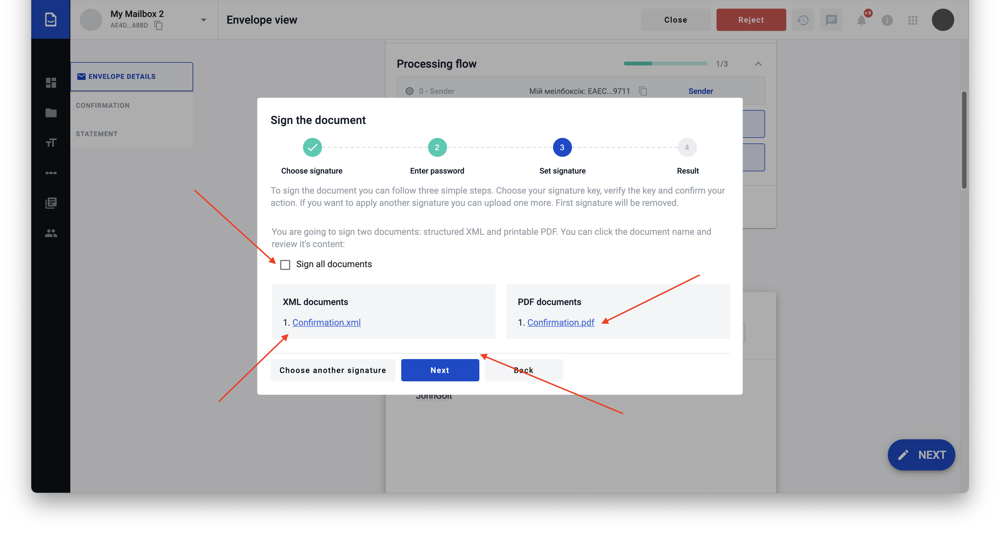
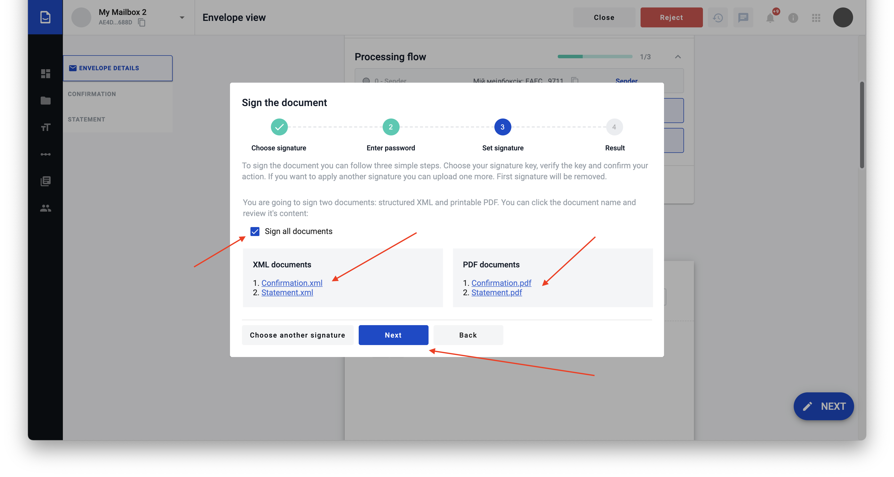
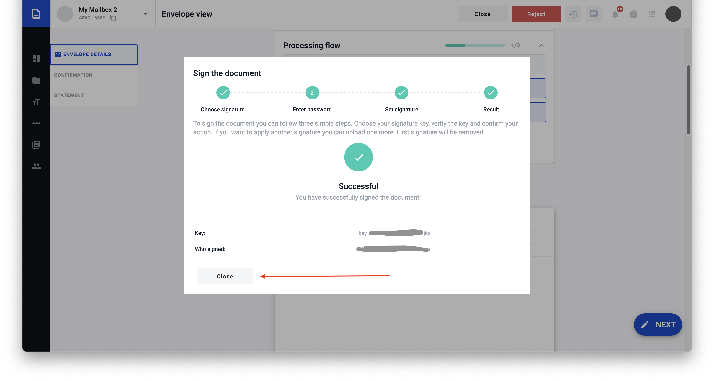

==========
Signatures
==========

.. toctree::

Simple Electronic Signatures
============================

Follow next steps to use your electronic signatures and sign documents.

1. Click on electronic signature field on any document in envelope:

2. Sign document popup will appear. Click "Choose Key" button:

3. Select "Advanced electronic signature" and choose your key file:

4. On the next view you will be asked for key password. Also you can reset your choice or choose another key:

5. After entering key password press "Open key" button

6. If password and key are valid you will see key's and key owner's info. Press "Next" to go to the next step:

7. You can view document your are signing and/or proceed to the next step

8. Also you can select "Sign all documents" option. In this case you will sign all documents you need to sign in current envelope:

9. After pressing "Next" on previous step document(s) will become signed and you can close signing popup.

.. warning::
    Don't forget to send signed envelope after last step, in other case all changes (signs) will be lost.

