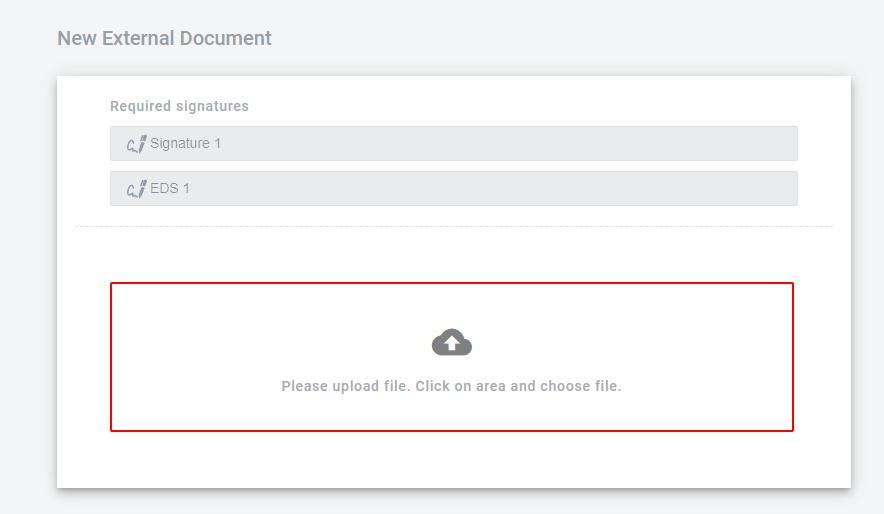
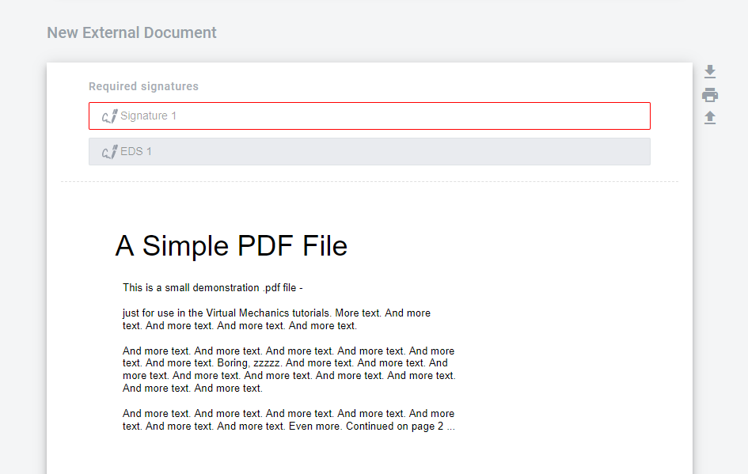
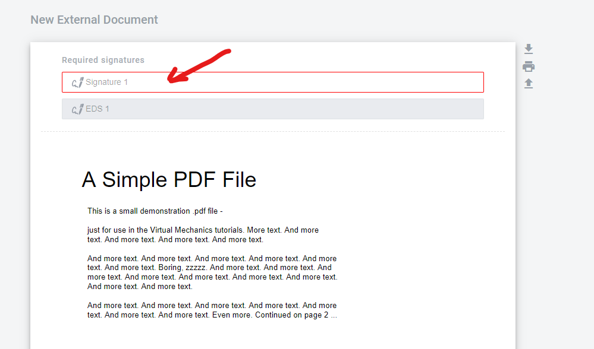
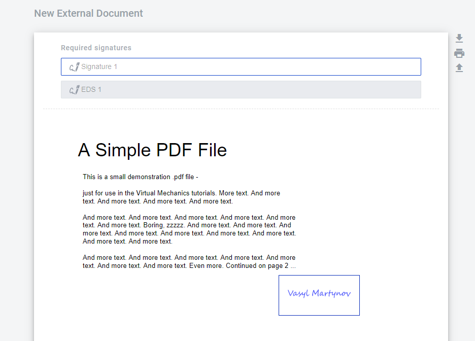
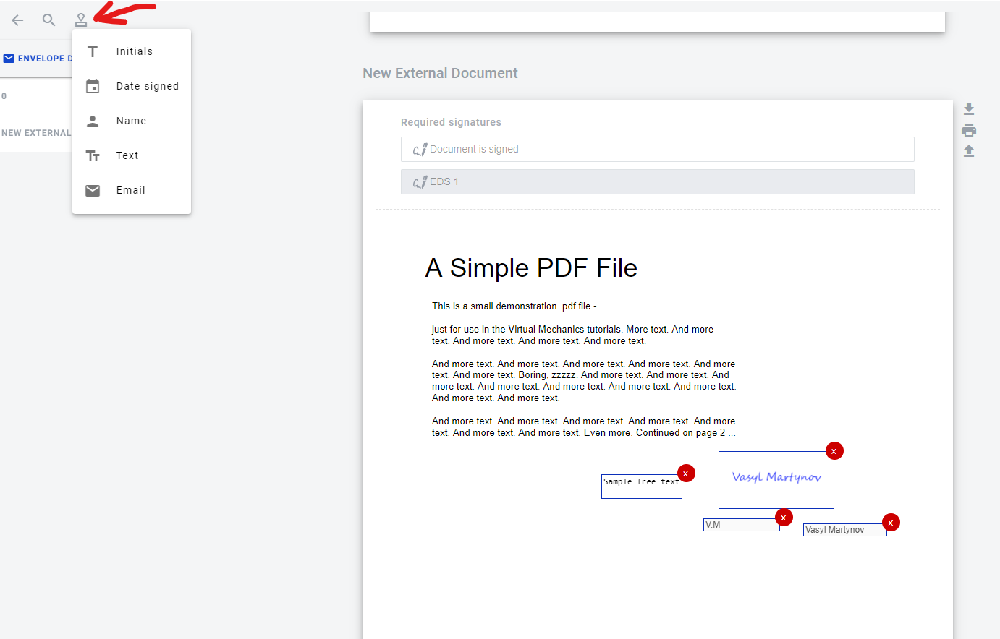

=================
External Document
=================

.. toctree::

---------

How to upload the external document?
====================================

1. Click on the upload zone

2. Select a file
3. When the upload is finished you will see name of file inside uploading section (or file itself it it was in .pdf format). Also you can choose another file before you send envelope.

4. To send envelope you should fill all other mandatory fields and upload all external documents assigned to your role.

External document signing process
=================================

Electronic digital signature and e-ink signatures can be used to sign external documents. According signatures should be added to the documents on the template.

.. note::
   Electronic ink signatures can be applied only to .pdf format external documents. Plsease note that if you will add e-ink signature to external document in the template, only .pdf files will be accepted for this documents in following envelopes.

Process of signing external documents with EDS has one difference from signing internal document. When signing external document electronic digital signature is applied only to .pdf file version (not to .xml file). Signature interface is same as for structured documents.

.. image:: pic_externalDocument/ExternalDocumentEDS.png
   :width: 600
   :align: center

How to add e-ink signature to external document?
================================================

1. To add e-ink signature to the external document click on the signature field

2. After this place signature where you want it to be and click

3. When this is done you can finish filling all mandatory fields and send the envelope - all signatures will be visible on it.

How to add stamps to external document?
=======================================

Note that you can add stamps to the external document in the same way as a e-ink signature. Text stamp can be edited to contain any needed text (up to 140 symbols)

