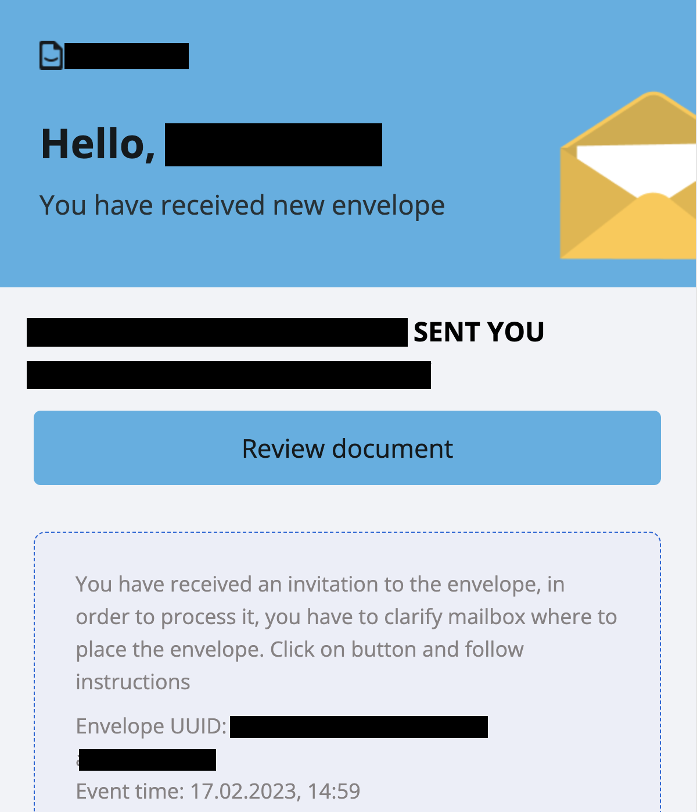

============================================
Fill or sign envelope as not registered user
============================================

On platform user is able to process envelope not registering here. It is easy way to perform any actions e-documents.
If some customer receive envelope invitation on email and don't want to go through registration process he is able to process it and do required actions

.. toctree::

How to process envelope if user is not registered?
==================================================

1. Firstly envelope flow participant has to be defined on envelope initiation. To do that initiator of the envelope has to fill any of assignee, signer, approver, copy with email address of recipient.

2. Secondly send envelope. And as soon as envelope processing flow reach recipient order platform send email with instructions

3. Follow instructions in the email and click on "Review document" button

4. Modal window with request to accept Terms and Condition and Privacy Policy will display and to process envelope customer has to accept it

5. Next step is envelope processing according to role in the flow. Assignee has to fill in fields assigned to him. Signer need to sign documents with EDS signature. Approver has to approve or cancel approval if needed. CC just receive copy and no need to do anything.

6. As soon as role did all actions related to role responsibility button "Send" will appear (exception is role CC).

7. Send envelope according to the rest of the flow or to the final status by click on button "Send"

8. Than customer will see "Success page" with proposal to authorize on platform to perform e-documents exchange
