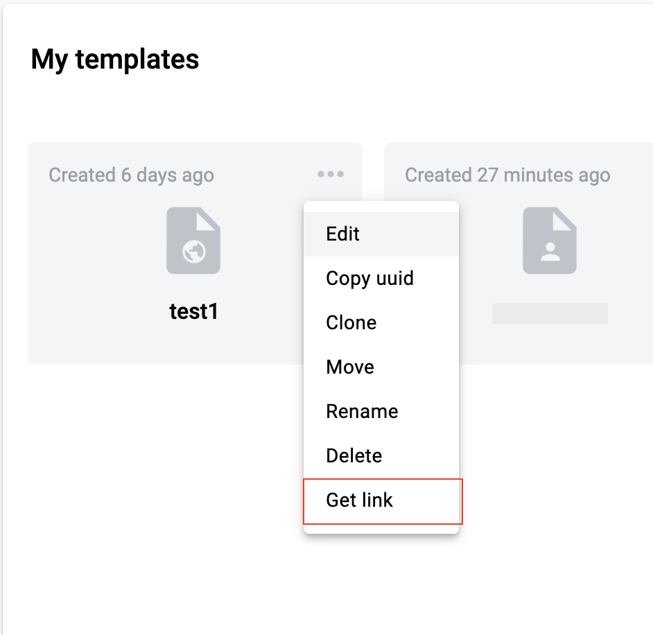
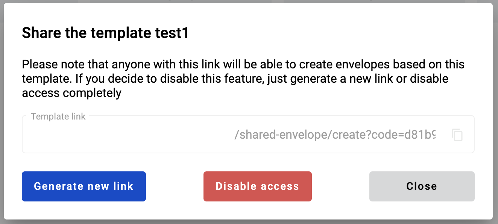
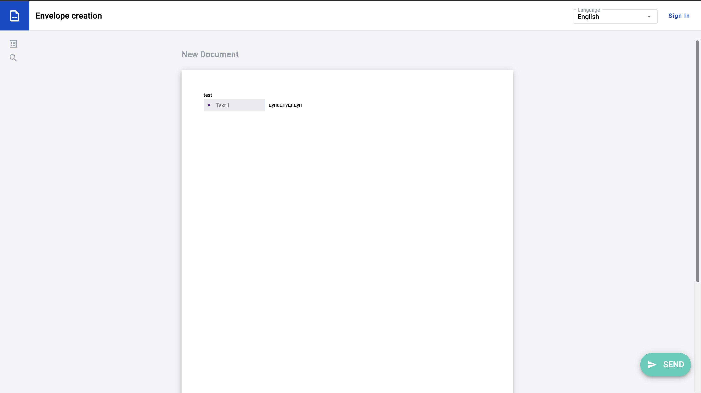
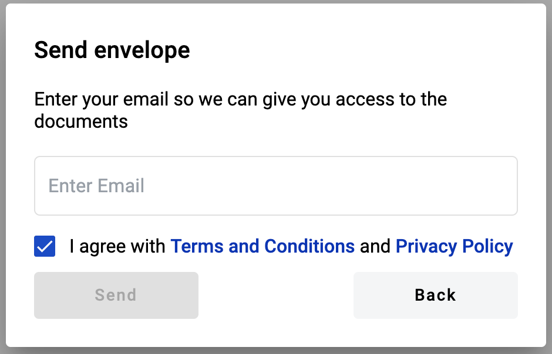
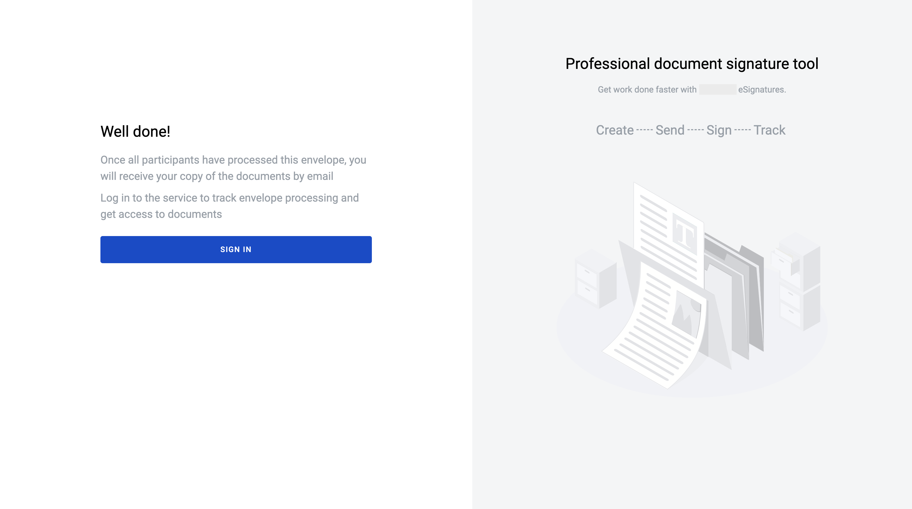
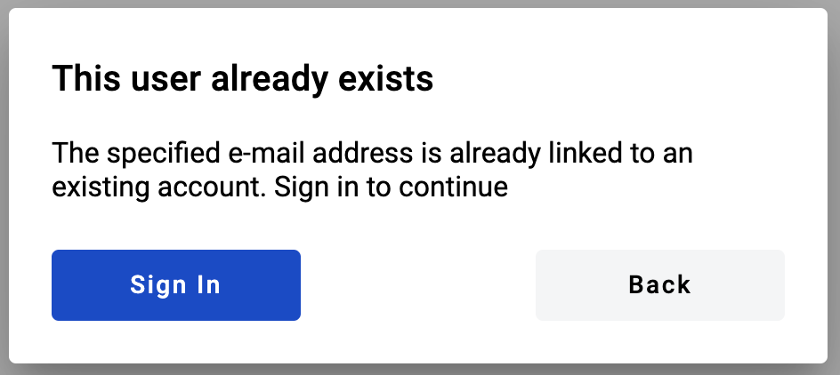
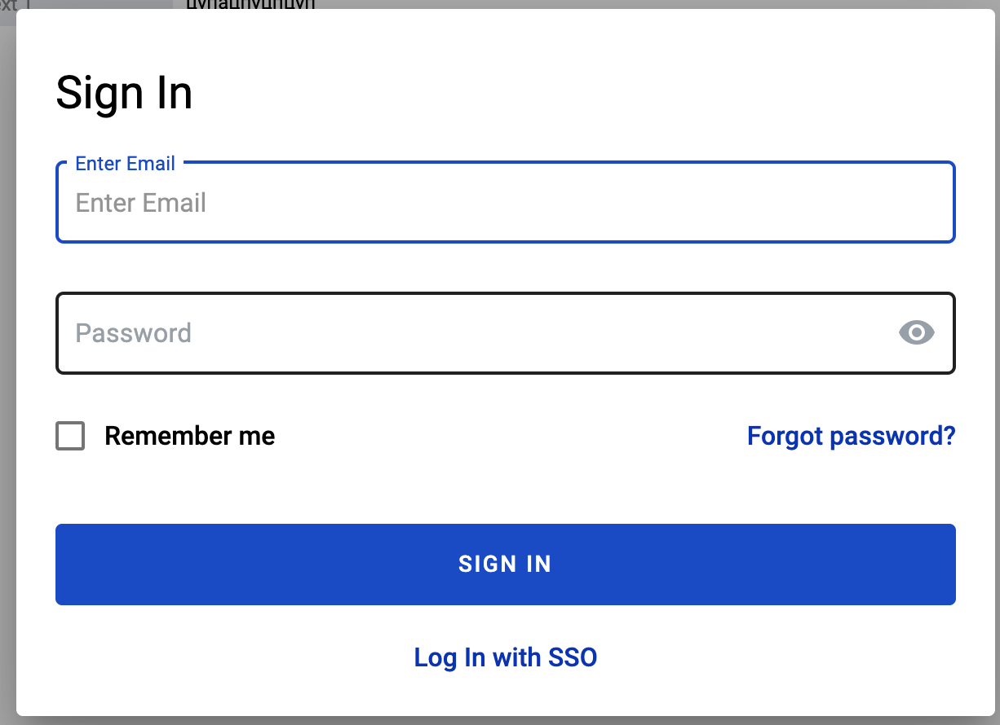
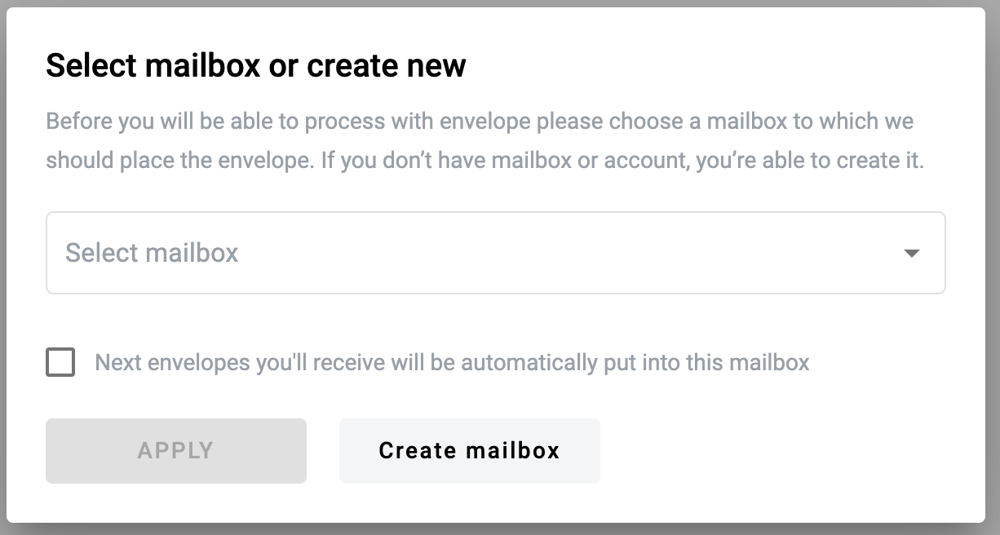

===================================
Send envelope without authorisation
===================================

.. toctree::

User is able to send envelope without authorisation. To use this functionality user has to do get special link (create link as authorised user or receive link from somebody).

Flow of the initiation envelope without authorisation
=====================================================

1. Create template with public access, filled in envelope subject and all roles except sender
2. Generate special link, which unathorised users can use
3. Follow the link without authorisation
4. Fill in all required fields assigned to sender role
5. Send envelope and follow the instructions
6. If user already registered on platform Log in if not leave email address to Send envelope

How to create share template link?
==================================

1. Create a template
2. Fill in envelope subject and fill in all roles in the flow with mailboxes
3. Set template access level to public

.. note:: If template uses dictionary access level of each dictionary used in template should be public or official access level.

4. Save template
5. Follow to template list
6. Open particular template menu and select option "Get link"

7. Generate new share template link

8. Copy link and send it to anybody who wants to initiate envelope with shared template

You are able to disable current link, just click on "Disable access". This action remove access to possibility to create envelope using shared template link. Also you are able to create new template shared link by click on "Generate new link". It leads to impossibility to use old link but you can share new link and use it.

How to send envelope without authorisation (for guests)?
========================================================

To have possibility to send envelope without authorisation user has to have template shared link.

1. Follow the template shared link. User observes limited functionality of envelope functionality (fill in fields, sign documents)
2. Fill in all required fields and signatures (button "Edit" changes to "Send")

3. Click on "Send" button
4. Choose an option "Continue without registration"

.. image:: pic_sendEnvelopeAsGuest/chooseWayAuthOrNot.png
   :width: 400
   :align: center

5. Enter your email (user with this email shouldn't be created)

6. Confirm envelope send. Success page will be displayed as soon as envelope will be send according to flow

How to send envelope without authorisation (for registered users)?
==================================================================
To have possibility to send envelope without authorisation user has to have template shared link.

1. Follow the template shared link
2. Fill in all required fields and signatures (button "Edit" changes to "Send")

3. Click on "Send" button
4. Choose an option "Continue without registration"

.. image:: pic_sendEnvelopeAsGuest/chooseWayAuthOrNot.png
   :width: 400
   :align: center

5. Enter your email (user with this email should be registered on platform)

6. Confirm envelope send. User observes modal window with possibility to complete authorisation

7. Accept proposition to complete authorisation
8. Enter valid credentials and sign in

9. If customer has only one mailbox or has several mailboxes and auto deposit mailbox turned on then envelope will be automatically send and user will be redirected to envelope with full functionality
10. If customer doesn't have mailboxes or has several mailboxes and auto deposit mailbox turned off then user will observe special modal window with proposition to choose mailbox or create new one

