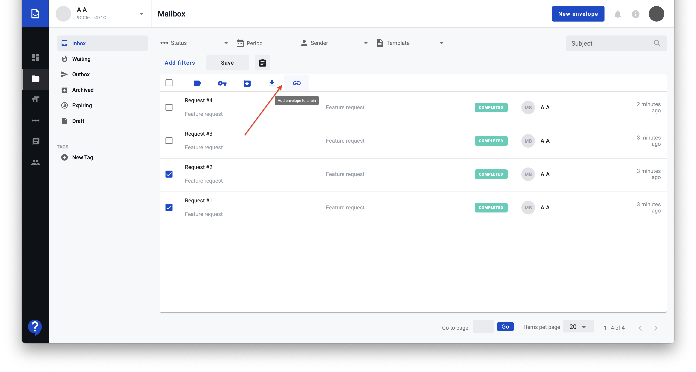
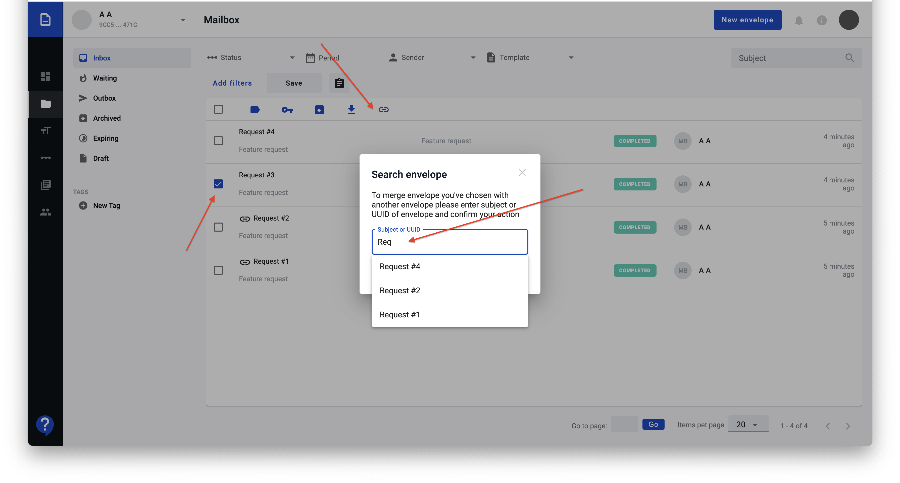
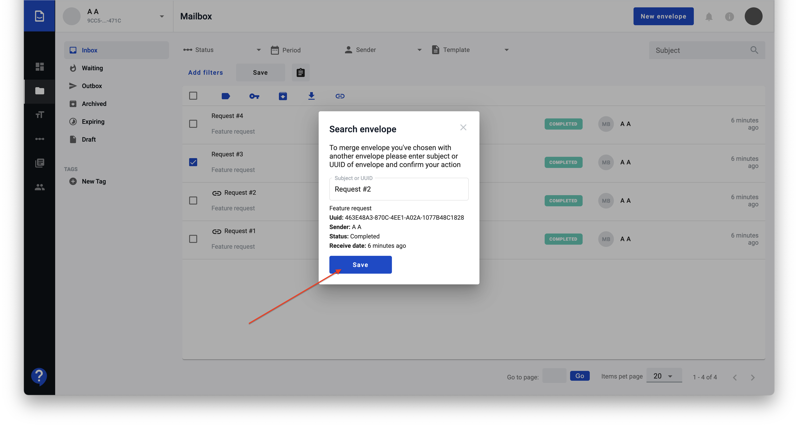

===================
Add envelope to chain
===================

User can merge few envelopes into chain or add envelopes to existing chain. Single restriction is envelope should not be in any chain before adding to some chain.

How to add envelopes into chain?
=========================

1. To merge envelopes into chain select envelopes you want to merge and press "Add to chain" button

2. In case you need to add envelope to existing chain or merge envelope which can't be filtered to be shown on one page you can select envelope and press "Add to chain" button. Search envelopes popup will be shown and you can search envelope you want to be chained with selected by subject or by UUID.

2.1. After choosing right one press "Save" button.

