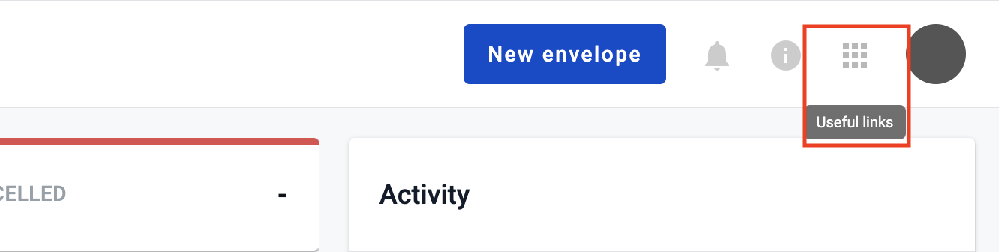
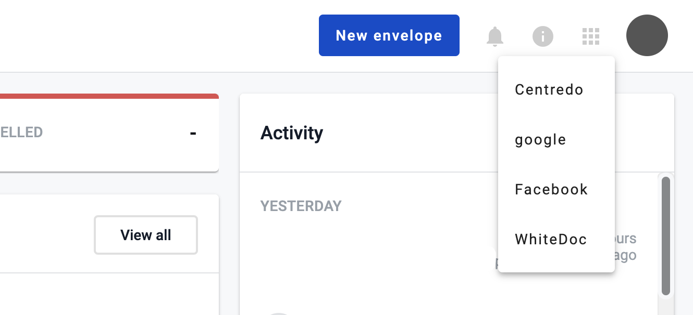

==============
External links
==============

.. toctree::

External links are list of links to external resources, which may be useful for mailbox users.

Where to find external links?
=============================

If at least one external link added as official, account or specifically for mailbox (how to add external link you can find :ref:`here <external-links-configuration>`) the special icon will appear in the header of the platform.

You can click on it and menu with links for external resources will be opened.

If you click on any link from menu external resource will be opened in new browser tab.