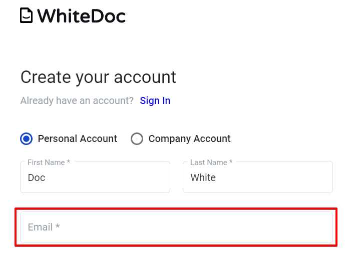
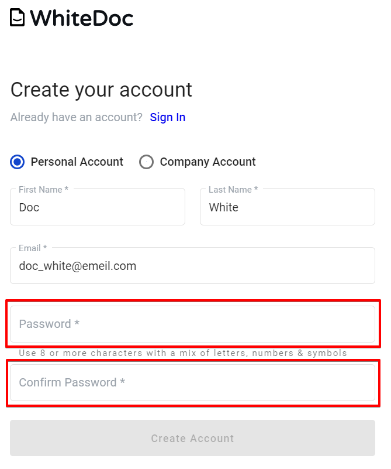
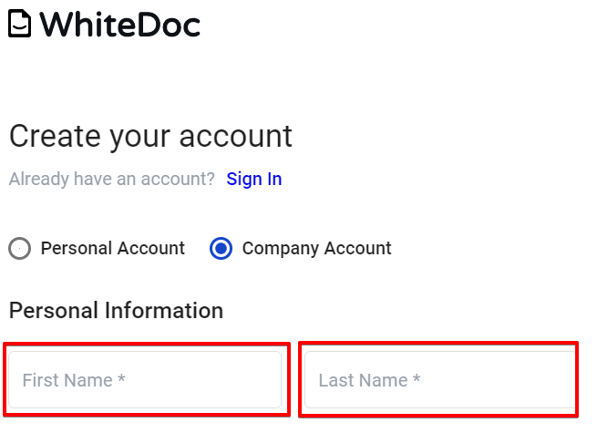
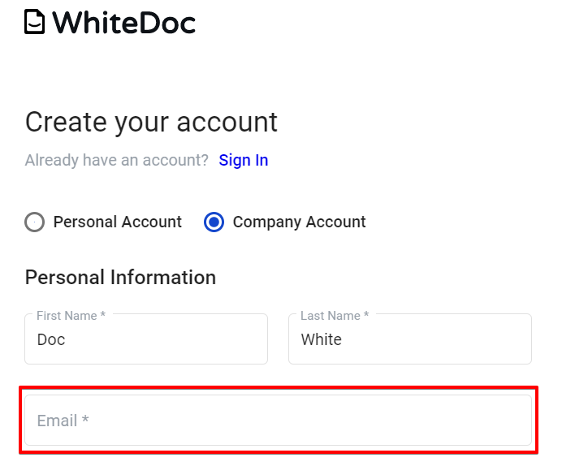
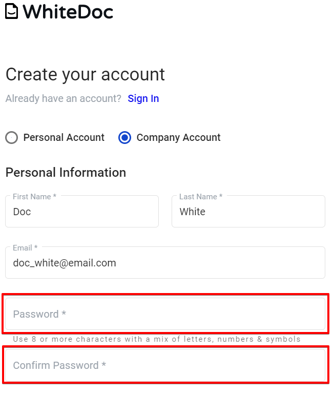

============================
How to register on platfrom?
============================

.. toctree::

To be able to use platform, you must register and create an account:

- Registration personal account.

- Registration company account.

Follow this link to register personal or company account: https://staging.whitedoc.space/registration

Personal account registration
=============================

1. Navigate to https://staging.whitedoc.space/registration

.. image:: pic_registration/personal_registration_1.png
   :width: 400
   :align: center

2. Select personal account checkbox if this checkbox not selected.

.. image:: pic_registration/personal_registration_2.png
   :width: 400
   :align: center

3. Fill in name and last name fields.

.. image:: pic_registration/personal_registration_3.png
   :width: 400
   :align: center

4. Fill in "Email" field, this email will be use for login.

5. Fill in "Password" field and repeat fill in password in "Confirm password" field.

6. After filled all required fields button "Create Account" stay active and clickable. Click on the button for continue registration.

.. image:: pic_registration/personal_registration_6.png
   :width: 400
   :align: center

7. After you click on "Create account" button will be send validation letter on address which you point on  4 step and you will redirect to confirmation page.

.. image:: pic_registration/personal_registration_7.png
   :width: 400
   :align: center

8. For finish registration you should confirm your email address. For that go to mailbox which you use for registration,in this mailbox
open letter from platform. Letter contains confirmation link and confirmation code. For finish registration you should use one of them.

.. image:: pic_registration/personal_registration_8.png
   :width: 400
   :align: center

* For finish registration by confirmation link you should click on link in email and after that you will be redirect to: https://staging.whitedoc.space/login
  and in the upper right corner will appear message about success registration.

* For finish registration by confirmation code, you should copy code from letter and return to confirmation page. Input code in confirmation field and click next.
  If you input correct code you will observe same message about success registration.

Company account registration
============================

1. Navigate to https://staging.whitedoc.space/registration.

.. image:: pic_registration/personal_registration_1.png
   :width: 400
   :align: center

2. Select company account checkbox if this checkbox not selected.

.. image:: pic_registration/company_registration_2.png
   :width: 400
   :align: center

3. Fill in name and last name fields.

4. Fill in "Email" field which will be use for registration process. You will get validation letter on this email.

5. Fill in "Password" field and repeat fill in your password in field "Confirm password"

6. Fill in Company name field.

.. image:: pic_registration/company_registration_6.png
   :width: 400
   :align: center

7. Fill in ITN field.

.. image:: pic_registration/company_registration_7.png
   :width: 400
   :align: center

6. For continue registration you should click on "Continue" button, this button will enable after you filled all required fields.

.. image:: pic_registration/company_registration_8.png
   :width: 400
   :align: center

7. After click on "Continue" button you will redirect to page where you can add mailboxes to your account. Account should has at least one mailbox.
To add mailbox click on "Plus" button.

.. image:: pic_registration/company_registration_9.png
   :width: 400
   :align: center

8. After you defined count of mailboxes and their names, click on "Complete" button.

.. image:: pic_registration/company_registration_10.png
   :width: 400
   :align: center

9. After you click on "Complete" button validation letter will be send on your email address which you point on step 4
and you will redirect to confirmation page.

.. image:: pic_registration/personal_registration_7.png
   :width: 400
   :align: center

10. For finish registration you should confirm your email address. For that go to mailbox which you use for registration,in this mailbox
open letter from platform. Letter contains confirmation link and confirmation code. For finish registration you should use one of them.

.. image:: pic_registration/personal_registration_8.png
   :width: 400
   :align: center

* For finish registration by confirmation link you should click on link in email and after that you will be redirect to: https://staging.whitedoc.space/login
  and in the upper right corner will appear message about success registration.

* For finish registration by confirmation code, you should copy code from letter and return to confirmation page. Input code in confirmation field and click next.
  If you input correct code you will observe same message about success registration.

