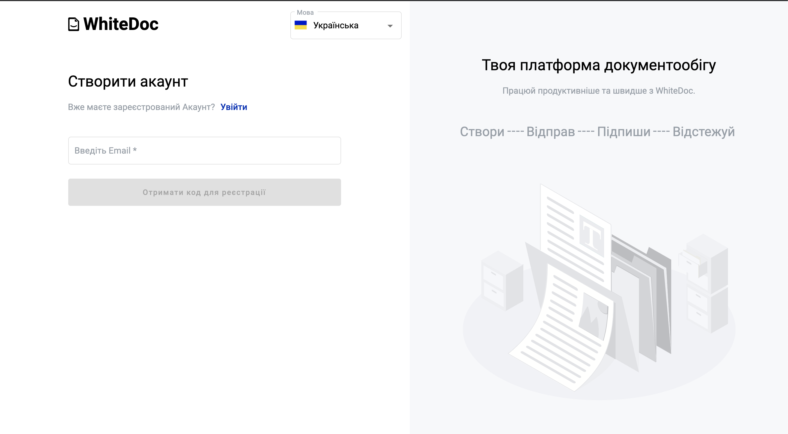
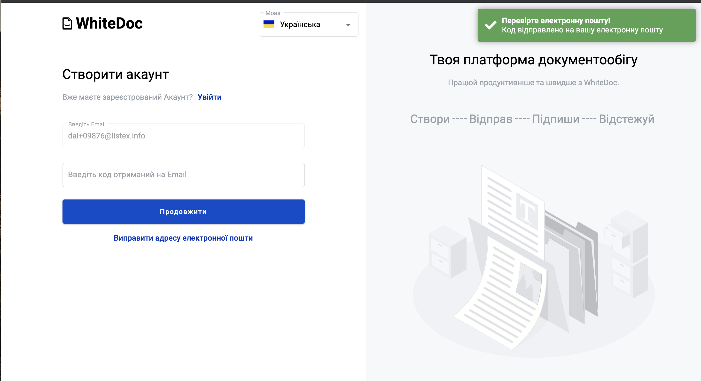
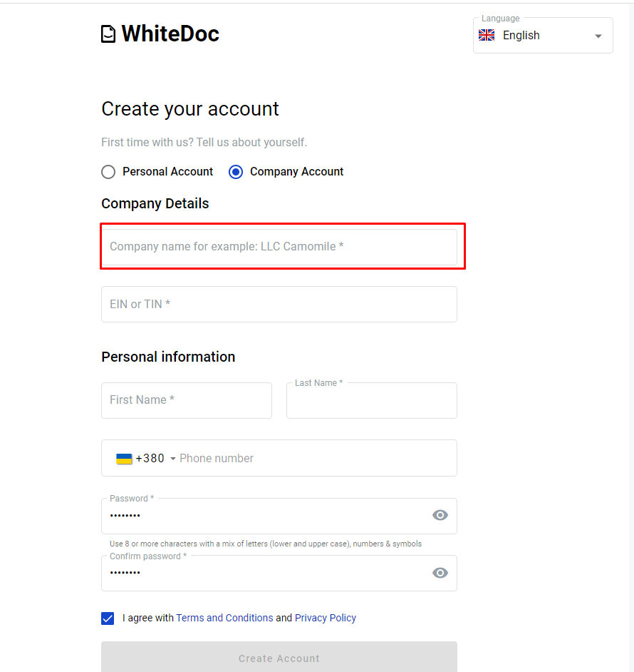
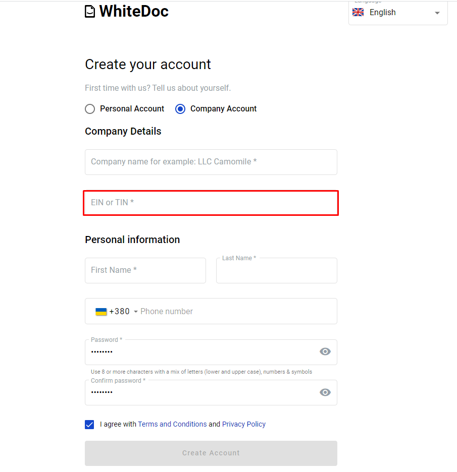

.. _registration-instruction:

============================
How to register on platform?
============================

.. toctree::

To be able to use platform, you must register and create an account:

- Registration personal account.

- Registration company account.

Follow  to register personal or company account page: path/registration

Personal account registration
=============================

1. Navigate to path/registration

2. Fill in the email field and click Send Code to Registration

3. For continue registration you should confirm your email address. For that go to mailbox which you use for registration,in this mailbox open letter from platform. Letter contains confirmation code. For finish registration you should use it.

4. Paste code to code field and click Next

5. Select personal account checkbox if this checkbox not selected.

.. image:: pic_registration/personal_registration_2.png
   :width: 400
   :align: center

6. Fill in name and last name fields.

.. image:: pic_registration/personal_registration_3.png
   :width: 400
   :align: center

7. Fill in "Password" field and repeat fill in password in "Confirm password" field.

.. image:: pic_registration/personal_registration_5.png
   :width: 400
   :align: center

8. After filled all required fields button "Create Account" stay active and clickable. Click on the button for continue registration.

.. image:: pic_registration/personal_registration_6.png
   :width: 400
   :align: center

9. After you click on "Create account", this button will be enabled after you filled in all required fields and will be navigate you to  main application page.

.. image:: pic_registration/registration_submit_btn.png
   :width: 400
   :align: center

Company account registration
============================

1. Navigate to path/registration.

2. Fill in the email field and click Send Code to Registration

3. For continue registration you should confirm your email address. For that go to mailbox which you use for registration,in this mailbox open letter from platform. Letter contains confirmation code. For finish registration you should use it.

4. Select company account checkbox if this checkbox not selected.

.. image:: pic_registration/company_registration_2.png
   :width: 400
   :align: center

5. Fill in Company name field.

6. Fill in ITN field.

7. Fill in name and last name fields.

.. image:: pic_registration/company_registration_3.png
   :width: 400
   :align: center

8. Fill in "Email" field which will be use for registration process. You will get validation letter on this email.

.. image:: pic_registration/company_registration_4.png
   :width: 400
   :align: center

9. Fill in "Password" field and repeat fill in your password in field "Confirm password"

.. image:: pic_registration/company_registration_5.png
   :width: 400
   :align: center

10. To finish registration you should click on "Create Account" button, this button will be enabled after you filled in all required fields and will be navigate you to  main application page

.. image:: pic_registration/registration_submit_btn.png
   :width: 400
   :align: center

