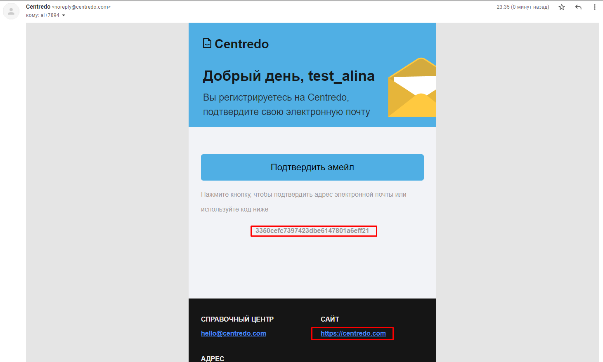
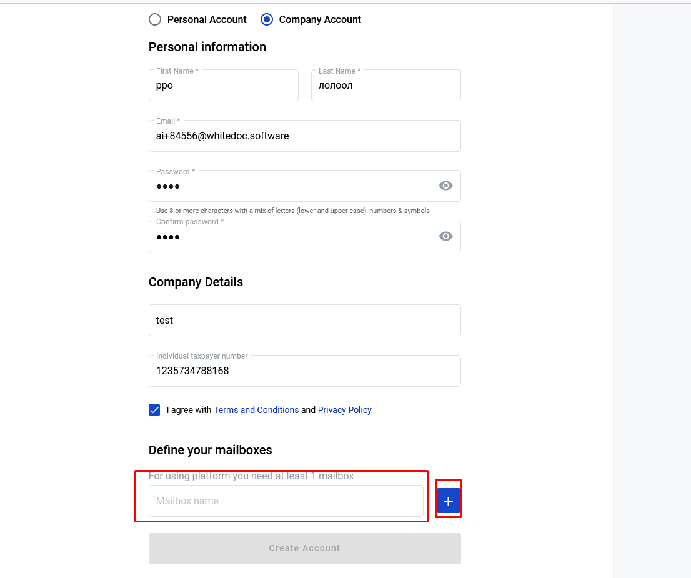
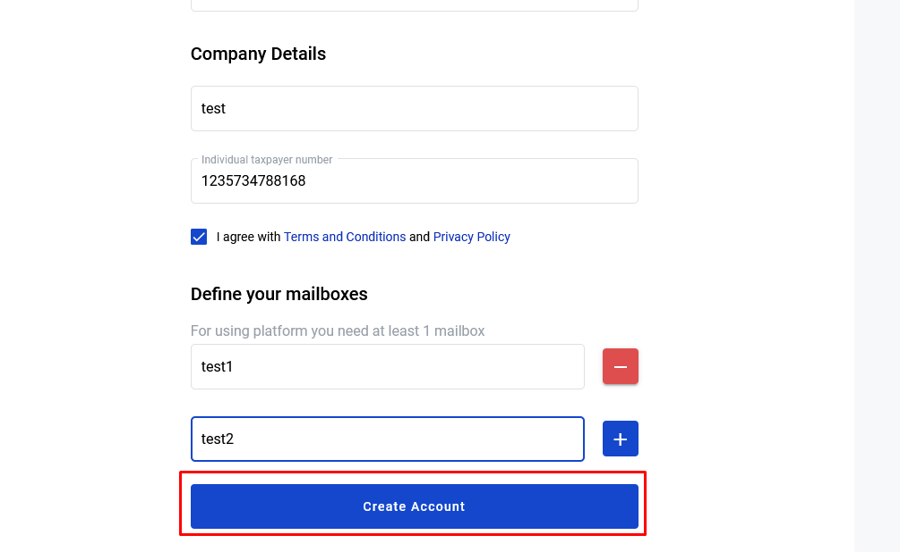

.. _registration-instruction:

============================
How to register on platform?
============================

.. toctree::

To be able to use platform, you must register and create an account:

- Registration personal account.

- Registration company account.

Follow  to register personal or company account page: path/registration

Personal account registration
=============================

1. Navigate to path/registration

.. image:: pic_registration/personal_registration_1.png
   :width: 400
   :align: center

2. Select personal account checkbox if this checkbox not selected.

.. image:: pic_registration/personal_registration_2.png
   :width: 400
   :align: center

3. Fill in name and last name fields.

.. image:: pic_registration/personal_registration_3.png
   :width: 400
   :align: center

4. Fill in "Email" field, this email will be use for login.

.. image:: pic_registration/personal_registration_4.png
   :width: 400
   :align: center

5. Fill in "Password" field and repeat fill in password in "Confirm password" field.

.. image:: pic_registration/personal_registration_5.png
   :width: 400
   :align: center

6. After filled all required fields button "Create Account" stay active and clickable. Click on the button for continue registration.

.. image:: pic_registration/personal_registration_6.png
   :width: 400
   :align: center

7. After you click on "Create account" button will be send validation letter on address which you point on  4 step and you will redirect to confirmation page.

.. image:: pic_registration/personal_registration_7.png
   :width: 400
   :align: center

8. For finish registration you should confirm your email address. For that go to mailbox which you use for registration,in this mailbox
open letter from platform. Letter contains confirmation link and confirmation code. For finish registration you should use one of them.

* To finish registration by confirmation link you should click on link in email and after that you will be redirect to path/login
  and in the upper right corner will appear message about success registration.

* For finish registration by confirmation code, you should copy code from letter and return to confirmation page. Input code in confirmation field and click next.
  If you input correct code you will observe same message about success registration.

.. image:: pic_registration/personal_registration_9.png
   :width: 400
   :align: center

Company account registration
============================

1. Navigate to path/registration.

.. image:: pic_registration/personal_registration_1.png
   :width: 400
   :align: center

2. Select company account checkbox if this checkbox not selected.

.. image:: pic_registration/company_registration_2.png
   :width: 400
   :align: center

3. Fill in name and last name fields.

.. image:: pic_registration/company_registration_3.png
   :width: 400
   :align: center

4. Fill in "Email" field which will be use for registration process. You will get validation letter on this email.

.. image:: pic_registration/company_registration_4.png
   :width: 400
   :align: center

5. Fill in "Password" field and repeat fill in your password in field "Confirm password"

.. image:: pic_registration/company_registration_5.png
   :width: 400
   :align: center

6. Fill in Company name field.

.. image:: pic_registration/company_registration_6.png
   :width: 400
   :align: center

7. Fill in ITN field.

.. image:: pic_registration/company_registration_7.png
   :width: 400
   :align: center

8. To continue registration you should click on "Continue" button, this button will be enabled after you filled in all required fields.

.. image:: pic_registration/company_registration_8.png
   :width: 400
   :align: center

9. After click on the "Continue" button, "Define mailbox" section will appear. You can define mailbox(es) according to your needs. To add mailbox click on "Plus" button and fill in the mailbox name. The account must have at least one mailbox.

10. After you defined count of mailboxes and their names, click on "Complete" button.

11. After you click on "Complete" button validation letter will be send on your email address which you point on step 4
    and you will be redirected to confirmation page.

.. image:: pic_registration/personal_registration_7.png
   :width: 400
   :align: center

12. To finish registration you should confirm your email address. For that go to mailbox which you use for registration,in this mailbox
    open letter from platform. To do that go to email address which you define on registration and open letter from platform.

* To finish registration by confirmation link you should click on link in email and after that you will be redirect to path/login
  and in the upper right corner will appear message about success registration.

* To finish registration by confirmation code, you should copy code from letter and return to confirmation page. Input code in confirmation field and click next.
  If you input correct code you will observe same message about success registration.

.. image:: pic_registration/personal_registration_9.png
   :width: 400
   :align: center

