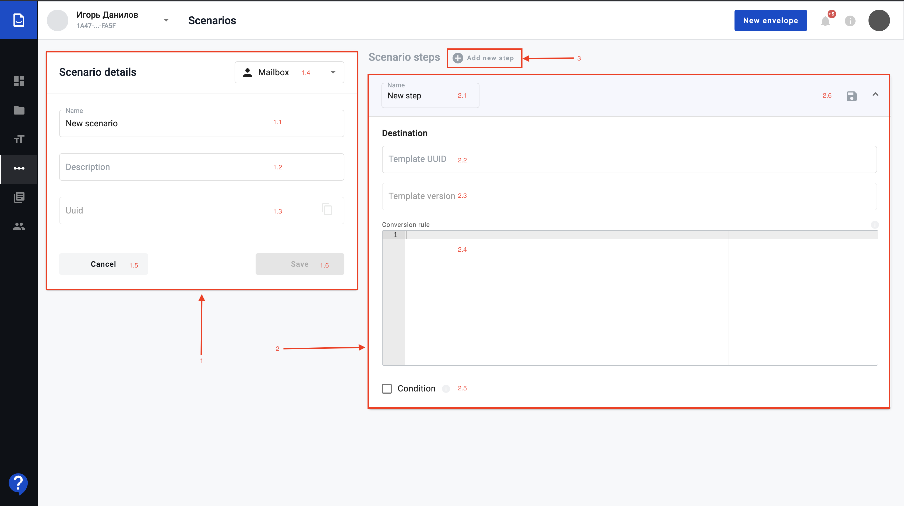
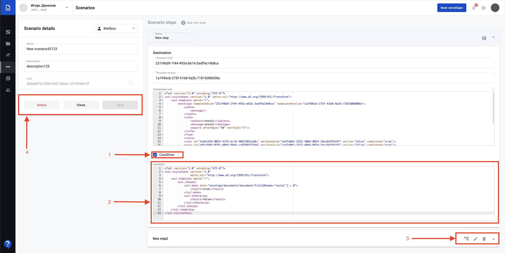

.. _scenario-management:

======================
How to manage scenario
======================
Scenario includes the following information: name, description, uuid and steps of the scenario.
Steps include name, source and destination (where source and destination include template uuid and template version uuid) and conversion rule.

.. toctree::

How to create scenario?
=======================

| **1** - Scenario main info form;
|    **1.1** - Scenario name. (required)
|    **1.2** - Scenario description. (required)
|    **1.3** - Scenario uuid(always disabled, with copy icon btn).
|    **1.4** - Access level select. (required)
|    **1.5** - Cancel button (go to list).
|    **1.6** - Save button (save scenario form changes). (disabled if scenario form invalid or at least one step not saved now).

| **2** - Step expanded panel with step form;
|    **2.1** - Scenario step name. (required)
|    **2.2** -  Scenario destination template uuid. (required)
|    **2.3** - Scenario destination template version. (required)
|    **2.4** - Scenario step conversation rule. (required)
|    **2.5** - Scenario step condition. (if true display field for condition rule). (required).
|    **2.6** - Scenario step form actions.

| **3** - Scenario step add button.

.. warning:: **Please note! First step of the scenario doesn\'t contain source. It contains only destination**

After you clicked on button above you have to fill in required data before you save scenario:

1. Name

2. Description

3. Steps of the scenario (steps also include required data, such as step name, source and destination, conversion rule)

As soon as you filled in required data you can save template.

How to configure particular step?
=================================
.. warning:: **The latest template version uuid automatically applies in the field after tempalte uuid entered**

You can configure steps of the scenario and each step will run new one envelope.

To configure the first step of scenario you have to click on "+" button near "Scenario steps" title. After that new form will appear and you will be able to:

1. Set the name of the scenario step.

2. Fill the destination with template uuid and template version uuid of template you need.
    

3. You have to enter xslt conversion rule which will create envelope after run. How to create xslt conversion rule you can find by the following link.

4. Click on "Save" icon in the right top corner of the step.

To create second, third and the rest of the following steps you have to do similar steps as above, but you will need to fill new field "source". Source it's two field with tempalte uuid and template version uuid of the previous step of the scenario.

How to edit scenario?
=====================

| **1** - Condition for step();
| **2** - Condition xslt field.(if true display field for condition rule). (required);
| **3** - Step form action buttons;
|       **3.1** - Save step button. (if edit step mode. disabled if step form invalid);
|       **3.2** - Edit step button. (if no edit step mode);
|       **3.3** - Delete step button. (first step cannot delete);
| **4** - Step form action buttons;
|       **4.1** - Delete scenario button.
|       **4.2** - Clone scenario button.
|       **4.3** - Save scenario button.

If you need to edit scenario you have to do the following:

1. Open scenario list

2. Click on three dots in the right corner of the scenario you need to edit

3. Click on "Edit" option from the list

4. Add your changes if needed and save scenario

How to edit scenario step?
==========================

If you need edit scenario step you have to click on "edit" button (pencil icon) on the scenario step you have to edit, add changes and click on "Save" button in the top right corner of the edited scenario step. 
After that click on "Save" scenario button.

How to clone scenario?
======================

If you need to clone any scenario you have to do the following:

1. Open scenario list

2. Click on three dots in the right corner of the scenario you need to edit

3. Click on "Clone" option from the list

If scenario cloned successfuly you will get respective message and will see cloned scenario in the list.

How to delete scenario?
=======================

If you need to delete any scenario you have to do the following:

1. Open scenario list

2. Click on three dots in the right corner of the scenario you need to edit

3. Click on "Delete" option from the list

If scenario deletes successfuly you will get respective message and scenario disapper from the list.

What is condition and how to use it?
====================================

| **1** Condition is the ability, based on some fields, to create different branches of the script, for example, if in the act of completed work the amount of the service is more than 1000, then give the opportunity to launch one branch of the script, if more then another
| Condition is optional and may or may not be in the request? or could be null.
| If after checking the execution "condition" = false, then check the next steps, if all steps are false, then run the step in order in which condition = null.
| If there are no conditions, then we run the next step with the null parameter.
| **2** Condition that create several envelopes based on the values in the source. But at the same time, if the values are "Yes", then create envelope (s) 1, and if the value is "No", then create envelope(s).
| If several steps meet the conditions, then the user in the envelope will display several buttons for starting different steps (in the rest, several steps will be received in the response)
