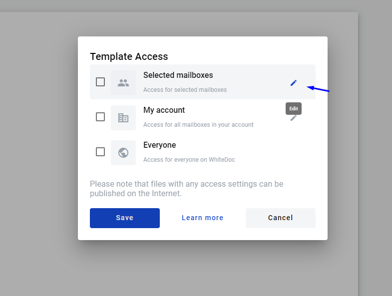
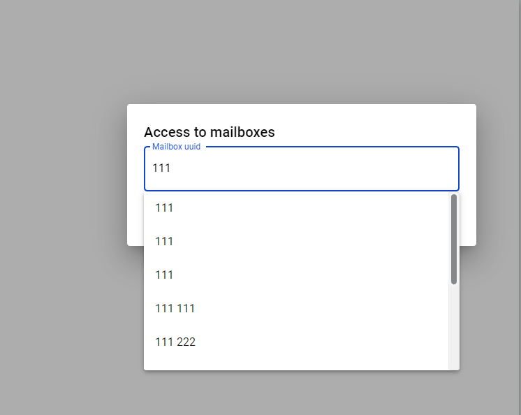
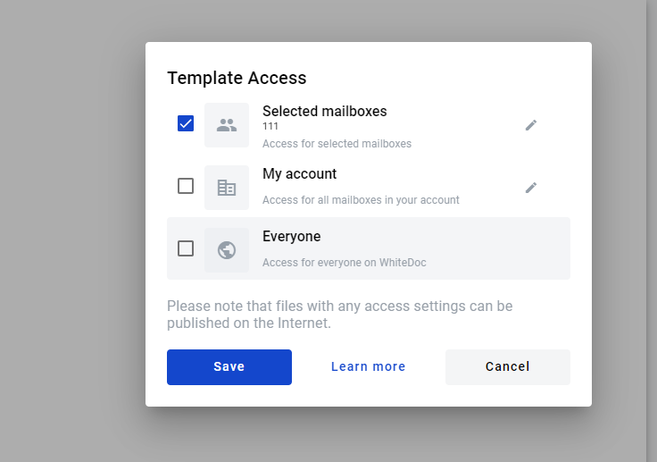

==================
Template Access
==================

.. toctree::

User can specify  access level of the template, when creating and editing it.

There are three types of access on the platform:

- access for selected mailboxes(Selected mailboxes)
- access for all mailboxes in your account(My account)
- access for everyone on WhiteDoc(Everyone)

How to add template access?
===========================

In order set access to template,user needs  go to tab "Template" and click on "Template Access".

.. image:: picTemplateAccess/Screenshot_700.png
   :width: 400
   :align: center

User can grant access to specific mailboxes. Next, you need to select edit access.

In the modal, enter: mailbox name, mailbox uuid, alias, or contact name.

When the mailbox is added, click "Save".

.. image:: picTemplateAccess/Screenshot_73.png
   :width: 400
   :align: center

Save сhanges.

After saving template, it will be available for mailboxes specified in the access. And be in the folder: "Shared with me".

.. image:: picTemplateAccess/Screenshot_725.png
   :width: 400
   :align: center

