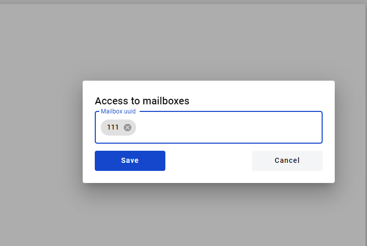
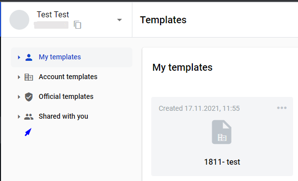
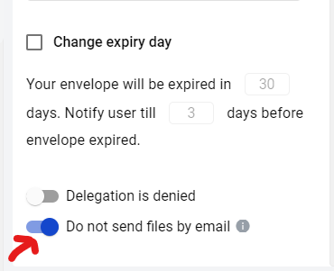

===============
Template Access
===============

.. toctree::

User can specify access level of the template when creating or editing it.

There are four types of access on the platform:

- access for your mailbox only
- access for selected mailboxes (Selected mailboxes)
- access for all mailboxes in your account (My account)
- access for everyone on the platform (Everyone)

.. note::
   Public templates can be made accessible to users not registered on the platform via direct link. To generate this link first you need to make sure that such template includes only public dictionaries (or no dictionaries at all). Also such templates should have subject field filled and all participants of the flow should have specified mailbox adresses in the flow configuration tab. When this is done, click on the template menu button in upper right corner of template on template list and click "Get link". Menu with sharing link will open where you can copy this link, generate new one to revoke access by previous link or remove access by link completely.

How to modify template access level
===================================

In order to set access level of template you need to go to "Template" tab and click on "Template Access".

.. image:: picTemplateAccess/TemplateAccess_1.png
   :width: 400
   :align: center

You can grant access to specific mailboxes. After selecting this option you will need to click on edit button.

.. image:: picTemplateAccess/TemplateAccess_2.png
   :width: 400
   :align: center

In the modal window you can enter mailbox name, mailbox uuid, alias, or contact name.

.. image:: picTemplateAccess/TemplateAccess_3.png
   :width: 400
   :align: center

When mailbox is added click "Save".

Save сhanges.

.. image:: picTemplateAccess/TemplateAccess_5.png
   :width: 400
   :align: center

After saving еру template it will be available for mailboxes specified by you in the folder "Shared with me".

   
Additional sharing access configurations
========================================

At the bottom of template tab of envelope menu you will find "Do not send files by email" attribute.

   
If you will enable it and save the template, all envelopes created from it will not contain any files from envelope in notification emails. Also such envelopes can not be shared with other mailboxes.

.. warning::
   If you will enable this toggle, it wouldn't be possible to turn in off in the envelopes. If it is disabled on template — it can be modified in the envelopes.