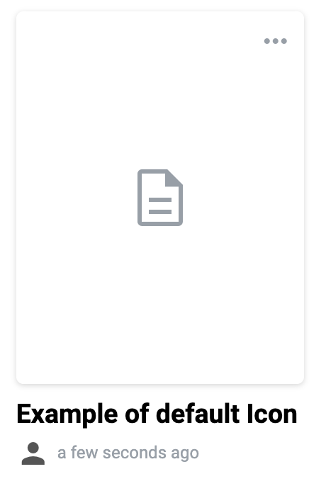
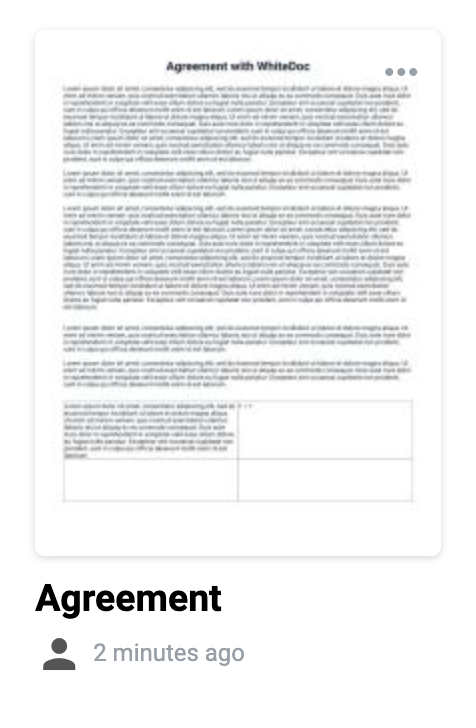

==================
Template list page
==================

.. toctree::

What is template list page?
===========================

Template list page is the library of the templates created by mailboxes. In default folder (mailbox) user observe templates created within particular mailbox.
Also user can see account, official and shared folders. Account folder contains templates with access level account.
Official templates are created by system and only can be used. Shared templates are templates which have been shared with particular mailbox

On template list you can create templates, clone, update and delete existing templates.

Also you can use search to find template by name or UUID. As the result of search will be templates your mailbox has access.

How template looks like?
========================

Template is the rectangle tile on the template list page with template name, access level and creation date below tile.

Each template has preview for better user experience within searching or choosing template to use.

There are three types of template preview available:

1. Default image of the template. If template contains only external documents inside system can't use them as preview, so in this case preview of template would be default icon of template

2. First page of the document. Template with at least one structured document inside has preview, as preview of the document system takes first page of the first structured document in template

3. Custom image of the template. User is able to upload custom image for template preview. How to do that described in :ref:`respective section <templatePropertyTemplate>`
