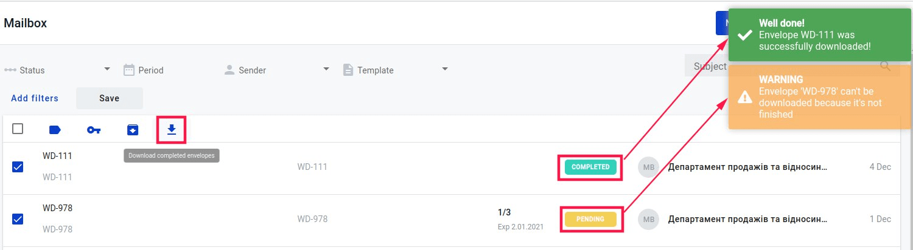
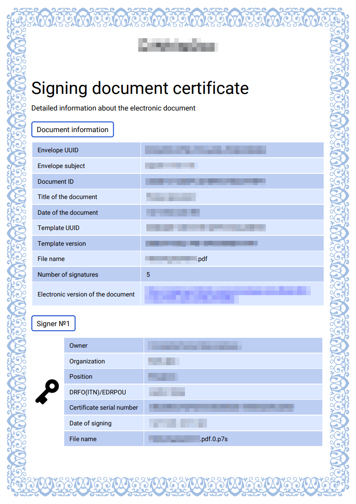

========================
Download the signed data
========================

.. toctree::

---------

How to download the signed data?
================================

You can download the signature(s) of the document(s) when all participants with role "Signer" completed actions. You're able to download particular document with signatures or
whole envelope with all documents inside and all signatures inside.

To do this, just :

1. Check that envelope completed;
2. Open envelope;
3. Click on respective "download" button in the header, to download the full envelope with all signed documents:

.. image:: pic_download/downloadEnvelope.png
   :width: 600
   :align: center

4. Or click on respective "download" button ahead document name to download particular document with all signatures:

.. image:: pic_download/downloadDocument.png
   :width: 600
   :align: center

As soon as you click on the document download button, archive with the documents will be uploaded.

You can also download all envelopes en masse:

1. Press button "Mailbox" on the left sidebar;
2. Choose envelopes which you want to download. You can download only completed envelopes;
3. Press button "Download completed envelopes" for downloading;

What are you downloading?
=========================

You download the archive with the zip extension.

* If you download a specific document.
Inside the archive will be a file with the extension .pdf, a file with the extension .xml, files with captions in .p7s format (qunatity of files
depends on qunatity of signers nultiple twice for each document) and signing certificate with .pdf extension and name: DocumentName.signatures.pdf. 
Where DocumentName it's name of the document you downloaded.

* If you download the entire envelope.
There will be several folders inside the archive (if the envelope consists of several documents).
Folder names match document names accordingly.
Inside their folders are the above-mentioned files (pdf, xml and p7s), as well as an AuditTrail file.

The signing document certificate
================================

In the signing document certificate you can find information about the document, signers, signs and stamps. 

1. Document information section contains:

* Envelope UUID - unique identifier of the envelope
* Envelope subject - subject of the envelope to which document relates
* Document ID - unique identifier of the document
* Title of the document - sublject of the document
* Date of the document - it is date of creation of envelope
* Template UUID - unique identifier of the template by whcih envelope has been created
* Template version - unique identifier of the template version
* File name - name of the signed file
* Number of signatures - quantity of the document signers
* Electronic version of the document - link to the envelope on the web platform

2. Section about the signer, sign and/or stamp contains (if it's signature you will see key icon opposite table block with data and if it's stamp 
you will see stamp icon opposite table block with data):

* Owner - name of the signature owner
* Organization - name of the organiztion to which signature belongs
* Position - signer position in the compnay
* DRFO(ITN)/EDRPOU - Identification code of signer or company
* Certificate serial number - number of the certificate with which system can garantor identity of the signer
* Date of signing - date of the signing document
* File name - signed file with extension

.. image:: pic_download/stampExample.png
   :width: 600
   :align: center

3. Explanation what is EDS and instructions how to check validity of the EDS.

.. image:: pic_download/FAQ.png
   :width: 600
   :align: center