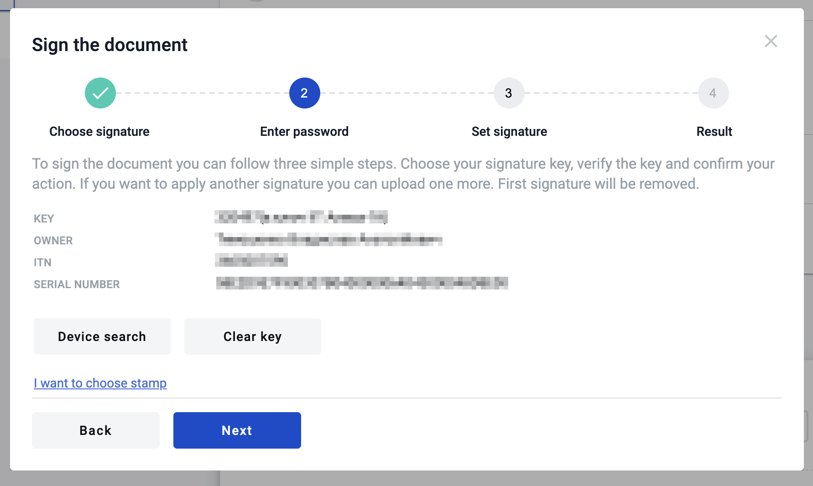

.. _qualified-electronic-signature:

Reading qualified electronic signature
======================================

To use qualified electronic signature you should install special software manually to your PC.

**Installation**

.. warning:: **Advice: update your browser and download latest version of your OS before software installation.**

1. Download and install crypto library (`MacOS <https://iit.com.ua/download/productfiles/EUSignWebInstall.pkg>`_ , `Windows <https://iit.com.ua/download/productfiles/EUSignWebInstall.exe>`_) to access your qualified keys.

2. Add `browser extension <https://chrome.google.com/webstore/detail/%D1%96%D1%96%D1%82-%D0%BA%D0%BE%D1%80%D0%B8%D1%81%D1%82%D1%83%D0%B2%D0%B0%D1%87-%D1%86%D1%81%D0%BA-1-%D0%B1%D1%96%D0%B1%D0%BB/jffafkigfgmjafhpkoibhfefeaebmccg?utm_source=chrome-app-launcher-info-dialog>`_ to access crypto library from browser.

3. Reboot your PC.

**Reading key**

1. Wait until process of searching devices is finished.

.. image:: pic_qualifiedSignature/searching-device.png
   :width: 400
   :align: center

2. Select your hardware key and enter the password of the key and click "Read key" button (if you enter the valid password and key is valid you will see sign details and the next form of
the modal window, if not you will see the error message);

.. image:: pic_qualifiedSignature/open-device.png
   :width: 400
   :align: center

3. As soon as you enter valid data you will see the information related to key with which you want to sign the document;

