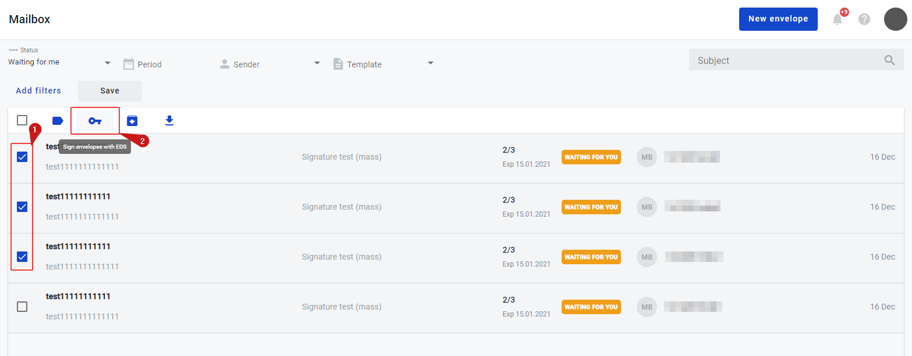
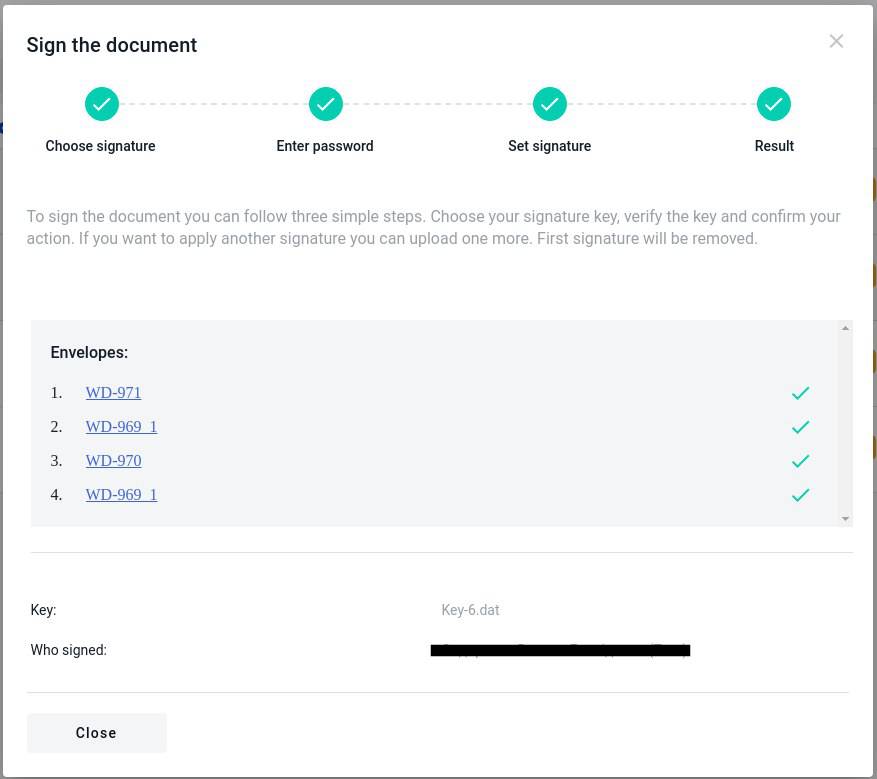

====================================
Electronic mass signing of envelopes
====================================

.. toctree::

---------

You are able to sign as mane envelopes which conatain EDS inside as you need. How to do this you can read below. 
Also, you can read how to add a EDS to the document in :ref:`the previous section<Electronic signature on template>`.

How to sign several envelopes at once
======================================

To mass sign the envelopes you have to do the following:

1. Press button "Mailbox" on the left sidebar;
2. Choose envelopes which you want to sign;
3. Find icon "key". Hover your mouse over the icon and you will see tooltip "Sign envelopes with EDS". Press this button:

As soon as you click on it, the modal window opens.

4. The first two steps are similar with signing of the single document. How to do this you can read in the topic
:ref:`Electronic signature on envelope<Electronic signature on envelope>`

5. In the third step you will see a list of envelopes that will be signed. You can click on any envelope to watch the content. Envelope opens in
new window.

.. image:: pic_listingPage/theListOfTheDocuments.png
   :width: 400
   :align: center

6. Click on 'Next' button and wait for the envelopes to sign. While you are waiting you will see progress bar of the envelopes signing process. You can
close the window if needed, process will not stop.

7. In the end you will see the result of the mass signing. If any error occures you will see special icon with error. To check the cause of error just hower
the mouse cursor on icon and you will see the explanation.

